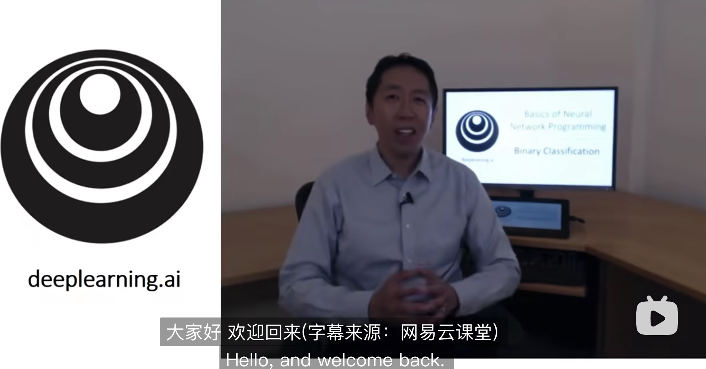
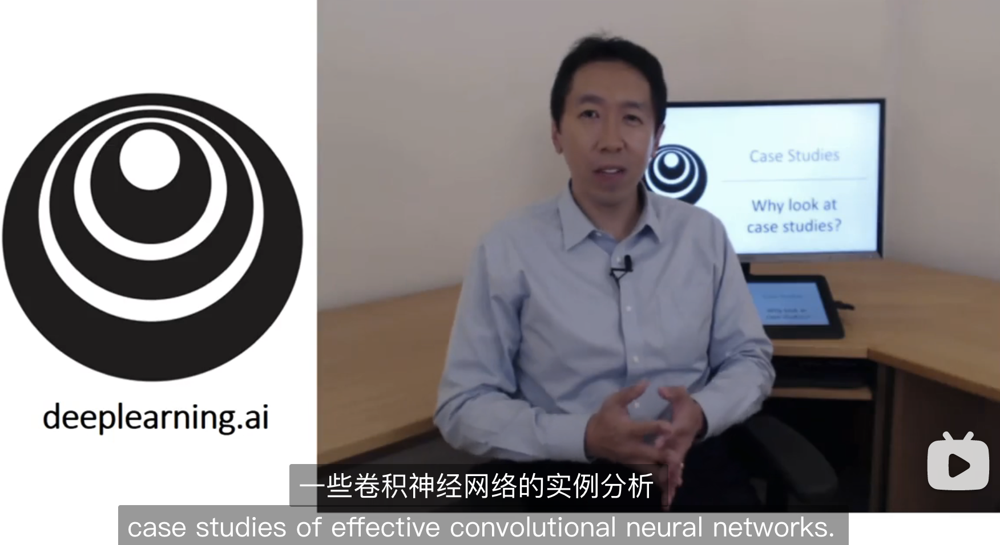
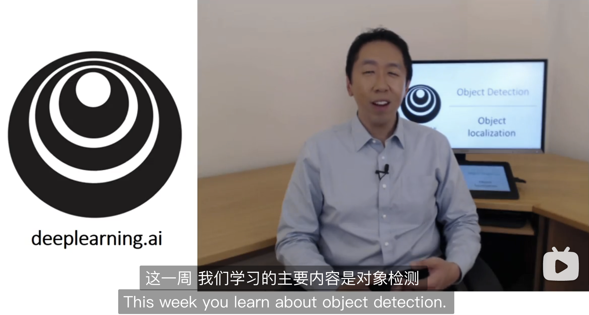

<h1 align="center">  《吴恩达深度学习课程》中文笔记</h1>

  	
  
  
   	
  	
    
     

  <a href="https://github.com/MLNLP-World/MIT-Linear-Algebra-Notes#-%E9%A1%B9%E7%9B%AE%E5%8A%A8%E6%9C%BA">项目动机</a>/
  <a href="https://github.com/MLNLP-World/MIT-Linear-Algebra-Notes#-%E8%AF%BE%E7%A8%8B%E7%AE%80%E4%BB%8B">课程简介</a>/
  <a href="https://github.com/MLNLP-World/MIT-Linear-Algebra-Notes#-%E8%AF%BE%E7%A8%8B%E8%B5%84%E6%BA%90">课程资源</a>/
  <a href="https://github.com/MLNLP-World/MIT-Linear-Algebra-Notes#-%E7%AC%94%E8%AE%B0">笔记</a>/
  <a href="https://github.com/MLNLP-World/MIT-Linear-Algebra-Notes#-%E7%BB%84%E7%BB%87%E8%80%85">组织者</a>/
  <a href="https://github.com/MLNLP-World/MIT-Linear-Algebra-Notes#-%E8%B4%A1%E7%8C%AE%E8%80%85">贡献者</a>

---

##  项目动机

《吴恩达深度学习课程》是众多深度学习课程中十分经典的一门好课。本项目总结了我们在学习吴恩达深度学习课程的学习笔记。赠人玫瑰，手留余香，我们将所有的笔记开源，希望在自己学习的同时，也对大家学习掌握《吴恩达深度学习课程》有所帮助。

>本项目的特色：
>
>1. **笔记**与**原课程视频**一一对应，可以帮助大家一边听课一边理解。
>2. 通过**图解**来使得笔记尽量通俗易懂
>3. 附带课程编程作业的**代码实现**

课程视频共五大课，十五小节，每个小节的视频大概可以用一周时间学习，预计三～四个月可以学习完毕。

本项目所用徽章来自互联网，如侵犯了您的图片版权请联系我们删除，谢谢。
并且由于我们的水平有限，有任何问题和错误请批评指正，谢谢。

##  课程简介

课程介绍：深度学习(DL, Deep Learning)是机器学习(ML, Machine Learning)领域中一个新的研究方向，它被引入机器学习使其更接近于最初的目标——人工智能(AI, Artificial Intelligence)。《吴恩达深度学习课程》的语言是**Python**，使用的框架是**Google**开源的**TensorFlow**。最吸引人之处在于，课程导师就是吴恩达本人，且课程对卷积神经网络 (**CNN**)、递归神经网络 (**RNN**)、长短期记忆 (**LSTM**) 等深度学习常用的网络结构、工具和知识都有涉及。

##  课程资源

- [吴恩达深度学习课程第一课：深度学习和神经网络](https://www.bilibili.com/video/BV164411m79z/?spm_id_from=333.788.recommend_more_video.0&vd_source=9dcc3801def980fa2c8938196ab81fea)
- [吴恩达深度学习课程第二课：改善神经网络](https://www.bilibili.com/video/BV164411m79z/?spm_id_from=333.788.recommend_more_video.0&vd_shttps://www.bilibili.com/video/av66524657?vd_source=9dcc3801def980fa2c8938196ab81fea)
- [吴恩达深度学习课程第三课：结构机器学习项目](https://www.bilibili.com/video/av66644404?vd_source=9dcc3801def980fa2c8938196ab81fea)
- [吴恩达深度学习课程第四课：卷积神经网络](https://www.bilibili.com/video/BV164411m79z/?spm_id_from=333.788.recommend_more_video.0&vd_shttps://www.bilibili.com/video/av66646276?vd_source=9dcc3801def980fa2c8938196ab81fea)
- [吴恩达深度学习课程第五课：序列模型](https://www.bilibili.com/video/av66647398?vd_source=9dcc3801def980fa2c8938196ab81fea)

##  笔记

**第一课：深度学习和神经网络**

- 视频和笔记

| 章节                             | 视频                                                         | 笔记                                                         |
| :------------------------------------- | :----------------------------------------------------------- | -------------------------------------- |
| 第一周：深度学习概论 |  | [深度学习概论](./notes/COURSE1-神经网络和深度学习/第一周-深度学习概论.md) |
| 第二周：神经网络基础            |  | [神经网络基础](./notes/COURSE1-神经网络和深度学习/第二周-神经网络基础.md) |
| 第三周：浅层神经网络         |  | [浅层神经网络](./notes/COURSE1-神经网络和深度学习/第三周-浅层神经网络.md) |
| 第四周：深层神经网络          |  | [深层神经网络](./notes/COURSE1-神经网络和深度学习/第四周-深层神经网络.md) |

- [课后作业](./notes/COURSE1-神经网络和深度学习/课后作业.md)
- [编程作业](./codes/course1)

**第二课：改善神经网络**

- 视频和笔记

| 章节                               | 视频                                                         | 笔记                                                         |
| :--------------------------------- | ------------------------------------------------------------ | :----------------------------------------------------------- |
| 第一周：深度学习的实用层面         |  | [深度学习的实用层面](./notes/COURSE2-改善神经网络/第一周-深度学习的实用层面.md) |
| 第二周：优化算法                   |  | [优化算法](./notes/COURSE2-改善神经网络/第二周-优化算法.md)  |
| 第三周：超参数调试、正则化以及优化 |  | [超参数调试、正则化以及优化](./notes/COURSE2-改善神经网络/超参数调试、正则化以及优化.md) |

- [课后作业](./notes/COURSE2-改善神经网络/课后作业.md)

- [编程作业](./codes/course2)

**第三课：结构机器学习项目**

- 视频和笔记

| 章节                       | 视频                                                         | 笔记                                                         |
| :------------------------- | ------------------------------------------------------------ | :----------------------------------------------------------- |
| 第一周：机器学习策略（上） |  | [机器学习策略](./notes/COURSE3-结构化机器学习项目/机器学习策略.md) |
| 第二周：机器学习策略（下） |  | [机器学习策略](./notes/COURSE3-结构化机器学习项目/机器学习策略.md) |

- [课后作业](./notes/COURSE3-结构化机器学习项目/课后作业.md)

- [编程作业](./codes/course3)

**第四课：卷积神经网络**

- 视频和笔记

| 章节                           | 视频                                                         | 笔记                                                         |
| :----------------------------- | ------------------------------------------------------------ | :----------------------------------------------------------- |
| 第一周：卷积神经网络           |  | [卷积神经网络](./notes/COURSE4-卷积神经网络/第一周-卷积神经网络.md) |
| 第二周：深度卷积网络：实例探究 |  | [深度卷积网络：实例探究](./notes/COURSE4-卷积神经网络/第二周-深度卷积网络：实例探究.md) |
| 第三周：目标检测               |  | [目标检测](./notes/COURSE4-卷积神经网络/第三周-目标检测.md)  |
| 第四周：人脸识别               |  | [人脸识别](./notes/COURSE4-卷积神经网络/第四周-人脸识别.md)  |

- [课后作业](./notes/COURSE4-卷积神经网络/课后作业.md)

- [编程作业](./codes/course4)

**第五课：序列模型**

- 视频和笔记

| 章节                         | 视频                                                         | 笔记                                                         |
| :--------------------------- | ------------------------------------------------------------ | :----------------------------------------------------------- |
| 第一周：循环序列模型         |  | [循环序列模型](./notes/COURSE5-序列模型/第一周-循环序列模型.md) |
| 第二周：自然语言处理与词嵌入 |  | [自然语言处理与词嵌入](./notes/COURSE5-序列模型/第二周-自然语言处理与词嵌入.md) |
| 第三周：序列模型和注意力机制 |  | [序列模型和注意力机制](./notes/COURSE5-序列模型/第三周-序列模型和注意力机制.md) |

- [课后作业](./notes/COURSE5-序列模型/课后作业.md)

- [编程作业](./codes/course5)

##  组织者
感谢以下同学对本项目的组织

 

##  贡献者
感谢以下同学对本项目的支持与贡献

   

 

