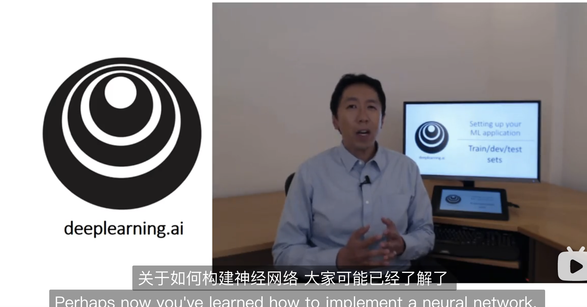
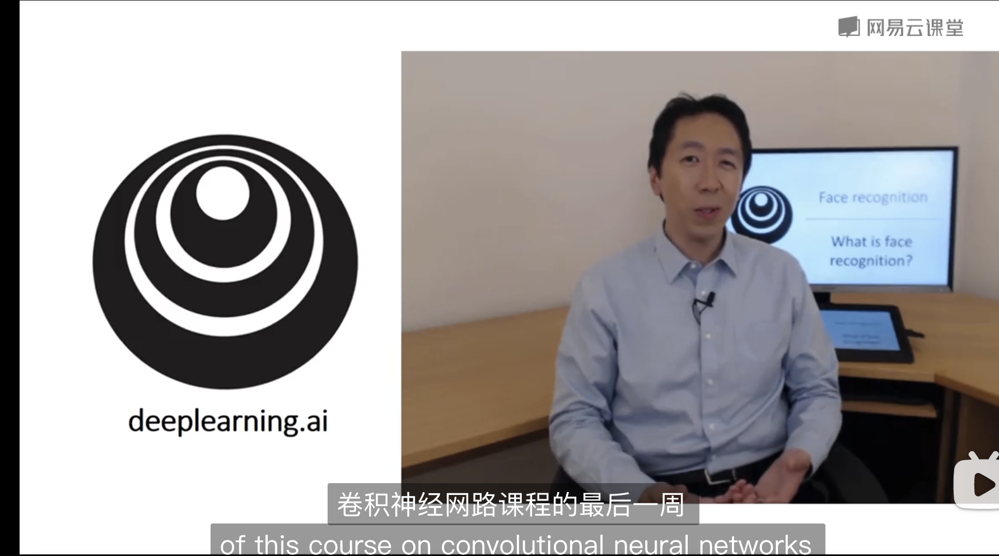
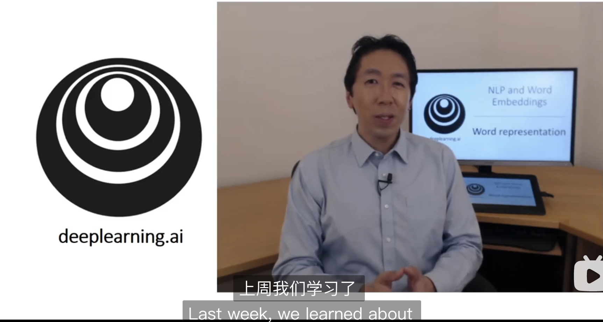

<h1 align="center">  《吴恩达深度学习课程》中文笔记</h1>

  	
  
  
   	
  	
    
     

  <a href="#项目动机">项目动机</a>/
  <a href="#课程简介">课程简介</a>/
  <a href="#课程资源">课程资源</a>/
  <a href="#笔记">笔记</a>/
  <a href="#组织者">组织者</a>/
  <a href="#贡献者">贡献者</a>

---

##  项目动机

《吴恩达深度学习课程》是众多深度学习课程中十分经典的一门好课。本项目总结了我们在学习吴恩达深度学习课程的学习笔记。赠人玫瑰，手留余香，我们将所有的笔记开源，希望在自己学习的同时，也对大家学习掌握《吴恩达深度学习课程》有所帮助。

>本项目的特色：
>
>1. **笔记**与**原课程视频**一一对应，可以帮助大家一边听课一边理解。
>2. 通过**图解**来使得笔记尽量通俗易懂
>3. 附带课程编程作业的**代码实现**

课程视频共五大课，十五小节，每个小节的视频大概可以用一周时间学习，预计三～四个月可以学习完毕。

本项目所用徽章来自互联网，如侵犯了您的图片版权请联系我们删除，谢谢。
并且由于我们的水平有限，有任何问题和错误请批评指正，谢谢。

##  课程简介

课程介绍：深度学习(DL, Deep Learning)是机器学习(ML, Machine Learning)领域中一个新的研究方向，它被引入机器学习使其更接近于最初的目标——人工智能(AI, Artificial Intelligence)。《吴恩达深度学习课程》的语言是**Python**，使用的框架是**Google**开源的**TensorFlow**。最吸引人之处在于，课程导师就是吴恩达本人，且课程对卷积神经网络 (**CNN**)、递归神经网络 (**RNN**)、长短期记忆 (**LSTM**) 等深度学习常用的网络结构、工具和知识都有涉及。

##  课程资源

- [吴恩达深度学习课程第一课：深度学习和神经网络](https://www.bilibili.com/video/BV164411m79z/?spm_id_from=333.788.recommend_more_video.0&vd_source=9dcc3801def980fa2c8938196ab81fea)
- [吴恩达深度学习课程第二课：改善神经网络](https://www.bilibili.com/video/av66524657/?vd_source=9dcc3801def980fa2c8938196ab81fea)
- [吴恩达深度学习课程第三课：结构机器学习项目](https://www.bilibili.com/video/av66644404?vd_source=9dcc3801def980fa2c8938196ab81fea)
- [吴恩达深度学习课程第四课：卷积神经网络](https://www.bilibili.com/video/av66646276/?vd_source=9dcc3801def980fa2c8938196ab81fea)
- [吴恩达深度学习课程第五课：序列模型](https://www.bilibili.com/video/av66647398?vd_source=9dcc3801def980fa2c8938196ab81fea)

##  笔记

<table>
	<tr>
	    <th>课程</th>
	    <th> 小节 </th>
	    <th>视频</th>
        <th>笔记</th>
	</tr >
	<tr >
	    <td rowspan="6">第一课：深度学习和神经网络</td>
       <td>第一周：深度学习概论 </td>
	    <td><a href="https://www.bilibili.com/video/av66314465?vd_source=9dcc3801def980fa2c8938196ab81fea">  </td>
	    <td><a href="./pdf_notes/COURSE1-神经网络和深度学习/第一周-深度学习概论.pdf">深度学习概论</a></td>
	</tr>
	<tr>
	    <td>第二周-神经网络基础</td>
	    <td></td>
	    <td><a href="./pdf_notes/COURSE1-神经网络和深度学习/第二周-神经网络基础.pdf">神经网络基础</a></td>
</tr>
<tr>
    <td>第三周-浅层神经网络</td>
    <td></td>
    <td><a href="./pdf_notes/COURSE1-神经网络和深度学习/第三周-浅层神经网络.pdf">浅层神经网络</a></td>
  </tr>
<tr>
    <td>第四周-深层神经网络</td>
    <td></td>
    <td><a href="./pdf_notes/COURSE1-神经网络和深度学习/第四周-深层神经网络.pdf">深层神经网络</a></td>
 </tr>
 <tr>
    <td>课后作业</td>
    <td></td>
    <td><a href="./notes/COURSE1-神经网络和深度学习/课后作业.md">课后作业</a></td>
  </tr>
   <tr>
    <td> 编程作业</td>
    <td></td>
    <td><a href="./codes/course1">编程作业</a></td>
  </tr>
  <tr >
	    <td rowspan="5">第二课：改善神经网络</td>
       <td>第一周：深度学习的实用层面 </td>
	    <td></td>
	    <td><a href="./pdf_notes/COURSE2-改善神经网络/第一周-深度学习的实用层面.pdf">深度学习的实用层面</a></td>
	</tr>
  <tr>
    <td>第二周：优化算法</td>
    <td></td>
    <td><a href="./pdf_notes/COURSE2-改善神经网络/第二周-优化算法.pdf">优化算法</a></td>
  </tr>
   <tr>
    <td>第三周：超参数调试、正则化以及优化</td>
    <td></td>
    <td><a href="./pdf_notes/COURSE2-改善神经网络/第三周-超参数调试、正则化以及优化.pdf">超参数调试、正则化以及优化</a></td>
  </tr>
   <tr>
    <td>课后作业</td>
    <td></td>
    <td><a href="./notes/COURSE2-改善神经网络/课后作业.md">课后作业</a></td>
  </tr>
   <tr>
    <td> 编程作业</td>
    <td></td>
    <td><a href="./codes/course2">编程作业</a></td>
  </tr>
   <tr >
	    <td rowspan="4">第三课：结构化机器学习项目</td>
       <td>第一周：机器学习策略（上） </td>
	    <td></td>
	    <td><a href="./pdf_notes/COURSE3-结构化机器学习项目/机器学习策略.pdf">机器学习策略</a></td>
</tr>
  <tr>
    <td>第二周：机器学习策略（下）</td>
    <td></td>
    <td><a href="./pdf_notes/COURSE3-结构化机器学习项目/机器学习策略.pdf">机器学习策略</a></td>
  </tr>
   <tr>
    <td>课后作业</td>
    <td></td>
    <td><a href="./notes/COURSE3-结构化机器学习项目/课后作业.md">课后作业</a></td>
  </tr>
   <tr>
    <td> 编程作业</td>
    <td></td>
    <td><a href="./codes/course3">编程作业</a></td>
  </tr>
  <tr >
	    <td rowspan="6">第四课：卷积神经网络</td>
       <td>第一周：卷积神经网络 </td>
	    <td></td>
	    <td><a href="./pdf_notes/COURSE4-卷积神经网络/第一周-卷积神经网络.pdf">卷积神经网络</a></td>
</tr>
  <tr>
    <td>第二周：深度卷积网络：实例探究 </td>
    <td></td>
    <td><a href="./pdf_notes/COURSE4-卷积神经网络/第二周-深度卷积网络：实例探究.pdf">深度卷积网络：实例探究</a></td>
  </tr>
  <tr >
       <td>第三周：目标检测 </td>
	    <td></td>
	    <td><a href="./pdf_notes/COURSE4-卷积神经网络/第三周-目标检测.pdf">目标检测</a></td>
</tr>
  <tr>
    <td>第四周：人脸识别 </td>
    <td></td>
    <td><a href="./pdf_notes/COURSE4-卷积神经网络/第四周-人脸识别.pdf">人脸识别</a></td>
  </tr>
   <tr>
    <td>课后作业</td>
    <td></td>
    <td><a href="./notes/COURSE4-卷积神经网络/课后作业.md">课后作业</a></td>
  </tr>
   <tr>
    <td> 编程作业</td>
    <td></td>
    <td><a href="./codes/course4">编程作业</a></td>
  </tr>
 <tr >
	    <td rowspan="5">第五课：序列模型</td>
       <td>第一周：循环序列模型 </td>
	    <td></td>
	    <td><a href="./pdf_notes/COURSE5-序列模型/第一周-循环序列模型.pdf">循环序列模型</a></td>
</tr>
  <tr>
    <td>第二周：自然语言处理与词嵌入 </td>
    <td></td>
    <td><a href="./pdf_notes/COURSE5-序列模型/第二周：自然语言处理与词嵌入.pdf">自然语言处理与词嵌入</a></td>
  </tr>
  <tr >
       <td>第三周：序列模型和注意力机制 </td>
	    <td></td>
	    <td><a href="./pdf_notes/COURSE5-序列模型/第三周：序列模型和注意力机制.pdf">序列模型和注意力机制</a></td>
</tr>
   <tr>
    <td>课后作业</td>
    <td></td>
    <td><a href="./notes/COURSE5-序列模型/课后作业.md">课后作业</a></td>
  </tr>
   <tr>
    <td> 编程作业</td>
    <td></td>
    <td><a href="./codes/course5">编程作业</a></td>
  </tr>
</table>

##  组织者

感谢以下同学对本项目的组织

 

##  贡献者
感谢以下同学对本项目的支持与贡献

  

 

