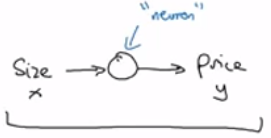
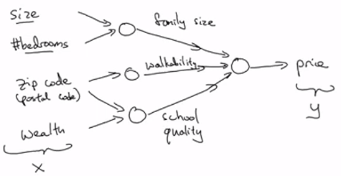
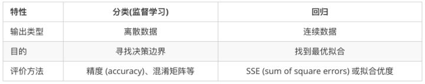

[TOC]

# 写在前面

​	神经网络和深度学习是机器学习常见算法中的两个，观察目录可得：神经网络具有速度快的优势，深度学习具有“思考”能力强的优势。两者相结合，一定能碰撞出非常实用的、更接近“智能”的机器学习模型

# （一）什么是神经网络

> “深度学习”指的是训练神经网络
>
> 神经网络也改变了深度学习

## 定义

​	人工神经网络（Artificial Neural Networks，简写为ANNs）也简称为神经网络（NNs）或称作连接模型（Connection Model），它是一种模仿动物神经网络行为特征，进行分布式并行信息处理的算法数学模型。这种网络依靠系统的复杂程度，通过调整内部大量节点之间相互连接的关系，从而达到处理信息的目的。

/*	本课程中的神经网络指的是人工神经网络。与之相对的是生物神经网络，它是人工神经网络的技术原型。

​	作为一门学科，生物神经网络主要研究人脑神经网络的结构、功能及其工作机制，意在探索人脑思维和智能活动的规律。

​	生物神经网络主要研究智能的机理；人工神经网络主要研究智能机理的实现，两者相辅相成。	*/

## 分类

​	人工神经网络按其模型结构大体可以分为前馈型网络（也称为多层感知机网络）和反馈型网络（也称为Hopfield网络）两大类，前者在数学上可以看作是一类大规模的非线性映射系统，后者则是一类大规模的非线性动力学系统。按照学习方式，人工神经网络又可分为有监督学习、非监督和半监督学习三类；按工作方式则可分为确定性和随机性两类；按时间特性还可分为连续型或离散型两类，等等。

/*

非线性映射：非线性算子又称非线性映射，不满足线性条件的算子。泛函分析的研究对象主要是线性算子及其特殊情况线性泛函。但是，自然界和工程技术中出现的大量问题都是非线性的。数学物理中的一些线性方程其实都是在一定条件下的近似。为研究这些非线性问题，涉及到的算子(映射)将不能只局限于线性算子。

非线性动力学：非线性动力学（nonlinear mechanics）是研究非线性动力系统中各种运动状态的定量和定性规律，特别是运动模式演化行为的科学。最简单的例子比如  dx/dt = f(x)

*/

## 特点

大规模并行处理，分布式存储，弹性拓扑，高度冗余和非线性运算。因而具有很髙的运算速度，很强的联想能力，很强的适应性，很强的容错能力和自组织能力。

**人工神经网络**主要模拟人类**右脑**的智能行为而**人工智能**主要模拟人类**左脑**的智能机理，人工神经网络与人工智能有机结合就能更好地模拟人类的各种智能活动。

## 工作原理

### 分点

1. 必须先学习，再工作。

2. 神经元间有连接权值，一开始是随机数，通过对训练结果正误的判断，改变随机数的大小。

3. 有监督的学习：利用给定的样本标准进行分类或模仿

   无监督的学习：只规定学习方式或某些规则，则具体的学习内容随系统所处环境 （即输入信号情况）而异，系统可以自动发现环境特征和规律性，具有更近似人脑的功能

### 总结

​	神经网络是通过对人脑的基本单元——神经元的建模和联接，探索模拟人脑神经系统功能的模型，并研制一种具有学习、联想、记忆和模式识别等智能信息处理功能的人工系统。神经网络的一个重要特性是它能够从环境中学习，并把学习的结果分布存储于网络的突触连接中。神经网络的学习是一个过程，在其所处环境的激励下，相继给网络输入一些样本模式，并按照一定的规则（学习算法）调整网络各层的权值矩阵，待网络各层权值都收敛到一定值，学习过程结束。然后我们就可以用生成的神经网络来对真实数据做分类。

## 研究方向

### 理论研究

1. 利用神经生理与认知科学研究人类思维以及智能机理。

2. 利用神经基础理论的研究成果，用数理方法探索功能更加完善、性能更加优越的神经网络模型，深入研究网络算法和性能，如：稳定性、收敛性、容错性、鲁棒性等；开发新的网络数理理论，如：神经网络动力学、非线性神经场等。

   //鲁棒性（Robust）：健壮、强壮。指系统抵御异常状况的能力。

### 应用研究

1. 神经网络的软件模拟和硬件实现的研究。
2. 神经网络在各个领域中应用的研究。这些领域主要包括：模式识别、信号处理、知识工程、专家系统、优化组合、机器人控制等。

## 修正线性单元 Rectified Linear Unit(ReLU)

修正：取不小于0的值

这是一个单神经元网络（实际上称不上网络哈）示意图

## 神经网络示意图

这是一个多神经元网络示意图，每一个节点都可能与一个或多个神经元连接。用法是：输入x，得到y， 中间过程全由神经网络自身完成。

这是前一张图的抽象。每一层网络上的每一个节点都与上一层的所有节点有关。 在神经网络中，这些圆点叫做隐藏单元。隐藏单元的实际含义是隐藏的，由神经网络自身决定。

只要给神经网络足够的(x,y)样本，神经网络很善于计算从x到y的精确映射函数。

# （二）用神经网络进行监督学习

## Supervised learning for Neural Network

### 分类与回归

主要的区别在于分类的输出类型是离散数据，回归的输出类型是连续数据。

### 监督学习举例

实际估计、线上广告、图像判断、声音处理、机器翻译、自动驾驶

### 几种神经网络

*卷积神经网络*（Convolutional Neural Networks, *CNN*），通常用于图像处理。示意图如下

*循环神经网络*（Recurrent Neural Network, *RNN*），通常用于一维数据处理，比如机器翻译、文本抄本。音频处理也属于此范畴，它的一维指的是时间轴，每个时间点上都有一个振幅信息(one-dementional temporal sequence)

*混合神经网络*（Hybrid Neural Network, *HNN*），通常用于汽车自动驾驶

### 结构化数据与非结构化数据

 结构化数据：数据的数据库

非结构化数据：音频、图像、文本等。特征可能是图像的像素、文本中的单词。非结构化数据比起结构化数据，计算机理解起来更难。

另外，深度学习使得计算机理解非结构化数据的能力增强了

# （三）深度学习的发展

深度学习发展的驱动力主要来自两点

1. 规模更大的模型
2. 大量的标签数据

三个基本要素的发展促进深度学习技术的迭代：数据量、计算速度、算法

其中计算速度的发展来自于硬件和算法的发展。

计算速度加快，人们的新想法就可以更快的实现，用以进行测试和比较。这又进一步促进了计算速度的加快。因此深度学习的迭代速度越来越快。