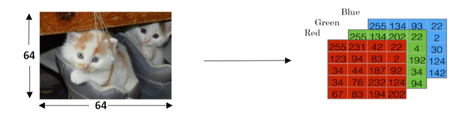
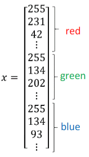
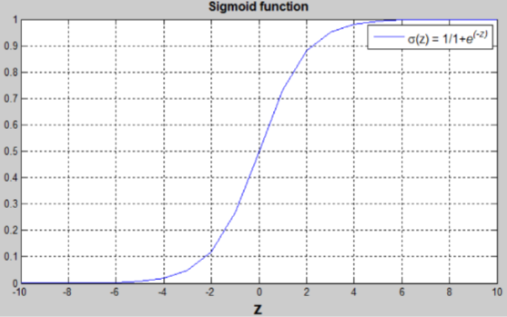
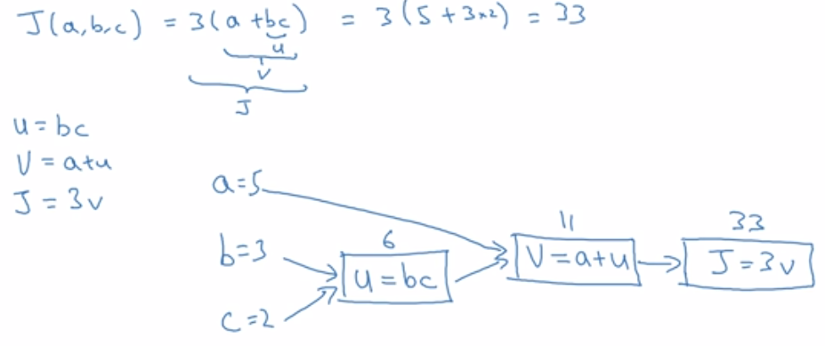
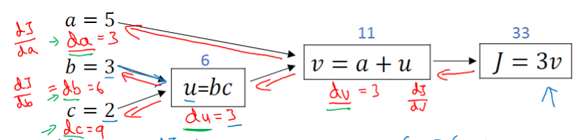
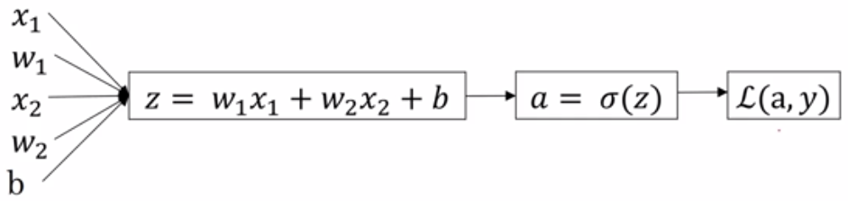
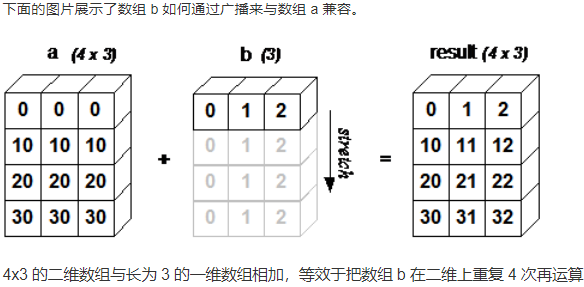
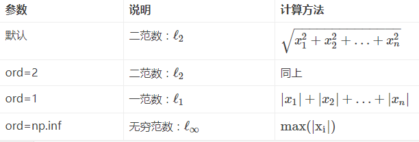

# （一）二分分类*(Binary Classification)*

## 一、定义

输出结果只有两种的问题。如：肿瘤恶性/良性；图片中有猫/无猫。

## 二、常用符号定义

以图片中有猫/无猫为例

### 1.y

输出：1或0

### 2.x

图片的特征向量，以列向量形式存储





### 3.n~x~

特征向量x的维度

### 4.(x,y)

一个单独的样本，x是n~x~维的特征向量，y是值1或0

### 5.m=m~train~

训练样本数。训练集最终包括 *(x~1~,y~1~),(x~2~,y~2~),...,(x~m~,y~m~)*

### 6.(m=m~test~)

测试样本数

### 7.X

用矩阵表示训练样本输入集。*X=[x~1~,x~2~,x~3~, ... ,x~m~]*, 是一个*n~x~ * m*的矩阵。

在python中，X.shape = (n~x~,m)

### 8.Y

用矩阵表示训练样本输出集。*Y=[y~1~,y~2~,y~3~, ... ,y~m~]*。

在python中，Y.shape = (1,m)

## 三、二分分类的目标

训练出一个分类器，以特征向量x为输入，预测输出结果y是1还是0

# （二）logistic回归：变量定义

logistic回归是一种当输出y为1或0时，用于监督学习的一种学习算法。logistic的目标是最小化模型预测与实验数据之间的误差。

仍然以图片中有无猫为例。已知一张图片，用向量x表示，算法会计算出图像中有猫的概率 *ŷ = P(y = 1 | x)*, 其中 *0 ≤ ŷ ≤ 1*

logistic回归中使用的变量如下：

- *n~x~*维输入特征向量：*x*

- 一维反馈结果：*y*（与x组对出现在输入训练集中）

- *n~x~*维权重向量：*w*

- 阀值：*b∈R*

- 算法输出：*y = σ(w^T^x + b)*

- sigmoid函数：
  $$
  s=σ(w^Tx+b)=σ(z)=\frac{1}{1+e^{-z}}
  $$




(w^T^x + b)是一个线性函数，但我们想要的是[0,1]的数。在神经网络算法中，我们常常使用sigmoid函数把一个函数映射到[0,1]区间上。

- 当z很大时，*σ(z) = 1*
- 当z很小时(z<0)，*σ(z) = 0*
- 当z = 0时，*σ(z) = 0.5*

# （三）logistic回归：成本函数

为了训练参数*w*和*b*，我们需要定义成本函数*(cost function)*

回顾：

$$
ŷ_i=σ(w^Tx_i+b_i)=σ(z_i)=\frac{1}{1+e^{-z_i}}
$$

$$
Given\{(x_1,y_1),\cdots,(x_m,y_m)\},we\ want\ ŷ_i≈y_i
$$

## 损失函数*(loss function)*

​	损失函数度量预测输出*ŷ~i~*与目标输出*y~i~*之间的差异。换句话说，损失函数计算每一个单独的训练样本的出错情况。

定义损失函数为：
$$
L(ŷ_i,y_i)=-[y_ilogy_i+(1-y_i)log(1-ŷ_i)]
$$
分析该函数可得：

- 如果*y~i~ = 1*,要使损失函数接近0，需要*ŷ~i~*接近1
- 如果*y~i~ = 0*,要使损失函数接近0，需要*ŷ~i~*接近0

## 成本函数*(cost function)*

​	成本函数是整个训练集每个训练样本的损失函数的平均水平。我们需要分析出使得该函数值最小的*w*和*b*。
$$
J(w,b)=\frac{1}{m}\sum_{i=1}^{m}{L(ŷ_i,y_i)}=-\frac{1}{m}\sum_{i=1}^{m}{[y_ilogy_i+(1-y_i)log(1-ŷ_i)]}
$$

# （四）梯度下降法*(Gradient Decent)*

我们使用梯度下降法寻找*J*的最小值以及此时*w*和*b*的值。

对*w*和*b*进行如下迭代，直到*J*达到一个稳定的最小值
$$
w=w-α\frac{dJ}{dw}
$$

$$
b=b-α\frac{dJ}{db}
$$


# （五）计算图*(Computation Graph)*



从左向右：计算中间变量和成本函数J的值。



从右向左：计算J对各变量的导数。

//由于计算中往往是*J*对其它变量求导，在编程中为了方便，我们用变量名*dvar*表示*dJ/dvar*
$$
代码中：“dv”=\frac{dJ}{dv}, “du”=dJ/jv=\frac{dJ}{dv}\frac{dv}{du},依此类推
$$

# （六）单个样本的梯度下降法

注：本节公式针对的是单个训练样本的损失函数和对应的参数*w*和*b*


$$
\frac{dL}{dz}=\frac{dL}{da}\frac{da}{dz}=a-y
$$

$$
\frac{dL}{dw_1}=x_1dz,\frac{dL}{dw_2}=x_2dz,\cdots,\frac{dL}{dw_{n_x}}=x_{n_x}dz,db=dz
$$

$$
w_i=w_i-α\frac{dL}{dw_i}
$$

$$
b=b-α\frac{dJ}{db}
$$

# （七）m个样本的梯度下降法

```python
randomly initialize w and b
repeat these until J is small enough:
    J=0
    dw=0
    db=0
    #计算m个样本在目前w和b情况下的成本函数
    for i=1 to m:
        z[i]=w*x[i]+b
        a[i]=σ(z[i])
        J+=L(a,y[i])
        dz=a[i]-y[i]
        for j=1 to n_x:
        	dw[j]+=x[i][j]*dz
        db += dz
    #得到当前成本函数值（和这一轮用来迭代的dw、db）
    J /= m
    for j=1 to n_x:
        dw[j] /= m
    db /= m
    #对w和b进行迭代
    for i=1 to m:
        w[i] = w[i] - α * dw
    b = b - α * db
```

这里显式地使用了许多for循环，对运行效率有很大负面影响。接下来会介绍如何使用“向量化”技术来为训练提速。

# （八）向量化与Numpy

## 1.Numpy简介

NumPy(Numerical Python) 是 Python 语言的一个扩展程序库，支持大量的维度数组与矩阵运算，此外也针对数组运算提供大量的数学函数库。

NumPy 的前身 Numeric 最早是由 Jim Hugunin 与其它协作者共同开发，2005 年，Travis Oliphant 在 Numeric 中结合了另一个同性质的程序库 Numarray 的特色，并加入了其它扩展而开发了 NumPy。NumPy 为开放源代码并且由许多协作者共同维护开发。

NumPy 是一个运行速度非常快的数学库，主要用于数组计算，包含：

- 一个强大的N维数组对象 ndarray
- 广播功能函数
- 整合 C/C++/Fortran 代码的工具
- 线性代数、傅里叶变换、随机数生成等功能

## 2.ndarray简介

NumPy 最重要的一个特点是其 N 维数组对象 ndarray，它是一系列同类型数据的集合，以 0 下标为开始进行集合中元素的索引。

ndarray 对象是用于存放同类型元素的多维数组。

ndarray 中的每个元素在内存中都有相同存储大小的区域。

ndarray 内部由以下内容组成：

- 一个指向数据（内存或内存映射文件中的一块数据）的指针。
- 数据类型或 dtype，描述在数组中的固定大小值的格子。
- 一个表示数组形状（shape）的元组，表示各维度大小的元组。
- 一个跨度元组（stride），其中的整数指的是为了前进到当前维度下一个元素需要"跨过"的字节数。

## 3.ndarray对象的创建

```python
numpy.array(object, dtype = None, copy = True, order = None, subok = False, ndmin = 0)
```

**参数说明：**

| 名称   | 描述                                                      |
| :----- | :-------------------------------------------------------- |
| object | 数组或嵌套的数列                                          |
| dtype  | 数组元素的数据类型，可选                                  |
| copy   | 对象是否需要复制，可选                                    |
| order  | 创建数组的样式，C为行方向，F为列方向，A为任意方向（默认） |
| subok  | 默认返回一个与基类类型一致的数组                          |
| ndmin  | 指定生成数组的最小维度                                    |

## 4.Numpy数组属性

| 属性             | 说明                                                         |
| :--------------- | :----------------------------------------------------------- |
| ndarray.ndim     | 秩，即轴的数量或维度的数量                                   |
| ndarray.shape    | 数组的维度，对于矩阵，n 行 m 列                              |
| ndarray.size     | 数组元素的总个数，相当于 .shape 中 n*m 的值                  |
| ndarray.dtype    | ndarray 对象的元素类型                                       |
| ndarray.itemsize | ndarray 对象中每个元素的大小，以字节为单位                   |
| ndarray.flags    | ndarray 对象的内存信息                                       |
| ndarray.real     | ndarray元素的实部                                            |
| ndarray.imag     | ndarray 元素的虚部                                           |
| ndarray.data     | 包含实际数组元素的缓冲区，由于一般通过数组的索引获取元素，所以通常不需要使用这个属性。 |

## 5.Numpy创建数组

### 5.1创建新数组

#### numpy.empty

numpy.empty 方法用来创建一个指定形状（shape）、数据类型（dtype）且未初始化的数组：

```python
numpy.empty(shape, dtype = float, order = 'C')
```

#### numpy.zeros

创建指定大小的数组，数组元素以 0 来填充：

```python
numpy.zeros(shape, dtype = float, order = 'C')
```

#### numpy.ones

创建指定形状的数组，数组元素以 1 来填充：

```python
numpy.ones(shape, dtype = None, order = 'C')
```

#### 参数说明

| 参数  | 描述                                                |
| :---- | :-------------------------------------------------- |
| shape | 数组形状                                            |
| dtype | 数据类型，可选                                      |
| order | 'C' 用于 C 的行数组，或者 'F' 用于 FORTRAN 的列数组 |

#### numpy.random.rand()

numpy.random.rand(d0,d1,…,dn)

- rand函数根据给定维度生成[0,1)之间的数据，包含0，不包含1
- dn表格每个维度
- 返回值为指定维度的array

#### numpy.random.randn()

numpy.random.randn(d0,d1,…,dn)

- randn函数返回一个或一组样本，具有标准正态分布。
- dn表格每个维度
- 返回值为指定维度的array

### 5.2从已有的数组创建数组

#### numpy.asarray

numpy.asarray 类似 numpy.array，但 numpy.asarray 参数只有三个，比 numpy.array 少两个。

```python
numpy.asarray(a, dtype = None, order = None)
```

参数说明：

| 参数  | 描述                                                         |
| :---- | :----------------------------------------------------------- |
| a     | 任意形式的输入参数，可以是，列表, 列表的元组, 元组, 元组的元组, 元组的列表，多维数组 |
| dtype | 数据类型，可选                                               |
| order | 可选，有"C"和"F"两个选项,分别代表，行优先和列优先，在计算机内存中的存储元素的顺序。 |

#### numpy.frombuffer

numpy.frombuffer 用于实现动态数组。

numpy.frombuffer 接受 buffer 输入参数，以流的形式读入转化成 ndarray 对象。

```python
numpy.frombuffer(buffer, dtype = float, count = -1, offset = 0)
```

*注意：buffer 是字符串的时候，Python3 默认 str 是 Unicode 类型，所以要转成 bytestring 在原 str 前加上 b。*

参数说明：

| 参数   | 描述                                     |
| :----- | :--------------------------------------- |
| buffer | 可以是任意对象，会以流的形式读入。       |
| dtype  | 返回数组的数据类型，可选                 |
| count  | 读取的数据数量，默认为-1，读取所有数据。 |
| offset | 读取的起始位置，默认为0。                |

#### numpy.fromiter

numpy.fromiter 方法从可迭代对象中建立 ndarray 对象，返回一维数组。

```python
numpy.fromiter(iterable, dtype, count=-1)
```

| 参数     | 描述                                   |
| :------- | :------------------------------------- |
| iterable | 可迭代对象                             |
| dtype    | 返回数组的数据类型                     |
| count    | 读取的数据数量，默认为-1，读取所有数据 |

### 5.3从数值范围创建数组

#### numpy.arange

numpy 包中的使用 arange 函数创建数值范围并返回 ndarray 对象，函数格式如下：

```
numpy.arange(start, stop, step, dtype)
```

根据 start 与 stop 指定的范围以及 step 设定的步长，生成一个 ndarray。

参数说明：

| 参数    | 描述                                                         |
| :------ | :----------------------------------------------------------- |
| `start` | 起始值，默认为`0`                                            |
| `stop`  | 终止值（不包含）                                             |
| `step`  | 步长，默认为`1`                                              |
| `dtype` | 返回`ndarray`的数据类型，如果没有提供，则会使用输入数据的类型。 |

#### numpy.linspace

numpy.linspace 函数用于创建一个一维数组，数组是一个等差数列构成的，格式如下：

```
np.linspace(start, stop, num=50, endpoint=True, retstep=False, dtype=None)
```

参数说明：

| 参数       | 描述                                                         |
| :--------- | :----------------------------------------------------------- |
| `start`    | 序列的起始值                                                 |
| `stop`     | 序列的终止值，如果`endpoint`为`true`，该值包含于数列中       |
| `num`      | 要生成的等步长的样本数量，默认为`50`                         |
| `endpoint` | 该值为 `true` 时，数列中包含`stop`值，反之不包含，默认是True。 |
| `retstep`  | 如果为 True 时，生成的数组中会显示间距，反之不显示。         |
| `dtype`    | `ndarray` 的数据类型                                         |

#### numpy.logspace

numpy.logspace 函数用于创建一个于等比数列。格式如下：

```
np.logspace(start, stop, num=50, endpoint=True, base=10.0, dtype=None)
```

base 参数意思是取对数的时候 log 的下标。

| 参数       | 描述                                                         |
| :--------- | :----------------------------------------------------------- |
| `start`    | 序列的起始值为：base ** start                                |
| `stop`     | 序列的终止值为：base ** stop。如果`endpoint`为`true`，该值包含于数列中 |
| `num`      | 要生成的等步长的样本数量，默认为`50`                         |
| `endpoint` | 该值为 `true` 时，数列中中包含`stop`值，反之不包含，默认是True。 |
| `base`     | 对数 log 的底数。                                            |
| `dtype`    | `ndarray` 的数据类型                                         |

## 6.Numpy索引与高级索引

1. 类似list进行索引

2. 用内置函数slice进行切片：slice(start, end, step)

3. 使用省略号进行选择

   ```python
   import numpy as np

   a = np.array([[1,2,3],[3,4,5],[4,5,6]])  
   print (a[...,1])   # 第2列元素
   print (a[1,...])   # 第2行元素
   print (a[...,1:])  # 第2列及剩下的所有元素
   ```

4. 整数数组索引

   ```python
   #获取数组中(0,0)，(1,1)和(2,0)位置处的元素
   import numpy as np

   x = np.array([[1,  2],  [3,  4],  [5,  6]])
   y = x[[0,1,2],  [0,1,0]]  
   print (y)
   ```

5. 布尔索引

   ```python
   import numpy as np

   x = np.array([[  0,  1,  2],[  3,  4,  5],[  6,  7,  8],[  9,  10,  11]])  
   print ('我们的数组是：')
   print (x)
   print ('\n')
   # 现在我们会打印出大于 5 的元素  
   print  ('大于 5 的元素是：')
   print (x[x >  5])
   ```

6. 花式索引

   ```python
   #花式索引即利用整数数组索引
   import numpy as np

   x=np.arange(32).reshape((8,4))
   print (x[[-4,-2,-1,-7]])
   ```

## 7.Numpy广播(BroadCast)

### 广播的规则

- 让所有输入数组都向其中形状最长的数组看齐，形状中不足的部分都通过在前面加 1 补齐。
- 输出数组的形状是输入数组形状的各个维度上的最大值。
- 如果输入数组的某个维度和输出数组的对应维度的长度相同或者其长度为 1 时，这个数组能够用来计算，否则出错。
- 当输入数组的某个维度的长度为 1 时，沿着此维度运算时都用此维度上的第一组值。

### 简单理解

对两个数组，分别比较他们的每一个维度（若其中一个数组没有当前维度则忽略），满足：

- 数组拥有相同形状。
- 当前维度的值相等。
- 当前维度的值有一个是 1。

若条件不满足，抛出 **"ValueError: frames are not aligned"** 异常。



## 8.Numpy数组操作

### 修改数组形状

| 函数      | 描述                                               |
| :-------- | :------------------------------------------------- |
| `reshape` | 不改变数据的条件下修改形状                         |
| `flat`    | 数组元素迭代器                                     |
| `flatten` | 返回一份数组拷贝，对拷贝所做的修改不会影响原始数组 |
| `ravel`   | 返回展开数组                                       |

#### numpy.reshape

numpy.reshape 函数可以在不改变数据的条件下修改形状，格式如下： numpy.reshape(arr, newshape, order='C')

- `arr`：要修改形状的数组
- `newshape`：整数或者整数数组，新的形状应当兼容原有形状
- order：'C' -- 按行，'F' -- 按列，'A' -- 原顺序，'k' -- 元素在内存中的出现顺序。

#### numpy.ndarray.flat

numpy.ndarray.flat 是一个数组元素迭代器

```python
import numpy as np

a = np.arange(9).reshape(3,3)
print ('原始数组：')
for row in a:
    print (row)

#对数组中每个元素都进行处理，可以使用flat属性，该属性是一个数组元素迭代器：
print ('迭代后的数组：')
for element in a.flat:
    print (element)
```

输出如下：

```
原始数组：
[0 1 2]
[3 4 5]
[6 7 8]
迭代后的数组：
0
1
2
3
4
5
6
7
8
```

#### numpy.ndarray.flatten

numpy.ndarray.flatten 返回一份数组拷贝，对拷贝所做的修改不会影响原始数组，格式如下：

```
ndarray.flatten(order='C')
```

#### numpy.ravel

numpy.ravel() 展平的数组元素，顺序通常是"C风格"，返回的是数组视图（view，有点类似 C/C++引用reference的意味），修改会影响原始数组。

该函数接收两个参数：

```
numpy.ravel(a, order='C')
```

参数说明：

- order：'C' -- 按行，'F' -- 按列，'A' -- 原顺序，'K' -- 元素在内存中的出现顺序。

实例

```python
import numpy as np

a = np.arange(8).reshape(2,4)

print ('原数组：')
print (a)
print ('\n')

print ('调用 ravel 函数之后：')
print (a.ravel())
print ('\n')

print ('以 F 风格顺序调用 ravel 函数之后：')
print (a.ravel(order = 'F'))
```

输出结果如下：

```
原数组：
[[0 1 2 3]
 [4 5 6 7]]


调用 ravel 函数之后：
[0 1 2 3 4 5 6 7]


以 F 风格顺序调用 ravel 函数之后：
[0 4 1 5 2 6 3 7]
```

### 翻转数组

| 函数        | 描述                       |
| :---------- | :------------------------- |
| `transpose` | 对换数组的维度             |
| `ndarray.T` | 和 `self.transpose()` 相同 |
| `rollaxis`  | 向后滚动指定的轴           |
| `swapaxes`  | 对换数组的两个轴           |

#### numpy.transpose

numpy.transpose 函数用于对换数组的维度，格式如下：

```
numpy.transpose(arr, axes)
```

参数说明:

- `arr`：要操作的数组
- `axes`：整数列表，对应维度，通常所有维度都会对换。

不输入axes参数即为将arr变为它的转置

#### numpy.ndarray.T

类似 numpy.transpose

#### numpy.rollaxis

numpy.rollaxis 函数向后滚动特定的轴到一个特定位置，格式如下：

```
numpy.rollaxis(arr, axis, start)
```

参数说明：

- `arr`：数组
- `axis`：要向后滚动的轴，其它轴的相对位置不会改变
- `start`：默认为零，表示完整的滚动。会滚动到特定位置。

#### numpy.swapaxes

numpy.swapaxes 函数用于交换数组的两个轴，格式如下：

```
numpy.swapaxes(arr, axis1, axis2)
```

- `arr`：输入的数组
- `axis1`：对应第一个轴的整数
- `axis2`：对应第二个轴的整数

### 修改数组维度

| 维度           | 描述                       |
| :------------- | :------------------------- |
| `broadcast`    | 产生模仿广播的对象         |
| `broadcast_to` | 将数组广播到新形状         |
| `expand_dims`  | 扩展数组的形状             |
| `squeeze`      | 从数组的形状中删除一维条目 |

#### numpy.broadcast

numpy.broadcast 用于模仿广播的对象，它返回一个对象，该对象封装了将数组1广播到数组2的结果。

该函数使用两个数组作为输入参数

```
numpy.broadcast(arr1,arr2)
```

#### numpy.broadcast_to

numpy.broadcast_to 函数将数组广播到新形状。它在原始数组上返回只读视图。 它通常不连续。 如果新形状不符合 NumPy 的广播规则，该函数可能会抛出ValueError。subok可以不填。

```
numpy.broadcast_to(array, shape, subok)
```

#### numpy.expand_dims

numpy.expand_dims 函数通过在指定位置插入新的轴来扩展数组形状，函数格式如下:

```
 numpy.expand_dims(arr, axis)
```

参数说明：

- `arr`：输入数组
- `axis`：新轴插入的位置

#### numpy.squeeze

numpy.squeeze 函数从给定数组的形状中删除一维的条目，函数格式如下：

```
numpy.squeeze(arr, axis)
```

参数说明：

- `arr`：输入数组
- `axis`：整数或整数元组，用于选择形状中一维条目的子集

### 连接数组

| 函数          | 描述                           |
| :------------ | :----------------------------- |
| `concatenate` | 连接沿现有轴的数组序列         |
| `stack`       | 沿着新的轴加入一系列数组。     |
| `hstack`      | 水平堆叠序列中的数组（列方向） |
| `vstack`      | 竖直堆叠序列中的数组（行方向） |

#### numpy.concatenate

numpy.concatenate 函数用于沿指定轴连接相同形状的两个或多个数组，格式如下：

```
numpy.concatenate((a1, a2, ...), axis)
```

参数说明：

- `a1, a2, ...`：相同类型的数组
- `axis`：沿着它连接数组的轴，默认为 0

#### numpy.stack

numpy.stack 函数用于沿新轴连接数组序列，格式如下：

```
numpy.stack(arrays, axis)
```

参数说明：

- `arrays`相同形状的数组序列
- `axis`：返回数组中的轴，输入数组沿着它来堆叠

#### numpy.hstack

numpy.hstack 是 numpy.stack 函数的变体，它通过水平堆叠来生成数组。

### 分割数组

| 函数     | 数组及操作                             |
| :------- | :------------------------------------- |
| `split`  | 将一个数组分割为多个子数组             |
| `hsplit` | 将一个数组水平分割为多个子数组（按列） |
| `vsplit` | 将一个数组垂直分割为多个子数组（按行） |

#### numpy.split

numpy.split 函数沿特定的轴将数组分割为子数组，格式如下：

```
numpy.split(ary, indices_or_sections, axis)
```

参数说明：

- `ary`：被分割的数组
- `indices_or_sections`：果是一个整数，就用该数平均切分，如果是一个数组，为沿轴切分的位置（左开右闭）
- `axis`：沿着哪个维度进行切向，默认为0，横向切分。为1时，纵向切分

#### numpy.hsplit

numpy.hsplit 函数用于水平分割数组，通过指定要返回的相同形状的数组数量来拆分原数组。

#### numpy.vsplit

numpy.vsplit 沿着垂直轴分割，其分割方式与hsplit用法相同。

### 数组元素的添加与删除

| 函数     | 元素及描述                               |
| :------- | :--------------------------------------- |
| `resize` | 返回指定形状的新数组                     |
| `append` | 将值添加到数组末尾                       |
| `insert` | 沿指定轴将值插入到指定下标之前           |
| `delete` | 删掉某个轴的子数组，并返回删除后的新数组 |
| `unique` | 查找数组内的唯一元素                     |

#### numpy.resize

numpy.resize 函数返回指定大小的新数组。

如果新数组大小大于原始大小，则包含原始数组中的元素的副本。

```
numpy.resize(arr, shape)
```

参数说明：

- `arr`：要修改大小的数组
- `shape`：返回数组的新形状

#### numpy.append

numpy.append 函数在数组的末尾添加值。 追加操作会分配整个数组，并把原来的数组复制到新数组中。 此外，输入数组的维度必须匹配否则将生成ValueError。

append 函数返回的始终是一个一维数组。

```
numpy.append(arr, values, axis=None)
```

参数说明：

- `arr`：输入数组
- `values`：要向`arr`添加的值，需要和`arr`形状相同（除了要添加的轴）
- `axis`：默认为 None。当axis无定义时，是横向加成，返回总是为一维数组！当axis有定义的时候，分别为0和1的时候。当axis有定义的时候，分别为0和1的时候（列数要相同）。当axis为1时，数组是加在右边（行数要相同）。

#### numpy.insert

numpy.insert 函数在给定索引之前，沿给定轴在输入数组中插入值。

如果值的类型转换为要插入，则它与输入数组不同。 插入没有原地的，函数会返回一个新数组。 此外，如果未提供轴，则输入数组会被展开。

```
numpy.insert(arr, obj, values, axis)
```

参数说明：

- `arr`：输入数组
- `obj`：在其之前插入值的索引
- `values`：要插入的值
- `axis`：沿着它插入的轴，如果未提供，则输入数组会被展开

#### numpy.delete

numpy.delete 函数返回从输入数组中删除指定子数组的新数组。 与 insert() 函数的情况一样，如果未提供轴参数，则输入数组将展开。

```
Numpy.delete(arr, obj, axis)
```

参数说明：

- `arr`：输入数组
- `obj`：可以被切片，整数或者整数数组，表明要从输入数组删除的子数组
- `axis`：沿着它删除给定子数组的轴，如果未提供，则输入数组会被展开

#### numpy.unique

numpy.unique 函数用于去除数组中的重复元素。

```
numpy.unique(arr, return_index, return_inverse, return_counts)
```

- `arr`：输入数组，如果不是一维数组则会展开
- `return_index`：如果为`true`，返回新列表元素在旧列表中的位置（下标），并以列表形式储
- `return_inverse`：如果为`true`，返回旧列表元素在新列表中的位置（下标），并以列表形式储
- `return_counts`：如果为`true`，返回去重数组中的元素在原数组中的出现次数

## 9.Numpy函数

### 数学函数

#### 三角函数

NumPy 提供了标准的三角函数：sin()、cos()、tan()。

#### 舍入函数

numpy.around() 函数返回指定数字的四舍五入值。

```
numpy.around(a,decimals)
```

#### numpy.floor()

numpy.floor() 返回小于或者等于指定表达式的最大整数，即向下取整。

#### numpy.ceil()

numpy.ceil() 返回大于或者等于指定表达式的最小整数，即向上取整。

### 算数函数

#### 加减乘除

NumPy 算术函数包含简单的加减乘除: **add()**，**subtract()**，**multiply()** 和 **divide()**。也相当于 + - * / 运算符

需要注意的是数组必须具有相同的形状或符合数组广播规则。

#### numpy.reciprocal()

numpy.reciprocal() 函数返回参数逐元素的倒数。如 **1/4** 倒数为 **4/1**。

#### numpy.power()

numpy.power() 函数将第一个输入数组中的元素作为底数，计算它与第二个输入数组中相应元素的幂。

#### numpy.mod()

numpy.mod() 计算输入数组中相应元素的相除后的余数。 函数 numpy.remainder() 也产生相同的结果。

### 统计函数

#### numpy.amin() 和 numpy.amax()

numpy.amin() 用于计算数组中的元素沿指定轴的最小值。

numpy.amax() 用于计算数组中的元素沿指定轴的最大值。

#### numpy.ptp(arr)

numpy.ptp()函数计算数组中元素最大值与最小值的差（最大值 - 最小值）。

也可以用axis指定轴：np.ptp(a, axis =  0)

#### numpy.percentile()

百分位数是统计中使用的度量，表示小于这个值的观察值的百分比。 函数numpy.percentile()接受以下参数。

```
numpy.percentile(a, q, axis)
```

参数说明：

- a: 输入数组
- q: 要计算的百分位数，在 0 ~ 100 之间
- axis: 沿着它计算百分位数的轴

#### numpy.median()

numpy.median() 函数用于计算数组 a 中元素的中位数（中值）

#### numpy.mean()

numpy.mean() 函数返回数组中元素的算术平均值。 如果提供了轴，则沿其计算。

算术平均值是沿轴的元素的总和除以元素的数量。

#### numpy.average()

numpy.average() 函数根据在另一个数组中给出的各自的权重计算数组中元素的加权平均值。

该函数可以接受一个轴参数。 如果没有指定轴，则数组会被展开。

加权平均值即将各数值乘以相应的权数，然后加总求和得到总体值，再除以总的单位数。

考虑数组[1,2,3,4]和相应的权重[4,3,2,1]，通过将相应元素的乘积相加，并将和除以权重的和，来计算加权平均值。

#### 标准差

标准差是一组数据平均值分散程度的一种度量。

标准差是方差的算术平方根。

标准差公式如下：

```
std = sqrt(mean((x - x.mean())**2))
```

#### 方差

统计中的方差（样本方差）是每个样本值与全体样本值的平均数之差的平方值的平均数，即 mean((x - x.mean())** 2)。

换句话说，标准差是方差的平方根。

## 10.Numpy线性代数

NumPy 提供了线性代数函数库 **linalg**，该库包含了线性代数所需的所有功能，可以看看下面的说明：

| 函数          | 描述                             |
| :------------ | :------------------------------- |
| `dot`         | 两个数组的点积，即元素对应相乘。 |
| `vdot`        | 两个向量的点积                   |
| `inner`       | 两个数组的内积                   |
| `matmul`      | 两个数组的矩阵积                 |
| `determinant` | 数组的行列式                     |
| `solve`       | 求解线性矩阵方程                 |
| `inv`         | 计算矩阵的乘法逆矩阵             |

### numpy.dot()

numpy.dot() 对于两个一维的数组，计算的是这两个数组对应下标元素的乘积和(数学上称之为内积)；对于二维数组，计算的是两个数组的矩阵乘积；对于多维数组，它的通用计算公式如下，即结果数组中的每个元素都是：数组a的最后一维上的所有元素与数组b的倒数第二位上的所有元素的乘积和： **dot(a, b)[i,j,k,m] = sum(a[i,j,:] \* b[k,:,m])**。

```
numpy.dot(a, b, out=None)
```

**参数说明：**

- **a** : ndarray 数组
- **b** : ndarray 数组
- **out** : ndarray, 可选，用来保存dot()的计算结果

### numpy.vdot()

numpy.vdot() 函数是两个向量的点积。 如果第一个参数是复数，那么它的共轭复数会用于计算。 如果参数是多维数组，它会被展开。

### numpy.inner()

numpy.inner() 函数返回一维数组的向量内积。对于更高的维度，它返回最后一个轴上的和的乘积。

### numpy.matmul

numpy.matmul 函数返回两个数组的矩阵乘积。 虽然它返回二维数组的正常乘积，但如果任一参数的维数大于2，则将其视为存在于最后两个索引的矩阵的栈，并进行相应广播。

另一方面，如果任一参数是一维数组，则通过在其维度上附加 1 来将其提升为矩阵，并在乘法之后被去除。

对于二维数组，它就是矩阵乘法

### numpy.linalg.det()

numpy.linalg.det() 函数计算输入矩阵的行列式。

行列式在线性代数中是非常有用的值。 它从方阵的对角元素计算。 对于 2×2 矩阵，它是左上和右下元素的乘积与其他两个的乘积的差。

换句话说，对于矩阵[[a，b]，[c，d]]，行列式计算为 ad-bc。 较大的方阵被认为是 2×2 矩阵的组合。

### numpy.linalg.solve()

numpy.linalg.solve() 函数给出了矩阵形式的线性方程的解。

### numpy.linalg.inv()

numpy.linalg.inv() 函数计算矩阵的乘法逆矩阵。

**逆矩阵（inverse matrix）**：设A是数域上的一个n阶矩阵，若在相同数域上存在另一个n阶矩阵B，使得： AB=BA=E ，则我们称B是A的逆矩阵，而A则被称为可逆矩阵。注：E为单位矩阵。

### np.linalg.norm(求范数)

```python
x_norm=np.linalg.norm(x, ord=None, axis=None, keepdims=False)
```

- x: 表示矩阵（也可以是一维）

- ord：范数类型

**向量的范数：**



**矩阵的范数：**

ord=1：列和的最大值

ord=2：|λE-ATA|=0，求特征值，然后求最大特征值得算术平方根([matlab在线版](https://octave-online.net/)，计算ans=ATA，[x,y]=eig(ans)，sqrt(y)，x是特征向量，y是特征值)

ord=∞：行和的最大值

ord=None：默认情况下，是求整体的矩阵元素平方和，再开根号。（没仔细看，以为默认情况下就是矩阵的二范数，修正一下，默认情况下是求整个矩阵元素平方和再开根号）

- axis：处理类型

axis=1表示按行向量处理，求多个行向量的范数

axis=0表示按列向量处理，求多个列向量的范数

axis=None表示矩阵范数。

- keepding：是否保持矩阵的二维特性

True表示保持矩阵的二维特性，False相反

## 11.logistic回归一次迭代的向量化形式

```
Z = w^T * X + b
  = np.dot(w.T, X) + b
A = σ(Z)
dZ = A - Y
dw = 1/m * X * dZ^T
db = 1/m * np.sum(dZ)

w = w - αdw
b = b - αdw
```
