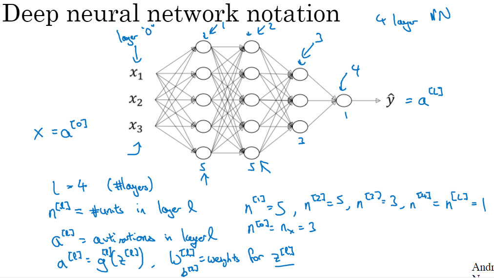
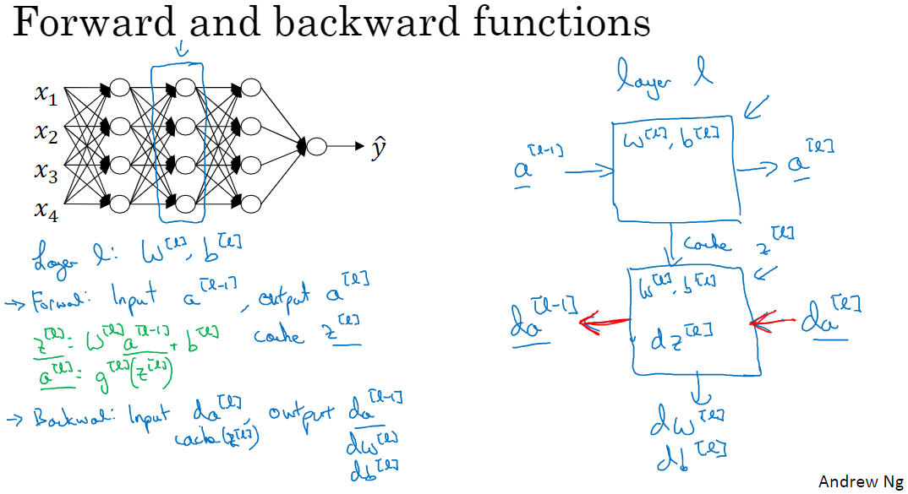
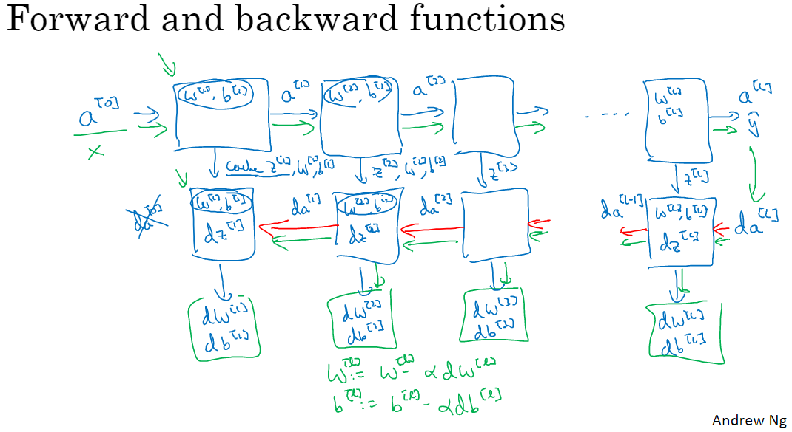
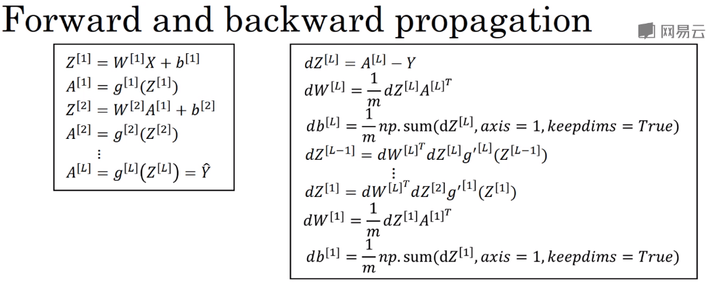

# （一）一些新变量的引入

| 变量名 | 变量含义         |
| ------ | ---------------- |
| l      | layers           |
| n^[l]^ | units in layer l |

# （二）核对矩阵的维数

这个在前面其实已经做过了，这里再总结一下

| 矩阵符号           | 矩阵维数              |
| :----------------- | --------------------- |
| X                  | (n^[0]^,m)            |
| W^[l]^ and dW^[l]^ | (n^[l]^,n^[l-1]^)     |
| b^[l]^ and db^[l]^ | (n^[l]^,1)            |
| Z^[l]^ and dZ^[l]^ | (n^[l]^,m)            |
| A^[l]^ and dA^[l]^ | (n^[l]^,m)            |
| Y                  | (n^[the\ last\ l]^,m) |

# （三）为什么使用深层表示

## 观点1

模拟大脑思考过程：由浅到深、由简到繁、层层深入

## 观点2

识别一个n维特征向量，使用单隐层神经网络需要的神经元个数，呈2^n^增长。

而使用多隐层神经网络所需神经元个数，则呈log n增长

# （四）搭建深层神经网络块

# （五）前向和反向传播的实现

$$
{
\#\#Forward\ Propagation\#\#\\
Z^{[l]}=W^{[1]}A^{[l-1]}+b^{[l]}\\
A^{[l]}=g^{[l]}(Z^{[l]})\\
\#\#Backward\ Propagation\#\#\\
dZ^{[l]}=dA^{[l]}*g^{[l]'}(Z^{[l]})\\
dW^{[l]}=\frac{1}{m}dZ^{[l]}A^{[l-1]T}\\
db^{[l]}=\frac{1}{m}np.sum(dZ^{[l]},axis=1,keepdims=True)\\
dA^{[l-1]}=W^{[l]T}dZ^{[l]}
}
$$

