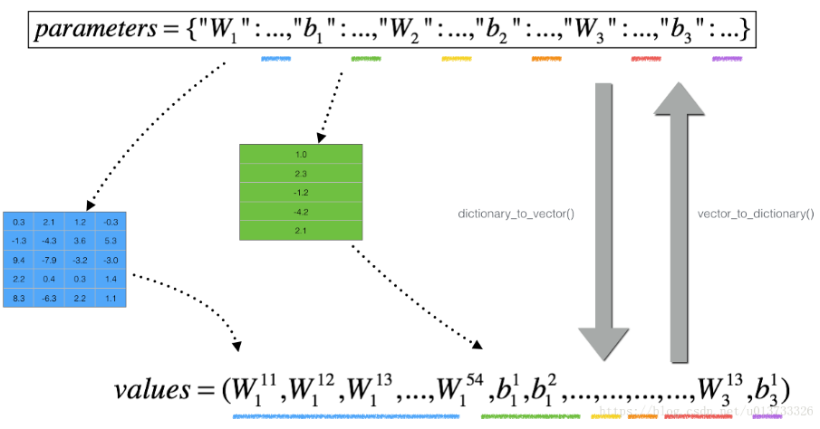

# （一）训练 / 验证 / 测试集(Train / Dev / Test)

## 获取

从实验所用的数据集中划分所得。一般训练集占比较多，验证集和测试集占比较少。

## 功能

训练集：训练模型

验证集：验证算法正确性

测试集：测试算法效率

## 比例

验证集和测试集总共不超过整个数据集的40％或各不超过10000条即可

# （二）偏差 / 方差 (Bias / Variance)

## 区别

1. 偏差大体现的是训练集上的结果较差
2. 方差大体现的是验证集上的结果比训练集上的差的较多

## 具体例子

1. 高偏差（欠拟合）

   

2. 高方差（过拟合）

   

3. 高偏差 & 高方差

   这类分类器几乎是线性的（高偏差），而中间的曲线部分又过于灵活（高方差），导致最后拟合的数据很差。

   

## 贝叶斯误差（最优误差）

假设贝叶斯误差为0，我们来分析以下训练结果的偏差与方差：


# （三）basic recipe for machine learning

- 若高偏差，则尝试
  1. 更大的神经网络
  2. 更多的神经网络层数
- 若高方差，则尝试
  1. 更多训练数据
  2. 正则化
- 若咋整也不行，则尝试
  1. 使用其他算法

# （四）范数

L0范数是指向量中非0的元素的个数。(L0范数很难优化求解)

L1范数是指向量中各个元素绝对值之和

L2范数是指向量各元素的平方和然后求平方根

L1范数可以进行特征选择，即让特征的系数变为0.

L2范数可以防止过拟合，提升模型的泛化能力，有助于处理 condition number不好下的矩阵(数据变化很小矩阵求解后结果变化很大)

（核心：L2对大数，对outlier离群点更敏感！）

下降速度：最小化权值参数L1比L2变化的快

模型空间的限制：L1会产生稀疏 L2不会。

L1会趋向于产生少量的特征，而其他的特征都是0，而L2会选择更多的特征，这些特征都会接近于0。

## 概念

范数是具有“长度”概念的函数。在向量空间内，为所有的向量的赋予非零的增长度或者大小。不同的范数，所求的向量的长度或者大小是不同的。

举个例子，2维空间中，向量(3,4)的长度是5，那么5就是这个向量的一个范数的值，更确切的说，是欧式范数或者L2范数的值。


特别的，L0范数：指向量中非零元素的个数。无穷范数：指向量中所有元素的最大绝对值。


# （五）正则化

## 定义

正则化(regularization)，是指在[线性代数](https://baike.baidu.com/item/线性代数/800)理论中，[不适定问题](https://baike.baidu.com/item/不适定问题)通常是由一组线性代数[方程](https://baike.baidu.com/item/方程/6306)定义的，而且这组方程组通常来源于有着很大的条件数的不适定反问题。大[条件数](https://baike.baidu.com/item/条件数/5293168)意味着舍入误差或其它误差会严重地影响问题的结果。

## 主要解决的问题

1. 正则化就是对最小化经验误差函数上加约束，这样的约束可以解释为先验知识(正则化参数等价于对参数引入先验分布)。约束有引导作用，在优化误差函数的时候倾向于选择满足约束的梯度减少的方向，使最终的解倾向于符合先验知识(如一般的l-norm先验，表示原问题更可能是比较简单的，这样的优化倾向于产生参数值量级小的解，一般对应于稀疏参数的平滑解)。
2. 同时，正则化解决了逆问题的不适定性，产生的解是存在，唯一同时也依赖于数据的，噪声对不适定的影响就弱，解就不会过拟合，而且如果先验(正则化)合适，则解就倾向于是符合真解(更不会过拟合了)，即使训练集中彼此间不相关的样本数很少。

- Regularization will help you reduce overfitting.
- Regularization will drive your weights to lower values.
- L2 regularization and Dropout are two very effective regularization techniques.

## L2正则化

重定义损失函数为
$$
{
\lambda:regularization\ parameter	\\
J(w,b)=\frac{1}{m}\sum_{i=1}^{m}{L(ŷ_i,y_i)}+\frac{\lambda}{2m}\sum_l||W^{[l]}||_F^{2}	\\
dW^{[l]}=(from\ propagation)+\frac{\lambda}{m}W^{[l]}	\\
W^{[l]}=W^{[1]}-\frac{\alpha\lambda}{m}W^{[l]}-\alpha(from\ propagation)
}
$$

L2正则化对dW进行了增大处理，使得W的值受到惩罚而变小。L2正则对特征系数做了比例的缩放，这会让系数趋向变小但不会变为0，因此L2正则会让模型变得更简单，防止过拟合，而不会起到特征选择的作用。

**What is L2-regularization actually doing?**:

L2-regularization relies on the assumption that a model with small weights is simpler than a model with large weights. Thus, by penalizing the square values of the weights in the cost function you drive all the weights to smaller values. It becomes too costly for the cost to have large weights! This leads to a smoother model in which the output changes more slowly as the input changes.

**What you should remember** -- the implications of L2-regularization on: - The cost computation: - A regularization term is added to the cost - The backpropagation function: - There are extra terms in the gradients with respect to weight matrices - Weights end up smaller ("weight decay"): - Weights are pushed to smaller values.

## 训练集增强

更大数量的训练集是提升机器学习模型泛化能力最好的方法。做一个不可能的假设，如果你的训练集包含了所有的你需要测试的数据，那么该模型的泛化能力将是100%(开个玩笑)。在实际项目中，获取训练数据的成本会很高，这时候就需要我们自己来“创造”数据。希望在以后，GAN可以成功的应用到训练集增强领域。
 对于一些特定的场景，“创造”数据其实是很简单的，例如图像识别。下面有一张6，我们可以对他采用**小幅旋转，平移，放大，缩小甚至给图片加上波动**等方法，他的标签实际还是6，但是我们已经多了很多的训练数据。需要注意的是不应做翻转操作，因为6会翻转成9，这会变成一个错误的样本。

## dropout

dropout 是一种计算方便但功能强大的正则化方法，适用于最近很火的神经网络。他的基本步骤是在每一次的迭代中，随机删除一部分节点，只训练剩下的节点。每次迭代都会随机删除，每次迭代删除的节点也都不一样，相当于每次迭代训练的都是不一样的网络，通过这样的方式降低节点之间的关联性以及模型的复杂度，从而达到正则化的效果。这点上有点类似 bagging，但是远比 bagging 来的简单。


说dropout简单是因为你只需要设置一个超参数 keep_prob，这个参数的意义是每层节点随机保留的比例，比如将 keep_prob 设置为 0.7，那么就会随机30%的节点消失，消失这个动作其实很简单，只是将这一层的参数矩阵与根据 keep_prob 生成的 {0, 1} 矩阵做 **逐点乘积**，当然前向传播与反向传播都需要做以上的操作。

dropout的缺点在于，需要将训练集分为不同子集输入每一次的迭代，这就需要较大的训练集，所以在训练集较小的情况下，dropout的效果可能并不好。我们上面也说过，增大数据集是最好的正则化方式，**所以在增大数据集的情况下，使用 dropout 需要使用的计算代价可能会比他带来正则化效果更高**，这需要我们在实际使用场景中做取舍。

```python
# GRADED FUNCTION: forward_propagation_with_dropout

def forward_propagation_with_dropout(X, parameters, keep_prob = 0.5):
    """
    Implements the forward propagation: LINEAR -> RELU + DROPOUT -> LINEAR -> RELU + DROPOUT -> LINEAR -> SIGMOID.

    Arguments:
    X -- input dataset, of shape (2, number of examples)
    parameters -- python dictionary containing your parameters "W1", "b1", "W2", "b2", "W3", "b3":
                    W1 -- weight matrix of shape (20, 2)
                    b1 -- bias vector of shape (20, 1)
                    W2 -- weight matrix of shape (3, 20)
                    b2 -- bias vector of shape (3, 1)
                    W3 -- weight matrix of shape (1, 3)
                    b3 -- bias vector of shape (1, 1)
    keep_prob - probability of keeping a neuron active during drop-out, scalar

    Returns:
    A3 -- last activation value, output of the forward propagation, of shape (1,1)
    cache -- tuple, information stored for computing the backward propagation
    """

    np.random.seed(1)

    # retrieve parameters
    W1 = parameters["W1"]
    b1 = parameters["b1"]
    W2 = parameters["W2"]
    b2 = parameters["b2"]
    W3 = parameters["W3"]
    b3 = parameters["b3"]

    # LINEAR -> RELU -> LINEAR -> RELU -> LINEAR -> SIGMOID
    Z1 = np.dot(W1, X) + b1
    A1 = relu(Z1)
    ### START CODE HERE ### (approx. 4 lines)         # Steps 1-4 below correspond to the Steps 1-4 described above.
    D1 = np.random.rand(A1.shape[0],A1.shape[1])                                         # Step 1: initialize matrix D1 = np.random.rand(..., ...)
    D1 = D1 < keep_prob                                         # Step 2: convert entries of D1 to 0 or 1 (using keep_prob as the threshold)
    A1 = A1 * D1                                         # Step 3: shut down some neurons of A1
    A1 = A1 / keep_prob                                         # Step 4: scale the value of neurons that haven't been shut down
    ### END CODE HERE ###
    Z2 = np.dot(W2, A1) + b2
    A2 = relu(Z2)
    ### START CODE HERE ### (approx. 4 lines)
    D2 = np.random.rand(A2.shape[0],A2.shape[1])                                         # Step 1: initialize matrix D2 = np.random.rand(..., ...)
    D2 = D2 < keep_prob                                         # Step 2: convert entries of D2 to 0 or 1 (using keep_prob as the threshold)
    A2 = A2 * D2                                         # Step 3: shut down some neurons of A2
    A2 = A2 / keep_prob                                         # Step 4: scale the value of neurons that haven't been shut down
    ### END CODE HERE ###
    Z3 = np.dot(W3, A2) + b3
    A3 = sigmoid(Z3)

    cache = (Z1, D1, A1, W1, b1, Z2, D2, A2, W2, b2, Z3, A3, W3, b3)

    return A3, cache
```

```python
# GRADED FUNCTION: backward_propagation_with_dropout

def backward_propagation_with_dropout(X, Y, cache, keep_prob):
    """
    Implements the backward propagation of our baseline model to which we added dropout.

    Arguments:
    X -- input dataset, of shape (2, number of examples)
    Y -- "true" labels vector, of shape (output size, number of examples)
    cache -- cache output from forward_propagation_with_dropout()
    keep_prob - probability of keeping a neuron active during drop-out, scalar

    Returns:
    gradients -- A dictionary with the gradients with respect to each parameter, activation and pre-activation variables
    """

    m = X.shape[1]
    (Z1, D1, A1, W1, b1, Z2, D2, A2, W2, b2, Z3, A3, W3, b3) = cache

    dZ3 = A3 - Y
    dW3 = 1./m * np.dot(dZ3, A2.T)
    db3 = 1./m * np.sum(dZ3, axis=1, keepdims = True)
    dA2 = np.dot(W3.T, dZ3)
    ### START CODE HERE ### (≈ 2 lines of code)
    dA2 = dA2 * D2              # Step 1: Apply mask D2 to shut down the same neurons as during the forward propagation
    dA2 = dA2 / keep_prob              # Step 2: Scale the value of neurons that haven't been shut down
    ### END CODE HERE ###
    dZ2 = np.multiply(dA2, np.int64(A2 > 0))
    dW2 = 1./m * np.dot(dZ2, A1.T)
    db2 = 1./m * np.sum(dZ2, axis=1, keepdims = True)

    dA1 = np.dot(W2.T, dZ2)
    ### START CODE HERE ### (≈ 2 lines of code)
    dA1 = dA1 * D1              # Step 1: Apply mask D1 to shut down the same neurons as during the forward propagation
    dA1 = dA1 / keep_prob              # Step 2: Scale the value of neurons that haven't been shut down
    ### END CODE HERE ###
    dZ1 = np.multiply(dA1, np.int64(A1 > 0))
    dW1 = 1./m * np.dot(dZ1, X.T)
    db1 = 1./m * np.sum(dZ1, axis=1, keepdims = True)

    gradients = {"dZ3": dZ3, "dW3": dW3, "db3": db3,"dA2": dA2,
                 "dZ2": dZ2, "dW2": dW2, "db2": db2, "dA1": dA1,
                 "dZ1": dZ1, "dW1": dW1, "db1": db1}

    return gradients
```

**Note**:

- A **common mistake** when using dropout is to use it both in training and testing. You should use dropout (randomly eliminate nodes) only in training.
- Deep learning frameworks like [tensorflow](https://www.tensorflow.org/api_docs/python/tf/nn/dropout), [PaddlePaddle](http://doc.paddlepaddle.org/release_doc/0.9.0/doc/ui/api/trainer_config_helpers/attrs.html), [keras](https://keras.io/layers/core/#dropout) or [caffe](http://caffe.berkeleyvision.org/tutorial/layers/dropout.html) come with a dropout layer implementation. Don't stress - you will soon learn some of these frameworks.

**What you should remember about dropout:** - Dropout is a regularization technique. - You only use dropout during training. Don't use dropout (randomly eliminate nodes) during test time. - Apply dropout both during forward and backward propagation. - During training time, divide each dropout layer by keep_prob to keep the same expected value for the activations. For example, if keep_prob is 0.5, then we will on average shut down half the nodes, so the output will be scaled by 0.5 since only the remaining half are contributing to the solution. Dividing by 0.5 is equivalent to multiplying by 2. Hence, the output now has the same expected value. You can check that this works even when keep_prob is other values than 0.5.

## earlystopping

提前终止可能是最简单的正则化方式，他适用于模型的表达能力很强的时候。这种情况下，一般训练误差会随着训练次数的增多逐渐下降，而测试误差则会先下降而后再次上升。我们需要做的就是在测试误差最低的点停止训练即可。

# （六）正则化输入

假设我们在处理深度学习相关问题时的输入有两个属性，分别为x1与x2。具体形式如下图所示。


## 步骤

1. 零均值化：使样本数据均匀分布到x轴上下
   $$
   {
   x^{(i)}为输入向量	\\
   \mu=\frac{1}{m}\sum_{i-1}^{m}x^{(i)}	\\
   x=x-\mu
   }
   $$
   

2. 归一化方差：使样本数据均匀分布到-1到1之间
   $$
   \sigma^{2}=\frac{1}{m}\sum_{i-1}^{m}x^{(i)2}	\\
   x/=\sigma^{2}
   $$


## 目的


使用归一化处理后损失函数的梯度可能会变得比较均匀，就像图片右侧所示。如果在图片左侧的情况下使用优化算法减少梯度，就必须使用一个非常小的学习率，那将会增加许多迭代次数。但如果函数是一个圆的球形轮廓，那么不论从哪个位置开始，优化算法往往都能更快的找到最优值。综上来说，在一些特殊数据中，例取值范围差异较大等，需要进行正则化处理，以此加快梯度下降的速度。

需要注意的是：用归一化方式去处理了训练集，那么一定要用相同的方式去处理测试集。否之，那么训练好的模型会比较拟合训练集，但是不能很好拟合测试集，带来较大的误差。

# （七）梯度消失 / 梯度爆炸

## 解释

已知：激活函数为线性函数，神经网络有L层，各层的W都相同，b=0


那么：
$$
yhat=W^{L}x
$$
若W是大于1的单位矩阵：

那么：前向传播中，激活函数的值会以指数形式增长，即爆炸

若W是小于1的单位矩阵：

那么：前向传播中，激活函数的值会以指数形式减小，即消失

## 解决方法：权重初始化（Xavier / He初始化）

### 做法

对第l层的W变量的初始化：

若第l层使用relu激活函数，建议使用：
$$
W^{[l]}=np.random.randn(shape)*np.sqrt(\frac{2}{n^{[l-1]}})
$$
若第l层使用tanh激活函数，建议使用：
$$
W^{[l]}=np.random.randn(shape)*np.sqrt(\frac{1}{n^{[l-1]}})
$$

### 理由

这种计算使得W中的值被初始化为接近1的数，使得它不容易出现梯度爆炸或消失的情况。

## 关于初始化Tips

- 随机初始化可以破坏对称性，保证不同隐藏单元能学到不同的东西
- 不要用过大的值初始化
- He初始化对使用ReLU激活函数的网络非常有效

# （八）梯度检验

## 理由

在模型实现过程中，我们会在代码中输入一些公式。我们可以通过梯度检验的方法，来检验公式的正确性。

## 做法

在模型中，通过一系列公式，我们计算出成本函数J以及J对各个W的导数dW们。为了确认求导公式的正确性，我们用数值计算的方法再次计算dW们并与公式得出的结果进行对比。

数值计算方法：
$$
f'(\theta)=lim_{\epsilon\rightarrow}\frac{f(\theta+\epsilon)-f(\theta-\epsilon)}{2\epsilon}
$$
误差级别为O(ϵ^2^)，可以又泰勒公式计算得出

具体代码中实现方法：把所有的W和b放到一个大向量θ里，将所有公式计算出的对应的dW和db放到另一个大向量dθ里。设数值计算出的所有dW和db放在另一个大向量dθ~appox~里。
$$
{
for\ each\ i:	\\
d\theta_{appox}[i]=\frac{J(\theta_1,\theta_2,\cdots,\theta_i+\epsilon,\cdots)-J(\theta_1,\theta_2,\cdots,\theta_i-\epsilon,\cdots)}{2\epsilon}	\\
}
$$


然后将其与dθ进行比较：
$$
{
\frac{||d\theta_{appox}-d\theta||_2}{||d\theta_{appox}||_2+||d\theta||_2}
}
$$
判断该数是否足够小。

这里分子使用了欧几里的距离，分母存在的意义是使得整体数字变成一个比率，而不至于过大。

## 注意事项

- 只在测试时使用梯度检测。

  因为梯度检测使用大量for loop，非常耗费时间

- 如果算法的梯度检测失败，要检查所有项

  找到使得矩阵dθ~appox~与矩阵dθ相差过大的那列向量，顺藤摸瓜找出导致梯度检测失败的错误方程

- 如果使用正则化，记得在cost function中添加正则项

- 梯度检验不能和dropout一起用

  因为dropout会隐藏隐层单元的部分子集，而J被定义为计算所有隐层的损失程度。dropout会使每一轮的J值变化不那么稳定，可能会导致梯度检验晕头转向

  解决方法：把dropout中的keepprob设成1，然后进行梯度检验、检验函数的正确性。然后寄希望于dropout会对调好的模型有好的影响，再把dropout加回去。

- 有时候W、b在比较小的时候运行正常，当训练一段时间后，W、b变大了之后运行不正常了。为了应对这种情况，可以在运行随机初始化参数的时候进行梯度检验，在训练一段时间后再进行梯度检验。
