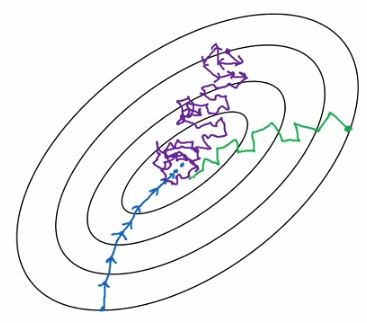
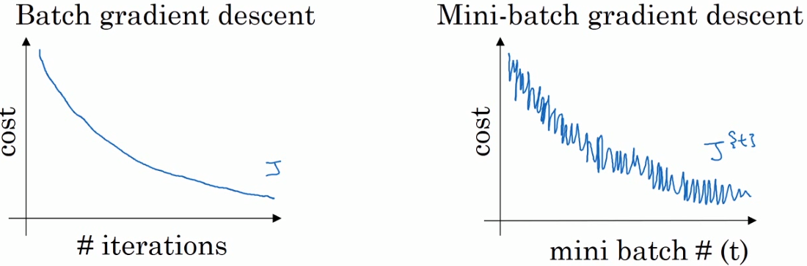

# （一）mini-batch梯度下降

## 目的

充分利用大规模数据集

## 手段

把大数据集分成多个小数据集，每轮梯度下降只是用一个小数据集。

（传统方法（batch梯度下降）：每次梯度下降使用全部训练集。注：设全部训练集有m个样本，每次梯度下降中，每一个样本都有自己的J，而这次梯度下降的J是m个样本的J的平均值。）

## 优点

1. 向量化
2. 不用跑完全部训练集就可以得到进展并且开始下一步工作

## batch梯度下降的缺点

1. 样本数量大的时候，单次迭代耗时太长

## 随机梯度下降的缺点

1. 失去了向量化带来的所有加速

## 相关超参数

### mini-batch size

一个小数据集所含样本的数量。若为m，则为batch梯度下降法；若为1，则为随机梯度下降法。

随即梯度下降法永远不会收敛到J的最小值，而是最终会在最小值附近摆动。

size=m为蓝色，size=1为紫色，其他size的图像：绿色。

## 理解

定义梯度下降时使用一次全部样本集合为**一代**。

1. batch梯度下降的J会不断下降；mini-batch梯度下降的J不一定会不断下降，但是整体呈现下降趋势。

   

2. 两者都需要多次遍历全部数据集才会有效果。在mini-batch中，如果只经历一代，那么梯度下降的效果虽然比batch一代好，但总体效果仍是微小的。

3. 使用mini-batch时，每重新开始遍历一次数据集，应当把数据集中的数据重新打乱分配到mini-batch中，体现出随机性

## 如何选择mini-batch size

1. 小训练集：使用batch gradient decent（m less than 2000）
2. 通常的minibatch size：64-128-256-512

# （二）指数加权移动平均线

## 定义

指数加权移动平均线是一种特殊的加权移动平均线。与一般的加权移动平均线一样，指数加权移动平均线也采取前沿加重方式。

不过，与其它移动平均方法不同的是，在指数加权[移动平均值](https://baike.baidu.com/item/移动平均值)的计算方法中，包括的不是一段数据，而是**所有历史数据**。在这种移动平均方法中，对全部历史价格数据分配了逐步减少的权重。每一个价格数据的权重都对后来的一个价格数据的权重按照指数形式递减，因此，这种方法就得到了所谓指数加权移动平均线的名称。

**具体加权过程举例**

## 算法及举例

假设英国去年第$$i$$天的气温是$$\theta_i$$

要用一条曲线拟合温度变化，可以进行如下操作

计算v
$$
v_0=0	\\
v_t=\beta v_{t-1}+(1-\beta)\theta_t
$$
其中$v_t$是第t天附近的$\frac{1}{1-\beta}$天的平均天气。

> 为什么这么规定？
>
> 因为（1-t）^1/t^约等于1/e（数学中一个挺重要的数）
>
> 这说明$\frac{1}{1-\beta}$天之外的数所占的权重总共不到1/e，不那么值得关注了

可以看出，$\beta$越大，平均的天数越大，拟合得越粗略。

红色：$\beta=0.9$；绿色：$\beta=0.98$

## 为什么使用这样的平均数

普通的平均数（求和除以数据个数）：需要保存较多最近数据，占用存储空间，计算较慢

指数加权平均数：迭代计算，计算下一个平均数只需要上一个计算出的平均数和当日数值，虽然损失了精确性，但是节省空间、计算较快。（对于精确性的损失大小也是灵活的，这是一个优点）

# （三）指数加权平均的偏差修正

## 目的

使平均数运算更加准确

## 方法

令上一节中的v~i~成为中间值，令真正的第i天的平均数为u~i~，那么
$$
u_i=\frac{v_i}{1-\beta^{i}}
$$
在算法的初期，由于v0=0，v1=beta * v0 + （1-beta）* theta_1 = （1-beta）* theta_1，前几个v_i的值会非常的小，如图中紫线。当迭代到一定数量之后，拟合才变得正常（紫线逼近绿线）。因此用以上公式进行修正。公式中的分母在i=1时，会使u_i=v_i，同理也会使之后的几个数适当的拟合向正常的值，而i足够大后，便不会再对平均数造成什么影响了。

# （四）动量梯度下降法 (Gradient descent of Momentum)

## 目的

加快梯度下降的速度

## 基本原理

如图

蓝线是一般梯度下降的成本函数值迭代情况，红线是动量梯度下降法中成本函数迭代境况。

我们使用指数加权平均来计算新的dW和db。在竖直方向上，由于平均值接近0，所以动量梯度下降的竖直方向迭代值接近0 。在水平方向上，动量梯度下降的迭代值则为正常水平。

这可以用一个球在碗中向下滚来比喻。

在这个式子中，等号右侧的v_dW 可以看作速度，dW可以看作加速度。

beta通常取0.9，在这个问题中0.9是一个鲁棒性非常好的数字。

## 超参数

alpha：学习率

beta：指数加权平均用的权重值，一般取0.9

## 算法

# （五）RMSprop

## 目的

加快梯度下降速度

## 优点

使用它的时候可以适当加大学习率

## 基本原理

如图，我们不想要绿线，而想要蓝线。

我们需要计算一个额外变量S，S等于目前数据附近水平方向或竖直方向的dX的方差。

我们在更新数据（W、b）的时候，把原来要减掉的dX除以这个方差，那么方差大的方向变化量就减少，方差小的方向变化量就仍处于正常水平甚至增大。

## 超参数

beta2：与monentum中的beta做区分。

# （六）Adam

## 简介

adam是训练神经网络中最有效的优化算法之一。它结合了momentum和RMSprop。

## 工作方式

1. 计算上一个梯度的指数加权平均，存储在v中。
2. 计算上一个梯度指数加权平均的平方，存储在s中。
3. 使用adam的规则更新参数。

## 优点

1. 通常比较节省内存（尽管还是比GD和momentum多）
2. 即使在低学习率条件下也能运行得很好

## 算法

The update rule is, for $l = 1, ..., L$:
$$
\begin{cases}
v_{dW^{[l]}} = \beta_1 v_{dW^{[l]}} + (1 - \beta_1) \frac{\partial \mathcal{J} }{ \partial W^{[l]} } \\
v^{corrected}_{dW^{[l]}} = \frac{v_{dW^{[l]}}}{1 - (\beta_1)^t} \\
s_{dW^{[l]}} = \beta_2 s_{dW^{[l]}} + (1 - \beta_2) (\frac{\partial \mathcal{J} }{\partial W^{[l]} })^2 \\
s^{corrected}_{dW^{[l]}} = \frac{s_{dW^{[l]}}}{1 - (\beta_1)^t} \\
W^{[l]} = W^{[l]} - \alpha \frac{v^{corrected}_{dW^{[l]}}}{\sqrt{s^{corrected}_{dW^{[l]}}} + \varepsilon}
\end{cases}
$$
其中：

- t是adam进行到的步数
- L是神经网络的层数
- beta1*（建议使用0.9）和beta2（建议使用0.999）是控制两个指数加权平均的超参数
- alpha是学习率
- epsilon是一个用来放置分母为0的值很小的数

# （七）学习率衰减

## 做法

在不同的代（epoch）上使用递减的学习率

## 几种公式

$$
{
\alpha=\frac{1}{1+decayrate*epochnum}*\alpha_0	\\
\alpha=a^{epochnum}*\alpha_0	\\
\alpha=\frac{k}{\sqrt{epochnum}}*\alpha_0	\\
手动调整\alpha的值
}
$$

# （八）局部最优的问题

1. 在神经网络规模较大、参数较多的时候，实际上很难达到局部最优点，更有可能达到的是鞍点。因此梯度下降被困在局部最优点不是很大的问题。
2. 鞍点会减缓学习速度，而momentum、RMSprop、Adam正式可以解决这种问题

