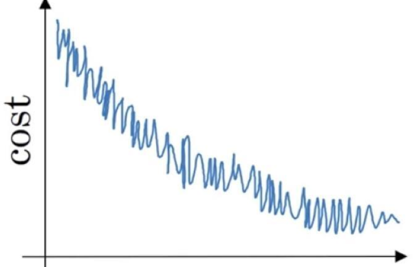
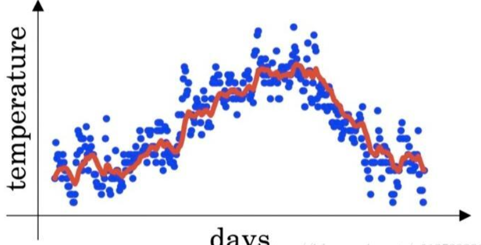
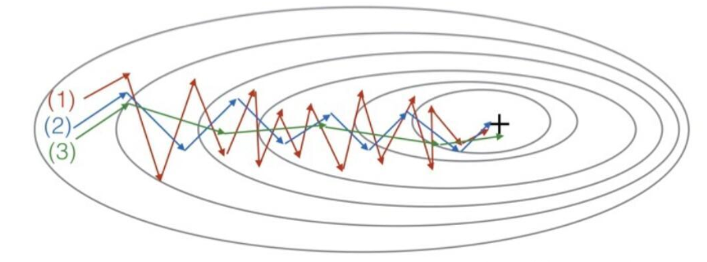

# 第一周

## Week 1 Quiz - Practical aspects of deep learning

1. If you have 10,000,000 examples, how would you split the train/dev/test set?

   - 98% train . 1% dev . 1% test

   > 少量数据可能采用6:2:2，但是大数据时代使用较高比例的验证集和测试集会浪费大量的运行时间。验证集、测试集样本数量以不超过10000为宜

2. The dev and test set should:

   - Come from the same distribution

   > 翻译：来自同一个数据集

3. If your Neural Network model seems to have high variance, what of the following would be promising things to try?

   - Add regularization
   - Get more training data

   > 方差大了，说明产生过拟合问题，可以正则化使其拟合程度适量下降，可以增加样本数减少噪声样本所占的比例

   Note: Check [here](https://user-images.githubusercontent.com/14886380/29240263-f7c517ca-7f93-11e7-8549-58856e0ed12f.png).

4. You are working on an automated check-out kiosk for a supermarket, and are building a classifier for apples, bananas and oranges. Suppose your classifier obtains a training set error of 0.5%, and a dev set error of 7%. Which of the following are promising things to try to improve your classifier? (Check all that apply.)

   - Increase the regularization parameter lambda
   - Get more training data

   > 训练集错误率远低于开发集，说明过拟合。由第三题得到答案。

   Note: Check [here](https://user-images.githubusercontent.com/14886380/29240263-f7c517ca-7f93-11e7-8549-58856e0ed12f.png).

5. What is weight decay?

   - A regularization technique (such as L2 regularization) that results in gradient descent shrinking the weights on every iteration.

   > 每次梯度下降的时候使用技巧让权重的值多下降一些，同时控制好度，防止梯度爆炸或消失。

6. What happens when you increase the regularization hyperparameter lambda?

   - Weights are pushed toward becoming smaller (closer to 0)

   > 权重会变得更小（接近0）

7. With the inverted dropout technique, at test time:

   - You do not apply dropout (do not randomly eliminate units) and do not keep the 1/keep_prob factor in the calculations used in training

   > 测试的时候不要使用dropout，也不要给A除以一个keep_prob。
   >
   > 只有在正式训练的时候才使用dropout

8. Increasing the parameter keep_prob from (say) 0.5 to 0.6 will likely cause the following: (Check the two that apply)

   - Reducing the regularization effect
   - Causing the neural network to end up with a lower training set error

   > 削弱正则化效果
   >
   > 导致神经网络在训练集上的错误率低一些

9. Which of these techniques are useful for reducing variance (reducing overfitting)? (Check all that apply.)

   - Dropout
   - L2 regularization
   - Data augmentation

   > dropout
   >
   > L2正则化
   >
   > 数据集扩充

10. Why do we normalize the inputs x?

    - It makes the cost function faster to optimize

    > 可以使梯度下降速度更快（参见笔记中的椭同心圆和圆同心圆的对比图）

# 第二周

1. Which notation would you use to denote the 3rd layer’s activations when the input is the 7th example from the 8th minibatch?

   - a^[3]{8}(7)

   Note: **[i]{j}(k)** superscript means **i-th layer**, **j-th minibatch**, **k-th example**

2. Which of these statements about mini-batch gradient descent do you agree with?

   - You should implement mini-batch gradient descent without an explicit for-loop over different mini-batches, so that the algorithm processes all mini-batches at the same time (vectorization).

     > 这个做不到，因为每过一个mini-batch都要单独进行一次梯度下降，如果把minibatch向量化了那顶多每过一个向量化的矩阵才进行一次梯度下降

   - Training one epoch (one pass through the training set) using mini-batch gradient descent is faster than training one epoch using batch gradient descent.

     > 不对。使用batch遍历一次数据集使用的是向量化的方法。而使用minibatch要多一层forloop，而且还要花费很多进行梯度下降的时间

   - One iteration of mini-batch gradient descent (computing on a single mini-batch) is faster than one iteration of batch gradient descent.

     > 对，因为minibatch做一次梯度下降使用的样本数量要少得多

   Note: Vectorization is not for computing several mini-batches in the same time.

3. Why is the best mini-batch size usually not 1 and not m, but instead something in-between?

   - If the mini-batch size is 1, you lose the benefits of vectorization across examples in the mini-batch.
   - If the mini-batch size is m, you end up with batch gradient descent, which has to process the whole training set before making progress.

   > 正如以上所说，我们要在整体速度和迭代速度间做出权衡

4. Suppose your learning algorithm’s cost ***J\***, plotted as a function of the number of iterations, looks like this:

   

   - If you’re using mini-batch gradient descent, this looks acceptable. But if you’re using batch gradient descent, something is wrong.

   Note: There will be some oscillations when you’re using mini-batch gradient descent since there could be some noisy data example in batches. However batch gradient descent always guarantees a lower ***J\*** before reaching the optimal.

   > minibatch具有一定随机性，而batch每次得到的J一定成下降趋势

5. Suppose the temperature in Casablanca over the first three days of January are the same:

   Jan 1st: θ_1 = 10

   Jan 2nd: θ_2 * 10

   Say you use an exponentially weighted average with β = 0.5 to track the temperature: v_0 = 0, v_t = βv_t−1 + (1 − β)θ_t. If v_2 is the value computed after day 2 without bias correction, and v^corrected_2 is the value you compute with bias correction. What are these values?

   - v_2 = 7.5, v^corrected_2 = 10

   > 计算即可

6. Which of these is NOT a good learning rate decay scheme? Here, t is the epoch number.

   - α = e^t * α_0

   Note: This will explode the learning rate rather than decay it.

   > 学习率会不断上升，不符合我们的需求。minibatch在J接近最小值的时候会在J附近震荡，此时我们需要降低学习率来降低震荡的幅度，使J更有可能更接近最小值

7. You use an exponentially weighted average on the London temperature dataset. You use the following to track the temperature: v_t = βv_t−1 + (1 − β)θ_t. The red line below was computed using β = 0.9. What would happen to your red curve as you vary β? (Check the two that apply)

   

   - Increasing β will shift the red line slightly to the right.
   - Decreasing β will create more oscillation within the red line.

   > 此方法计算的是某天之前所有天（附近$\frac{1}{1-\beta}$天的权重尤其大）的加权平均值。增大beta，权重较大的日子增加，平均值收到过去的影响增大，使得图像轻微右移。减小beta，权重大的日子减少，平均值反应的只是近几日较少的日子的平均，因此图线的震荡增加

8. Consider this figure:

   

   These plots were generated with gradient descent; with gradient descent with momentum (β = 0.5) and gradient descent with momentum (β = 0.9). Which curve corresponds to which algorithm?

   (1) is gradient descent. (2) is gradient descent with momentum (small β). (3) is gradient descent with momentum (large β)

9. Suppose batch gradient descent in a deep network is taking excessively long to find a value of the parameters that achieves a small value for the cost function J(W[1],b[1],…,W[L],b[L]). Which of the following techniques could help find parameter values that attain a small value forJ? (Check all that apply)

   - [x] Try using Adam
   - [x] Try better random initialization for the weights
   - [x] Try tuning the learning rate α
   - [x] Try mini-batch gradient descent
   - [ ] Try initializing all the weights to zero（无法破坏对称性）

10. Which of the following statements about Adam is False?

    - Adam should be used with batch gradient computations, not with mini-batches.

    Note: Adam could be used with both.

    > 俩都行

# 第三周

1. If searching among a large number of hyperparameters, you should try values in a grid rather than random values, so that you can carry out the search more systematically and not rely on chance. True or False?

   **False**

   Note: Try random values, don’t do grid search. Because you don’t know which hyperparamerters are more important than others.

   > 因为你往往不知道哪个参数更重要
   >
   > 举个极端的例子，学习率和用于防止除0的epsilon，那当然不需要使用网格，显然学习率更重要

   > And to take an extreme example, let’s say that hyperparameter two was that value epsilon that you have in the denominator of the Adam algorithm. So your choice of alpha matters a lot and your choice of epsilon hardly matters.

2. Every hyperparameter, if set poorly, can have a huge negative impact on training, and so all hyperparameters are about equally important to tune well. True or False?

   - [x] False
   - [ ] True

   > We’ve seen in lecture that some hyperparameters, such as the learning rate, are more critical than others.
   >
   > 显然学习率最重要。在笔记中有转载超参数优先级排列，可以参看。

3. During hyperparameter search, whether you try to babysit one model (“Panda” strategy) or train a lot of models in parallel (“Caviar”) is largely determined by:

   - Whether you use batch or mini-batch optimization
   - The presence of local minima (and saddle points) in your neural network
   - **The amount of computational power you can access**
   - The number of hyperparameters you have to tune

   > 电脑比较好就用鱼子酱，电脑不太行就用熊猫

4. If you think β (hyperparameter for momentum) is between on 0.9 and 0.99, which of the following is the recommended way to sample a value for beta?

   ```python
   r = np.random.rand()
   beta = 1 - 10 ** (-r - 1)12
   ```

   > 因为beta越接近1越敏感，因此需要给不同的数量级相同的资源，而不是在线性数轴上随机取样

5. Finding good hyperparameter values is very time-consuming. So typically you should do it once at the start of the project, and try to find very good hyperparameters so that you don’t ever have to revisit tuning them again. True or false?

   - [x] False
   - [ ] True

   Note: Minor changes in your model could potentially need you to find good hyperparameters again from scratch.

   > 模型中的细微变化可能导致您需要从头开始重新找到好的超参数。

6. In batch normalization as presented in the videos, if you apply it on the lth layer of your neural network, what are you normalizing?

   - z^[l]

   > 而非a^[l]

7. In the normalization formula, why do we use epsilon?

   - To avoid division by zero

8. Which of the following statements about γ and β in Batch Norm are true?

   - They can be learned using Adam, Gradient descent with momentum, or RMSprop, not just with gradient descent.
   - They set the mean and variance of the linear variable z^[l] of a given layer.

9. After training a neural network with Batch Norm, at test time, to evaluate the neural network on a new example you should:

   - Perform the needed normalizations, use μ and σ^2 estimated using an exponentially weighted average across mini-batches seen during training.

   > 对样本的处理要在各个输入集上同步

10. Which of these statements about deep learning programming frameworks are true?

    - √  A programming framework allows you to code up deep learning algorithms with typically fewer lines of code than a lower-level language such as Python.
    - √  Even if a project is currently open source, good governance of the project helps ensure that the it remains open even in the long term, rather than become closed or modified to benefit only one company.
