# （一）什么是ML策略

假设你正在训练猫模型，精确度已经达到90％，为了进一步优化效果，你可能会想

- 收集更多数据
- 收集不同姿势的猫图
- 使用不同算法
- 多梯度下降一会
- 用不同规模的神经网络
- 试试dropout
- 试试L2正则化
- 修改网络架构
- ……

问题是，如果选错了方法，你可能会浪费大量的时间。

ML策略就是如何选择正确方法的策略

# （二）正交化

搭建机器学习系统的挑战之一是：可以调的东西太多了；

我们希望调整每一项可调整的东西时，系统只会有一种性质发生改变。

## 举例

你不希望你的汽车由图片下方的两行算式绑定的两个操作轴所控制，虽然他们也能把车调到任意想要的方向和速度

你更想要一个轴调速度，一个轴调角度

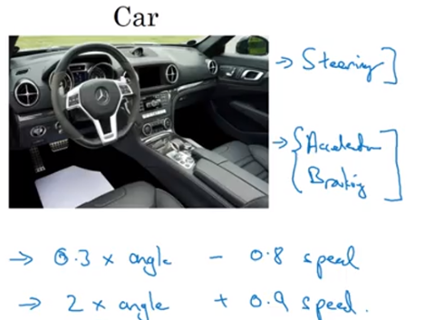

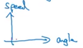

## 调模型的过程

1. 希望在训练集上得到好结果
2. 希望在开发集上得到好结果
3. 希望在测试集上得到好结果
4. 希望在应用中得到好结果

## 正交化的目的

1. 使用一组调节方法，调节他们使得在训练集上得到好结果
   - 使用更大的神经网络
   - 使用更好的优化函数
2. 使用一组调节方法，调节他们使得在训练集上结果不变，在开发集上的结果改变，直到得到好结果
   - 正则化
   - 使用更大的训练集
3. 使用一组调节方法，调节他们使得在训练集和开发集上结果不变，在测试集上的结果改变，直到得到好结果
   - 使用更大的开发集
4. 使用一组调节方法，调节他们使得训练集、开发集和测试集上结果不变，在应用中效果改变，直到得到好结果
   - 开发集不精确/成本函数没有估计正确的事物

# （三）单一数字评估指标

## F~1~

**以猫猫分类器器为例，我们定义查准率和查全率**

查准率（precesion）：在你的分类器标记为猫的例子中，有多少百分比真的是猫

查全率（recall）：对于所有真猫的图片，你的分类器正确识别出了多少百分比

然而用两个指标评估一个分类器的效果是不爽的，要是能有一个单个的评估指标，把查准率和查全率结合起来就好了。

**我们使用查准率（p）和查全率（r）的调和平均数**
$$
F_1=\frac{2}{\frac{1}{p}+\frac{1}{r}}
$$
来作为这个指标

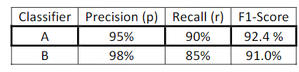

## 使用平均数

下图中表示某算法在某地区运行时的误差

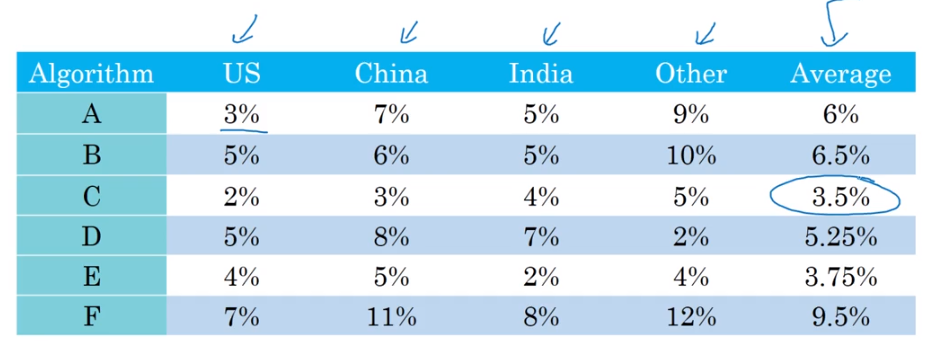

通过计算每个算法的平均误差，找到效果最好的算法，这里是C

# （四）满足和优化指标

举个例子

现在我们有了猫猫分类器的精确度的定义，也就是F~1~，现在我们还需要考虑识别图片的速度，把精确度和对速度的考虑结合起来。

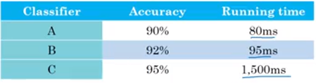

我们可能用一个精确度和运行速度的线性组合来评判整体性能，但这样实际上不太好，有些刻意。万一我精确度特别高、但运行时间难以接受该怎么办？

这时，我们可以规定，在running time小于100ms条件下，寻找最好的accuracy。

此时，accuracy就是优化(optimizing)指标，running time就是满足(satisficing)指标

那么这个例子中最好的就是B。

**总结**

如果你要顾及多个指标，其中有一个优化指标、一个或多个满足指标，现在你就有了新方法来找到“最好的”情况。

# （五）训练、开发、测试集

开发集==保留交叉验证集

## 不同集合的使用条件

用训练集训练不同的模型，然后用开发集评估不同的思路，然后选择一个，不断迭代去改善开发集的性能，然后得到一个满意的结果，然后用测试集去评估

## 设定目标：开发集+单一数字评估指标

要注意的是，这个目标和最后的测试集瞄准的目标一定要是相同的。否则的话，结果就会非常差，导致不得不倒退工作进度重新做许多工作

## 设定开发集和测试集的原则

在设立开发集和测试集时，要选择这样的开发集和测试集，能够反映你未来会得到的数据、认为很重要的数据、必须得到好结果的数据。特别是，这开发集和测试集必须来自同一个分布。而且，要继续收集类似的数据时，也一定要随机分配到开发集和测试集上。这样你才能瞄准想要的目标，让团队高效迭代，来逼近同一个目标。

## 开发集和测试集的大小

机器学习初期，数据量比较少（<10000或更多一些），训练：开发：测试 = 7:1.5:1.5是比较合理的

现在，数据量很大，然而开发集、测试集实际上有10000或100000或是多少的数据就够了，这样就不是7：1.5：1.5分布了

也可以不设测试集，只设训练集和开发集（用训练集训练模型，用开发集迭代）（这种分法是不被建议的，只有训练集很大、不容易过拟合的时候，才可能这么做）

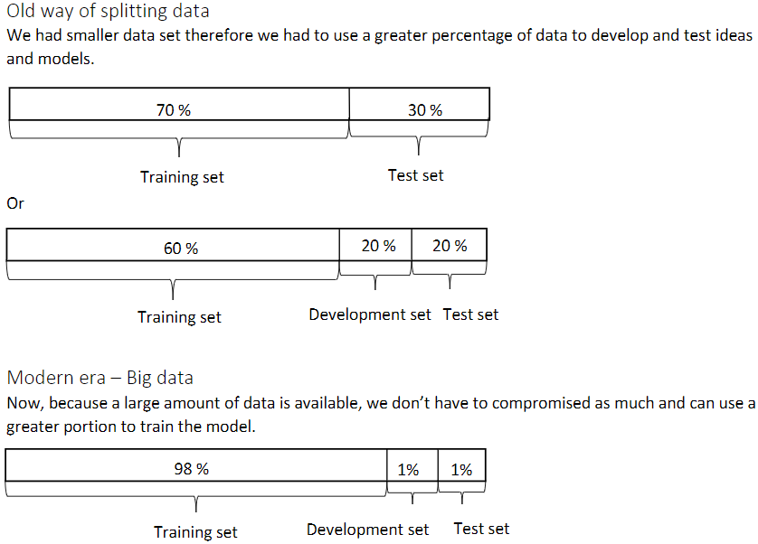

## 什么时候改变开发集、测试集、评估指标

## 答案

1. 出现新指标，需要与老指标结合考虑
2. 你的开发集和测试集在指标上表现很好，在实际应用上，你关注的地方表现不好

## 举例

如果你在为推送公司做猫猫图片推送器，评估指标是猫猫识别的准确率。现在有两个模型。第一个模型有3％错误率，出错的时候都是把色图当成猫推送给客户了。第二个模型有5％错误率，出错的时候绝对不会推送色图。实际上肯定是第二个模型对公司好。但是你的指标会告诉你第一个模型好。

这时你就需要改变评估指标了，或者改变开发集或测试集。

以下是可能的解决方案，这里不作重点。建议跳过。

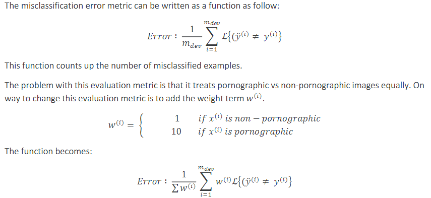

## 建议

1. 可以先快速确定指标，以促进团队迭代速度
2. 不要在没有指标的情况下工作很久，这会减慢团队迭代和改善算法的速度

# （六）人的表现

## 机器学习准确率上升规律

如今，机器学习算法由于高效和在应用中表现很好，已经可以达到人类水平的表现了。而且，设计和搭建机器学习系统的速度，也要比以前快很多。

而且，有些任务由人来做接近完美，比如图像识别和声音识别，这就是机器学习想达到人类水平表现的原因。

下图展示了人类、机器学习随时间变化，表现的变化。

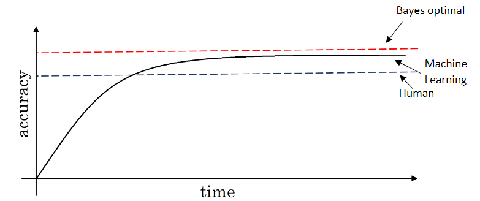

当机器学习表现超过人类的时候，它的学习速度会下降。

原因一：人类表现很可能非常接近贝叶斯最优误差，尤其是在自然信息处理方面。

原因二：当机器学习的表现比人差时，人可以用不同的工具来提升其表现。当机器学习表现超过人时，那些工具就不太好用了

工具：

- 用人力制作标签数据。
- 人力领悟：为什么人能做对，机器就不行？
- 对平均数和方差做更好的分析。

贝叶斯误差：最小可能误差。它意味着任何可能的算法的精确度都无法超越。

## 可避免误差

通过了解人类等级的表现是什么样的，我们可以判断一个训练集表现的好坏。

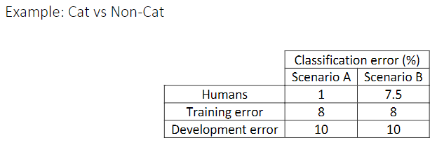

在第一列中，人类错误率和训练错误率差的很多，很可能是模型拟合不好，应该着重于减少偏差(bias)。
在第二列中，人类错误率和训练错误率相差较少，相对而言训练集和开发集错误率相差较大，在实际情况下，我们可以把人类错误率看作贝叶斯误差，那么此时我们将不再追究那0.5的偏差，而应该将工作重心放在减小方差上（降低开发集的错误率直到接近训练集）。

人类水平误差衡量了可避免误差（Scenario A中是偏差，Scenario B中是方差）。

## 理解“人的表现”这个词

**人类水平误差的定义**

人类水平误差是贝叶斯误差的替代品。

如果你想要代替或估计贝叶斯误差，而你的认知中，人类水平误差最低为0.5％（最好是统计数据，而不是捏造出来的估计），那么也许人类可以有更低的误差，但贝叶斯误差绝对不会高于0.5％了。此时，我们就可以将人类水平误差定义为0.5％。如果你的目标是让这个机器学习系统代替一个普通人的误差水平，也许是1％，那么你也可以将人类水平误差定义为1％。但是，你必须将贝叶斯误差定义为0.5％。

 **人类水平误差的应用之一**

对人类水平有大概的估计，可以让你做出对贝叶斯误差的估计，这样可以让你快速做出决定，是否应该专注于减少算法的偏差或方差，这个决策技巧通常很有效，直到你的系统性能开始超越人类，那时你对贝叶斯误差的估计就不再准确了。

## 机器表现超越人类

处理结构化数据、喂给足够多数据，很多机器学习系统在单一监督问题上可以超越人类。比如判断广告是否会被点击，某人能否还贷。

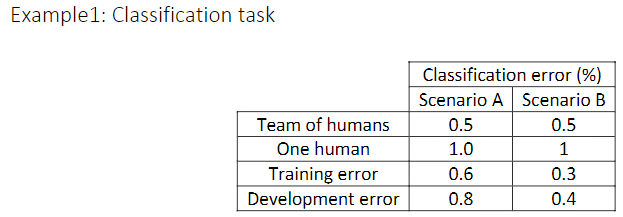

在场景A中，偏差是0.1％，方差是0.2％，总之都不如人类，我们可以先从方差入手增加精准度。

在场景B中，训练错误率和开发错误率都比已知的人类水平低。我们无法判断此时的贝叶斯误差是多少，我们的偏差能否继续修正。这不意味着模型不能再改进了，只是意味着传统的改进手段在这种情况下基本不会生效了。

# （七）改善模型表现

## 监督学习的两个基本假设

1. 有一个低的可避免偏差，这说明训练集拟合得很好。
2. 有一个低的或可接受的变量，这说明训练集的性能可以很好地推广到开发集和测试集。

如果人误差和训练集误差的差距比训练集和开发集的大，关注点就应该在减小偏差上。例如：训练更大的模型、训练更久、改变神经网络结构、尝试各种各样的超参数搜索。

如果训练集和开发集的差距比人误差和训练集误差的大，关注点就应该在减小方差上。例如：使用更大的数据集、正则化、改变神经网络结构、尝试各种各样的超参数搜索。

## 总结

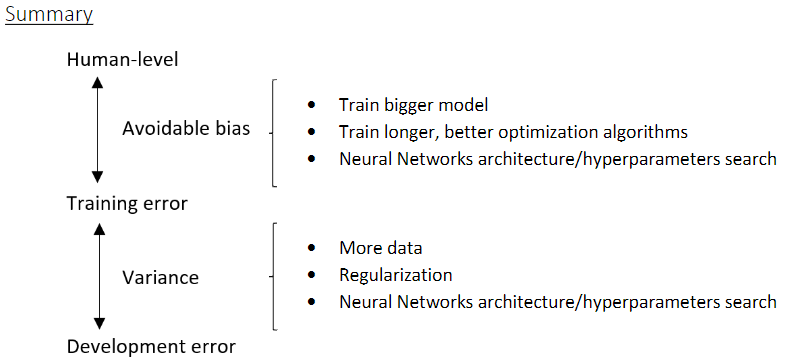

# （八）误差分析

## 定义

人工分析算法中的错误，以寻找模型中的问题

## 举例

在做猫分析器（错误率10%）的过程中，发现把一些狗识别为了猫。是否需要花几个月做一个处理狗图的项目，以辅助猫分析器？

建议：

首先进行错误分析

- 收集一百个错误标记的开发集的例子
- 手动数一数有几个是狗

假设有5%是狗。这说明就算完全解决了狗的问题，也只能修正错误中的5%。那么就不应该去做这个狗项目。

假设有50%是狗，那么显然值得去做这个狗项目。

另外，还有可能是把一些其他猫科动物识别成了猫，或者有图片模糊的问题。

这个错误分析过程可以在电子表格中进行。

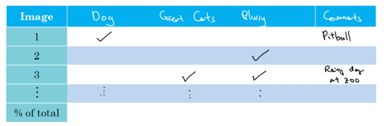

然后记录各个问题的百分比。另外，在这个过程中，你可能发现instagram的照片滤镜也可能对分类器有影响，于是你就在电子表格再加一列。

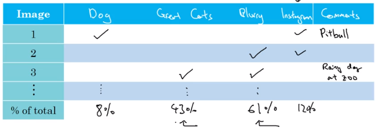

在这个过程中，你可能归纳出新的解决问题的方法。

# （九）正确标注开发集数据

## 若训练集中标签数据有误

深度学习模型对随机误差是非常鲁棒的，因此如果是随机误差，那无伤大雅，但是系统误差是危险的。比如猫分类器中，训练集中的所有白色狗都被标记为猫，那么未来识别过程中所有白狗都会被识别为猫

若开发集或测试集中标签数据有误

## 根据上节内容进行错误分析，再加一列错误标记

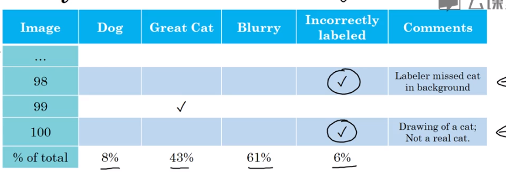

你可以统计因为标签错误二产生错误的百分比

## 原则

- 对数据集的修改要同时作用到开发集和测试集上（使分布相同）
- 同时检验算法判断正确和判断错误的例子（通常不这么做，因为判断正确的例子太多了，不好检验）
- 开发集和测试集要分布相同，训练集的分布有一点不同没关系，通常这是一件很合理的事情。

## 建议

有的人感觉人工去做修正和调整很low，但是这其实很有效，对团队的帮助很大，有利于找到新的目标。因此不要反感人工干预、人工分析这类工作。

# （十）快速搭建第一个系统原型，然后迭代

- 设定开发集和测试集，设定评估指标
- 马上搭好一个机器学习系统原型，然后找到一个训练集，训练一下，看看效果
- 使用偏差/方差分析、误差分析， 来确定下一步优先做什么

# （十一）在不同的划分上进行训练并测试

假设你在做识别猫的app

你的训练样本都是高清图，但是用户上传了模糊图。

你现在有了两个数据来源，一个是你真正关心的数据分布——来自用户上传的数据。另一个是用爬虫程序挖掘网页直接下载。

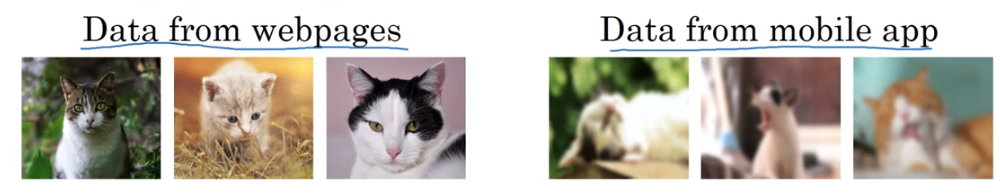

现在情况是，属于你想要的分布的数据集数据量很少（假设为10000），而从网上爬来的数据大多不属你想要的数据分布，这种样本却很多（假设为200,000）。

然而只用想要的分布的数据训练又太少了。怎么办？

**方法1**（坏方法）：把这210000数据打乱，然后在划分为训练集、开发集、测试集

好处：三集分布相同

大坏处：大部分样本还是来自不想要的数据分布。你的大部分精力花在优化网页下载的图片上了。

**方法2**：用200000网络样本+5000手机样本做训练集，2500手机样本做开发集，2500手机样本做测试集。

好处：瞄准的目标就是想要的目标（尽量识别好手机上传的图片）

# （十二）不匹配数据划分的偏差和方差

**不匹配数据划分：**指的是训练集、开发集（、测试集）数据来自不同分布。本节研究这种情况下的误差分析方法。

假设你在做猫分类器，训练集是高清图，开发集是模糊图，训练集错误率1%，开发集错误率10%。贝叶斯误差约为0%

首先，算法只见过训练集数据，没见过开发集数据；其次，训练集与开发集的数据来自不同分布。

因为同时改变了两件事情，所以很难确定这增加的9%误差是怎么来的。

我们要做的事随机打散训练集，从中分出一部分作为训练-开发集（Training-Dev Set）。

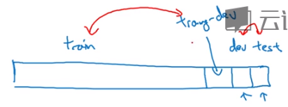

此时训练集与训练-开发集来自同一分布，开发集和测试集来自同一分布。

如果训练集错误率1%，训练-开发集错误率9%，开发集错误率10%，我们可以得出结论：误差的主要来源是方差问题。（当然，由于方差问题尚未解决，我们也无法判断算法对不同分布数据是否适应良好，）

如果训练集错误率1%，训练-开发集错误率1.5%，开发集错误率10%，我们可以得出结论：误差的主要来源是算法对不同分布数据适应性不好

如果训练集错误率10%，训练-开发集错误率11%，开发集错误率12 %，我们可以得出结论：误差的主要来源是偏差问题。

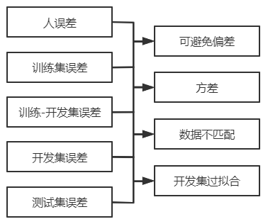

注意，开发集和测试集来自同一分布，如果开发集误差比测试集低很多，那么你很可能对开发集过拟合了。你可能需要收集更多开发集数据。

# （十三）处理数据不匹配问题

## 分析数据不匹配

- 亲自做误差分析，尝试了解 训练集与开发测试集 的具体差异。

  技术上为了防止对测试集过拟合，要做误差分析，应该只人工去看开发集而不是测试集。但你可能想知道开发集和测试集究竟有什么不同，来找到自己模型欠缺的地方。

  现在你找到了训练集中缺少识别开发集、测试集中某一类元素的能力，你可以：

- 使训练集更像开发集一点，或者收集更多类似于开发集和测试集的数据，加入训练集中，来完善你模型的能力（这与过拟合不同）。

## 人工数据合成

假设在语音识别的训练中，你想通过安静环境的人声，与汽车的噪音，的合成，来获得噪音中的人声。那么要注意的一点是，防止把重复的噪声与各不相同的人声合成到一起，因为这样可能使得算法对噪声过拟合。

在图像识别中，你的算法想识别出图像中的汽车。你用20辆汽车图和很多风景图合成了大量的训练样本。这样也是危险的，算法可能对那20辆车过拟合，导致识别不出其他模样的车。

# （十四）迁移学习

## 啥是迁移学习呢？

算法从一个任务中学到的知识可以用到另一个独立的任务中。

比如做了个猫识别器，拿去做X-光图分析了。

在下图的例子中，你把一个训练好的猫识别器的输出层拿掉，重新设置输出层、初始化输出层的参数，然后用放射科图像对这个模型进行训练。

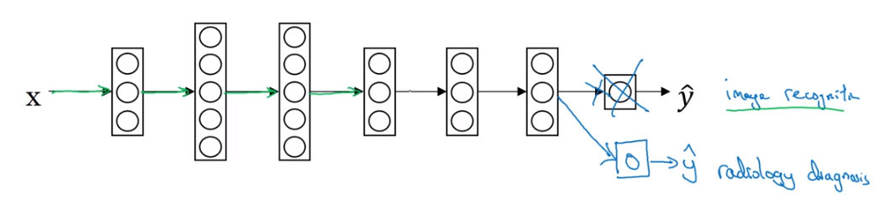

如果你用于放射科图像训练的数据量比较少，你可以只训练最后几层，如果比较多，可以把所有层都训练一下。

预训练：用猫图预先训练神经网络的权重

微调：用放射科数据训练，更新参数的权重

预训练、微调的作用：迁移学习来源的权重。

在此例中：你将图像识别的知识，迁移到了放射科诊断上。

## 为啥有效

神经网络的前几层做的是：边缘检测、曲线检测、对象阳性检测，学习关于结构信息、图像形状的知识，这些比较通用，而且对于放射科诊断也很有帮助。

## 啥时候用

- 迁移来源和迁移目标输入相同，比如都是文本，或都是图片，或都是音频
- 迁移来源的样本数据量远大于迁移目标，且你希望提高迁移目标的性能
- 迁移来源的低层次特征可以帮助 迁移目标的学习

# （十五）多任务学习

## 简介

在迁移学习中，你是先学完任务A，然后再学习任务B。

在多任务学习中，你是同时开始学习的，试图让单个神经网络同时做几件事情，希望这里每个任务都能帮到其他所有任务。

## 举例

现在你在做无人驾驶，你需要同时识别图像中的汽车、行人、红绿灯、路牌。

你有两种方案：1、做一个同时识别四个元素的神经网络，如下图

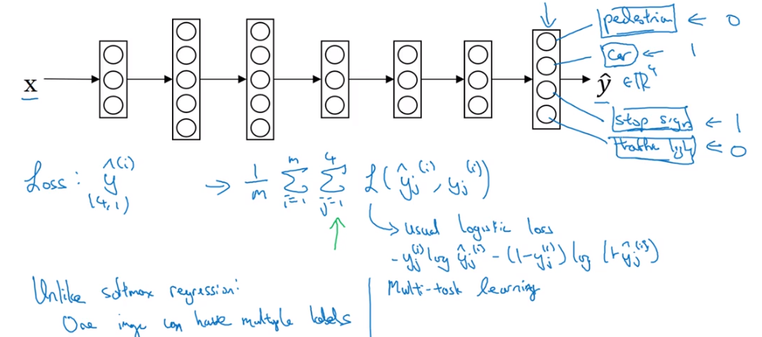

你的损失函数将是对四种元素的损失的求和，你的成本函数将是对所有样本、所有四种元素的损失求和

2、做四个二分分类器，分别检测输入图片中的四种元素。

这就出问题了，神经网络的前几层特征，对分析这四样东西都有所帮助，如果分开练四个网络，实际上相当于前几层的训练不够充分。

**题外话**

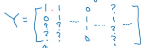

如果训练集的Y给的是这样的，就是说有些图中有没有某种元素是不确定的。这也没有关系，你计算损失函数的时候只要关注元素确定的就行了。带问号的就在求和的时候忽略那一项。

## 啥时候用

- 你训练的一组任务可以共用低层次特征
- 每个任务的数据量很接近（例如你针对单个任务每个都只有10000个数据，但你有100个任务，同时你满足其他多任务学习应有的条件，这就是很适用的情况了）
- 当你可以训练一个足够大的神经网络同时做好所有工作（Rich Carona发现多任务学习会降低学习效果的唯一情况就是神经网络不够大）

实际上多任务学习很少见（多用于计算机视觉），更常见的是迁移学习

# （十六）端到端学习

## 定义

以前有一些数据处理系统，或者学习系统，他们需要多个阶段的处理。端到端学习就是忽略这些阶段，用单个神经网络代替它。

## 举例

语音识别

输入：一段音频。输出：音频转化出的文本。

传统做法：提取特征（手工设计的音频特征）——使用机器学习找到音位（声音的基本单位）——音位合称为单词——单词串联为文本

端到端做法：｛在一个巨大的神经网络中｝输入语音——输出听写文本

## 端到端学习面对的挑战

- 需要大量的数据
- 如果数据量中等，可以使用传统做法+端到端的思想，跳过传统做法的一部分。

## 实际应用

**面部识别**

在面部识别门禁系统中，端到端就是：我们从摄像头中获取人脸数据，然后判断是否是组织内的一员

我们实际使用两步法，第一步（任务1）是从照片中识别出人脸，第二步（任务2）将人脸这部分图像裁剪好交给人脸识别程序。

理由：你没有足够的数据训练整个任务，但你有足够的数据训练任务1和任务2

**机器翻译**

传统方法：英语——提取特征——xxx——xxx——……——汉语

端到端方法：英语——汉语

**手骨图片判断年龄**

传统方法：图片——各骨头长度、相对位置等——……——年龄

端到端方法：图片——年龄

在这里由于数据量往往不够，传统方法更有优势、更可能做好

## 端到端学习的优点

- 让数据说话

  端到端的方法更能捕获数据中的统计信息，而不是被迫引入人类的成见。

  在语音识别的例子中，音位概念就是人创造出来的，不应该强迫学习算法以音位为单位思考

- 所需手工组件更少

  这可以简化你的设计工作流程

## 端到端学习的缺点

- 可能需要大量数据

- 排除了可能有用的学习组件

  数据较少的时候，我们需要手工方法直接把人类知识注入算法。

## 何时使用端到端学习

- 你是否有足够的数据，能够直接学到从x映射到y的，足够复杂的函数

在自动驾驶领域，从图像直接到行动可能很诱人，但是就目前能收集到的数据而言，这不是最有希望的做法。（而且我们训练神经网络的能力的是有限的）

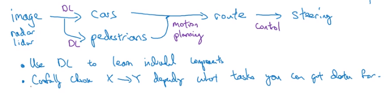

想要应用机器学习，我们必须格外关注输入输出的信息的类型
