[TOC]

# （一）计算机视觉

之前做的猫识别器分辨的都是64\*64的图像，输入是64\*64\*3维的向量。

如果我们希望分辨1000\*1000的图像，那么输入就是3000,000维，如果神经网络第一层有1000个神经元，那第一层就有3000,000,000个参数，我们很难找到足够的样本来防止这种情况下的过拟合问题。

但是我们真的希望能够分辨1000\*1000的图像，所以就要用到神奇的卷积神经网络了。

# （二）卷积运算与边缘检测

## 卷积运算方法

请看图

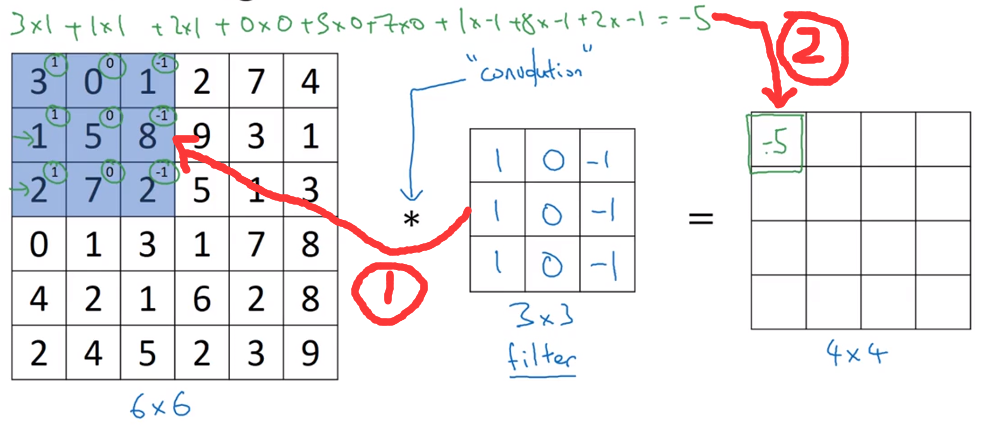

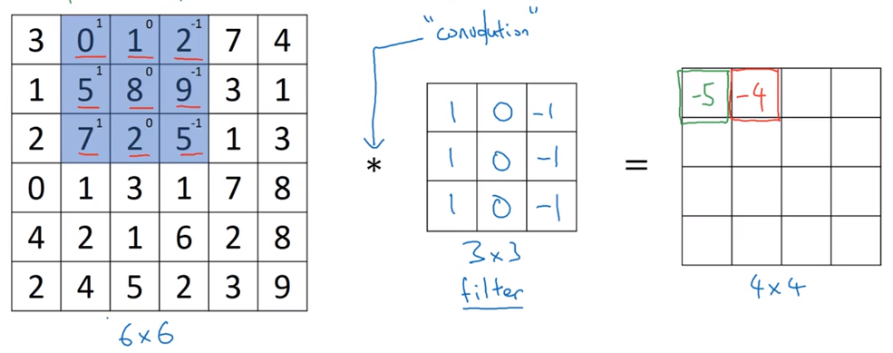

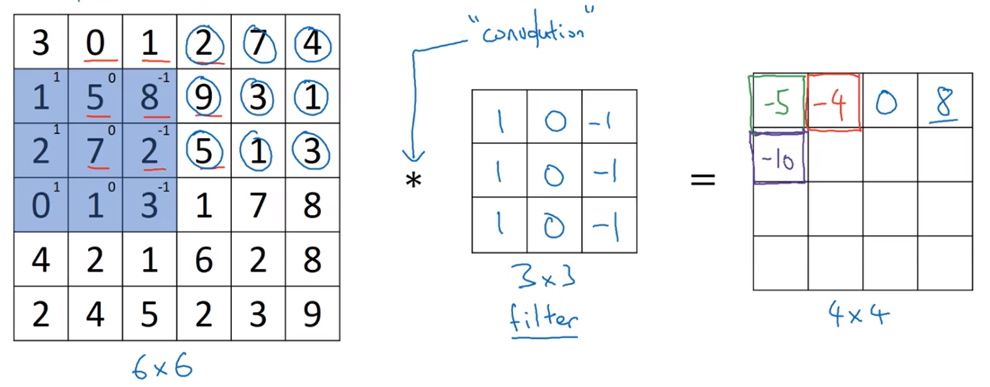

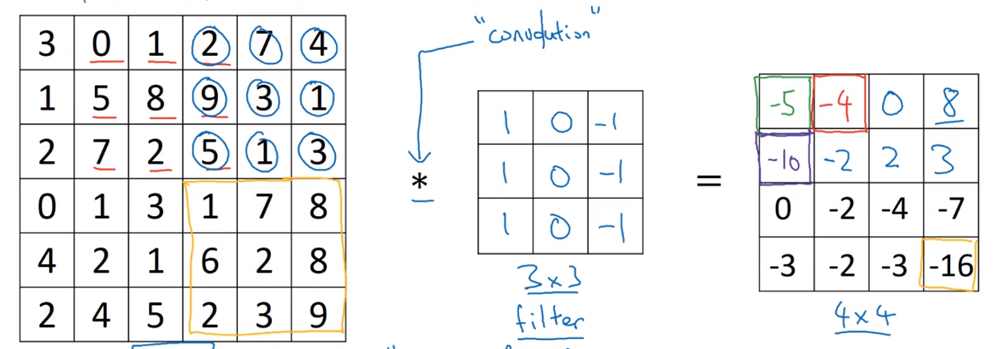

## 检测器（过滤器/filter）

**本节中的检测器均指的是卷积符号右侧的方阵**

### 垂直边缘检测器

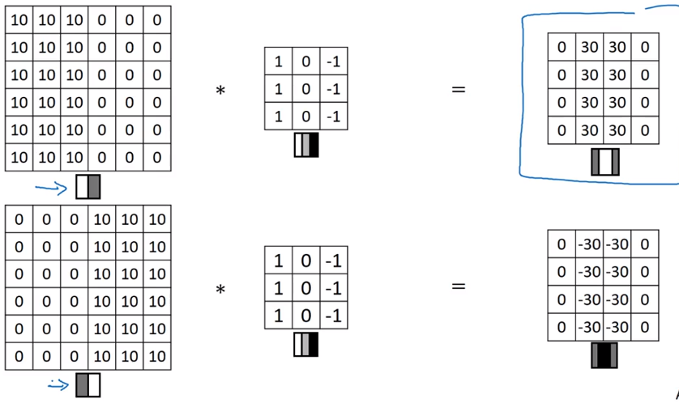

### 水平边缘检测器

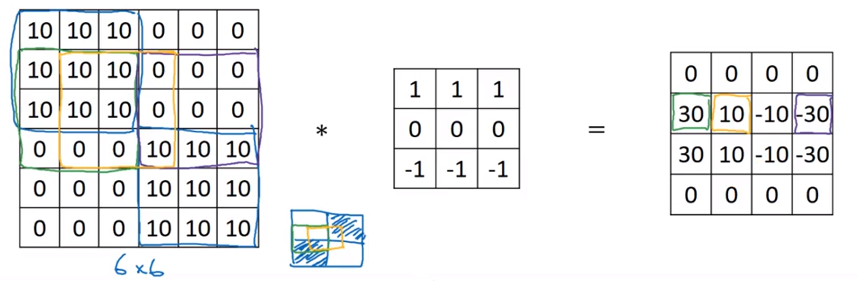

### 其他种类的过滤器

sobel filter和scharr filter

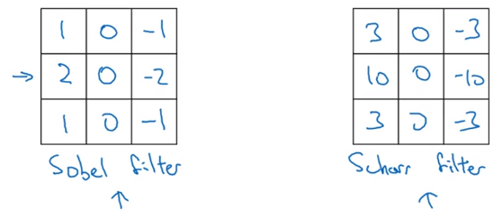

参数化的过滤器，调整参数可以使之成为任意角度的边缘检测器。其中参数可以由机器学习获得，也可以手工计算。

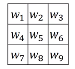

# （三）Padding（填充）

## 上一节的卷积运算的缺陷之处

- 如果对一个图做多次运算，运算结果会越来越小
- 在角落和边缘的像素点只会被用一次，这些信息会丢失

## 解决方法：Padding

引入变量p，表示在图像边缘加像素的圈数。

以下两图分别为：p=1, p=2

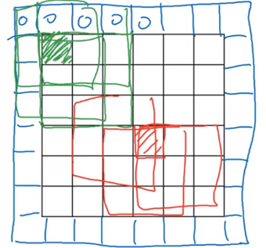

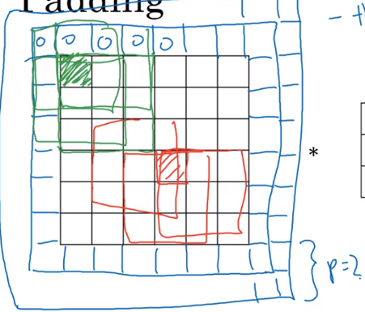

## Valid卷积

就是不进行Padding

卷积计算前后的图像尺寸变化为：
$$
(n×n)*(f×f)--->((n-f+1)×(n-f+1))
$$

## Same卷积

进行padding，使得输入大小和输出大小相同

设padding的大小是p，进行padding之后的输出大小为$n+2*p-f+1$

令$n=n+2*p-f+1$，即可解出应该做padding的大小
$$
p=\frac{f-1}{2}
$$
可能是为了padding方便，你会发现平时大家用的检测器的f一般都是奇数

## 步长不为1的卷积

步长为2的卷积运算如下：

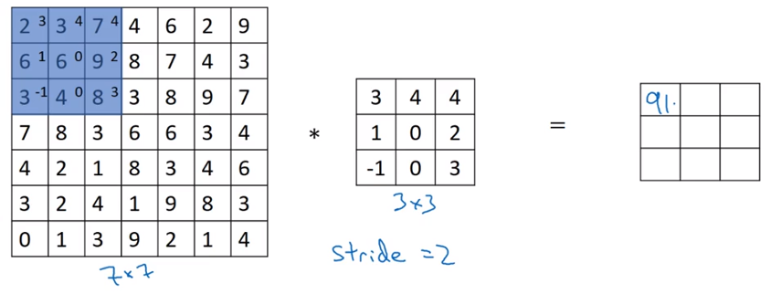

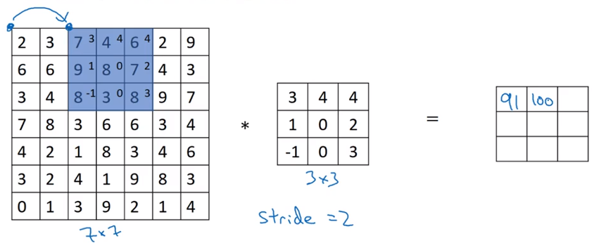

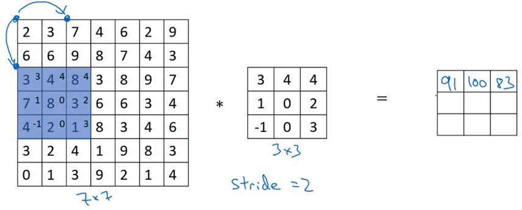

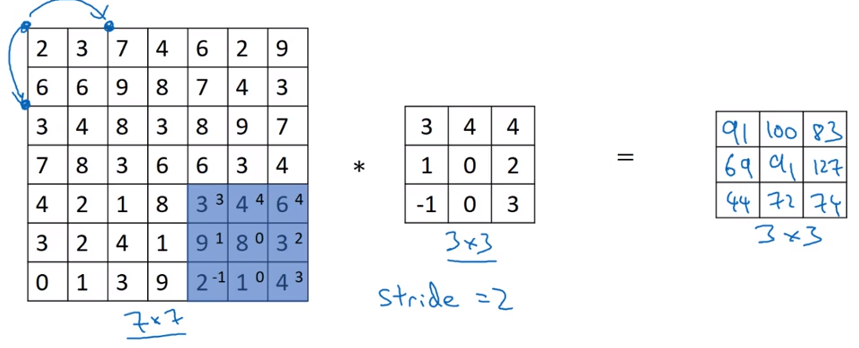

**输入输出尺寸变化如下：**

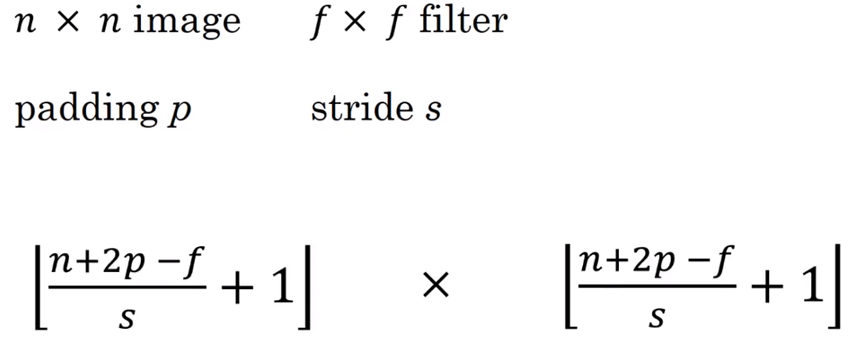

> 在数学中，卷积运算指的是，将*号右侧的方阵沿着左下到右上的轴翻转后，再做我们前文所说的操作（数学中称为互相关），这样使得卷积运算满足结合律。在机器学习中，我们就把前文那种运算成为卷积运算，因为结合律啥的在机器学习里没啥用，做两次翻转只是个麻烦。

# （四）三维立体上的卷积

## 算法

对应位置相乘，然后求和，然后放到结果方阵的相应位置上。

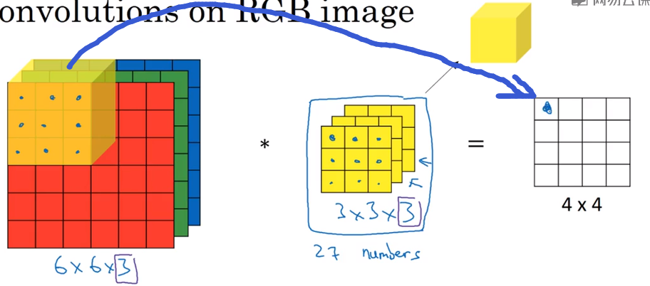

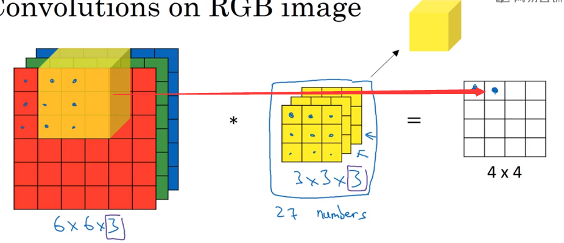

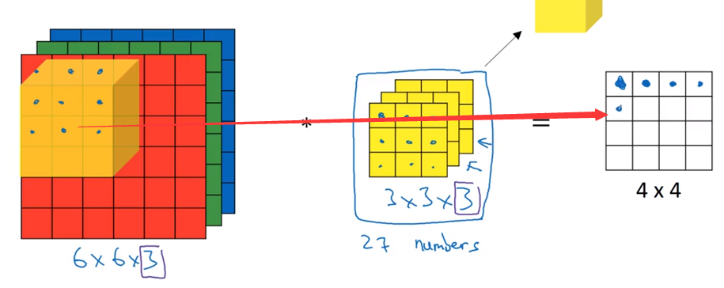

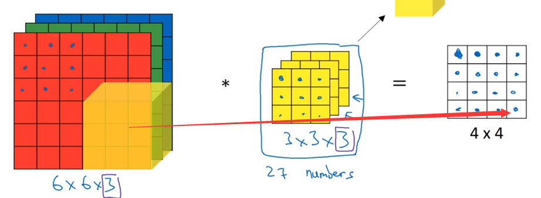

假设上面的图片是对RGB图像的运算，那么构造以下垂直边缘检测器，检测红色图层边缘：
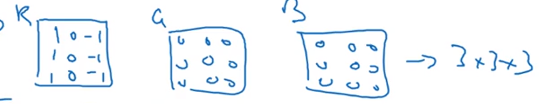

构造以下边缘检测器，检测整体图像垂直边缘：
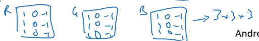

# （五）同时使用多个过滤器

假设你现在想同时获得RGB图像的垂直边缘和水平边缘，你可以进行如下计算。

先分别使用垂直边缘检测器和水平边缘检测器，然后将得到的结果叠加。

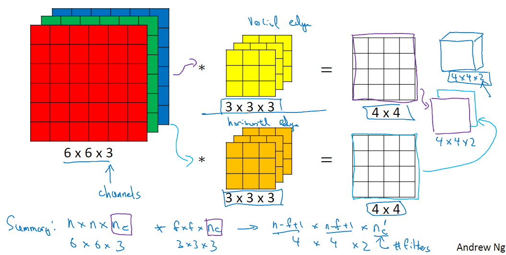

对于输入输出的维数如上图所示：
输入为n\*n\*n~c~，过滤器为f\*f\*n~c~，注意这里二者的第三维是相同的。
输出的维数为(n-f+1)\*(n-f+1)\*n'~c~，n'~c~表示同时使用的过滤器的个数。

# （六）造一个卷积神经网络

## 相关变量

-  上标$[l]$表示第$l$层
- 上标$(i)$表示第$i$个样本
- 下标$i$表示第$i$个样本
- $n_H$, $n_W$ 和 $n_C$ 表示某一层的高度、宽度、通道数，对特定的$l$层，可以用$n_H^{[l]}$, $n_W^{[l]}$, $n_C^{[l]}$表示
- $n_{H_{prev}}$, $n_{W_{prev}}$ and $n_{C_{prev}}$表示某一层的前一层高度、宽度、通道数，对特定的$l$层，可以用表示$n_H^{[l-1]}$, $n_W^{[l-1]}$, $n_C^{[l-1]}$表示

## 目标卷积神经网络结构

我们将实现一个卷积神经网络的一些模块，下面我们将列举我们要实现的模块的函数功能：

- 卷积模块，包含了以下函数：
  - 使用0扩充边界
  - 卷积窗口
  - 前向卷积
  - 反向卷积（可选）
- 池化模块，包含了以下函数：
  - 前向池化
  - 创建掩码
  - 值分配
  - 反向池化（可选）

我们将在这里从底层搭建一个完整的模块，之后我们会用TensorFlow实现。


## 卷积层

### 实现0-Padding

0padding在图像的边界用0填充

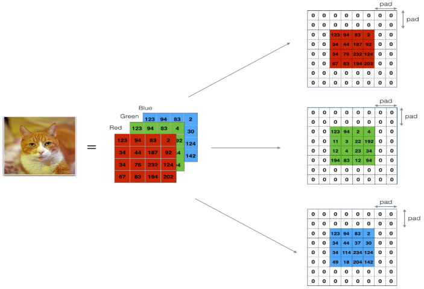

**padding的好处：**

- 使卷积层不会缩水输入进来的图片的高和宽
- 能保留图像边界的信息

```python
# GRADED FUNCTION: zero_pad

def zero_pad(X, pad):
    """
    把数据集X的图像边界全部使用0来扩充pad个宽度和高度。
    
    参数：
        X - 图像数据集，维度为（样本数，图像高度，图像宽度，图像通道数）
        pad - 整数，每个图像在垂直和水平维度上的填充量
    返回：
        X_paded - 扩充后的图像数据集，维度为（样本数，图像高度 + 2*pad，图像宽度 + 2*pad，图像通道数）
    
    """
    
    ### START CODE HERE ### (≈ 1 line)
    X_pad = np.pad(X,(
                        (0,0),       #样本数，不填充
                        (pad,pad),   #图像高度,你可以视为上面填充x个，下面填充y个(x,y)
                        (pad,pad),   #图像宽度,你可以视为左边填充x个，右边填充y个(x,y)
                        (0,0)),      #通道数，不填充
                        'constant', constant_values=0)      #连续一样的值填充
    ### END CODE HERE ###
    
    return X_pad
```

注释转自csdn，这里详细说明了np.pad各个参数的含义。

### 实现单步卷积运算


以下函数的作用就是计算上图中单个黄色框经过过滤器后得到的实数

```python
def conv_single_step(a_slice_prev,W,b):
    """
    在前一层的激活输出的一个片段上应用一个由参数W定义的过滤器。
    这里切片大小和过滤器大小相同
    
    参数：
        a_slice_prev - 输入数据的一个片段，维度为（过滤器大小，过滤器大小，上一通道数）
        W - 权重参数，包含在了一个矩阵中，维度为（过滤器大小，过滤器大小，上一通道数）
        b - 偏置参数，包含在了一个矩阵中，维度为（1,1,1）
        
    返回：
        Z - 在输入数据的片X上卷积滑动窗口（w，b）的结果。
    """
    
    s = np.multiply(a_slice_prev,W) + b
    
    Z = np.sum(s)
    
    return Z
```

### 实现向前传播（单层卷积运算）

在一个卷积层中，可能有多个filter。每一个filter会输出一个2D矩阵。将这些矩阵叠加，就得到了这个卷积层的最后的3D输出。

<video src="../../../../../Desktop/conv_kiank.mp4"></video>

我们需要对所有切片、所有过滤器进行运算，利用上一节的单步运算函数，算出该层的输出。

如何选择切片？如下图：

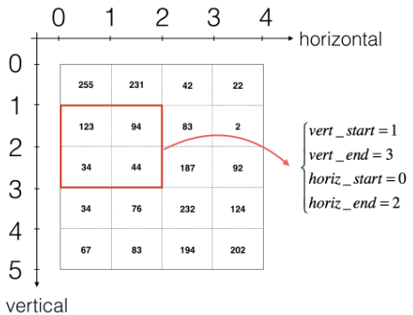

如何计算该层输出的形状？如下图：
$$
n_H = \lfloor \frac{n_{H_{prev}} - f + 2 \times pad}{stride} \rfloor +1\\
n_W = \lfloor \frac{n_{W_{prev}} - f + 2 \times pad}{stride} \rfloor +1\\
n_C =该层的过滤器数量
$$
函数实现？如下图：（暂时不考虑向量化）

```python
def conv_forward(A_prev, W, b, hparameters):
    """
    实现卷积函数的前向传播
    
    参数：
        A_prev - 上一层的激活输出矩阵，维度为(m, n_H_prev, n_W_prev, n_C_prev)，（样本数量，上一层图像的高度，上一层图像的宽度，上一层过滤器数量）
        W - 权重矩阵，维度为(f, f, n_C_prev, n_C)，（过滤器大小，过滤器大小，上一层的过滤器数量，这一层的过滤器数量）
        b - 偏置矩阵，维度为(1, 1, 1, n_C)，（1,1,1,这一层的过滤器数量）
        hparameters - 包含了"stride"与 "pad"的超参数字典。
    
    返回：
        Z - 卷积输出，维度为(m, n_H, n_W, n_C)，（样本数，图像的高度，图像的宽度，过滤器数量）
        cache - 缓存了一些反向传播函数conv_backward()需要的一些数据
    """
    
    #获取来自上一层数据的基本信息
    (m , n_H_prev , n_W_prev , n_C_prev) = A_prev.shape
    
    #获取权重矩阵的基本信息
    ( f , f ,n_C_prev , n_C ) = W.shape
    
    #获取超参数hparameters的值
    stride = hparameters["stride"]
    pad = hparameters["pad"]
    
    #计算卷积后的图像的宽度高度，参考上面的公式，使用int()来进行板除
    n_H = int(( n_H_prev - f + 2 * pad )/ stride) + 1
    n_W = int(( n_W_prev - f + 2 * pad )/ stride) + 1
    
    #使用0来初始化卷积输出Z
    Z = np.zeros((m,n_H,n_W,n_C))
    
    #通过A_prev创建填充过了的A_prev_pad
    A_prev_pad = zero_pad(A_prev,pad)
    
    for i in range(m):                              #遍历样本
        a_prev_pad = A_prev_pad[i]                  #选择第i个样本的扩充后的激活矩阵
        for h in range(n_H):                        #在输出的垂直轴上循环
            for w in range(n_W):                    #在输出的水平轴上循环
                for c in range(n_C):                #循环遍历输出的通道
                    #定位当前的切片位置
                    vert_start = h * stride         #竖向，开始的位置
                    vert_end = vert_start + f       #竖向，结束的位置
                    horiz_start = w * stride        #横向，开始的位置
                    horiz_end = horiz_start + f     #横向，结束的位置
                    #切片位置定位好了我们就把它取出来,需要注意的是我们是“穿透”取出来的，
                    #自行脑补一下吸管插入一层层的橡皮泥就明白了
                    a_slice_prev = a_prev_pad[vert_start:vert_end,horiz_start:horiz_end,:]
                    #执行单步卷积
                    Z[i,h,w,c] = conv_single_step(a_slice_prev,W[: ,: ,: ,c],b[0,0,0,c])
      
    #数据处理完毕，验证数据格式是否正确
    assert(Z.shape == (m , n_H , n_W , n_C ))
    
    #存储一些缓存值，以便于反向传播使用
    cache = (A_prev,W,b,hparameters)
    
    return (Z , cache)

```

### 实现激活函数

把Z变成A，使用ReLU、sigmoid、tanh等，这里暂时不需要做。

## 池化层

### 目的

减小输入的高度和宽度。这有助于减少计算，同时使特征检测器在输入中的位置更稳定（因为检测器可检测的位置少了？或者由于padding对数据的处理，使得减少运算的同时没怎么影响到特征检测的鲁棒性？）

### 两种池化之一：最大池化

- 在输入矩阵中滑动一个大小为fxf的窗口，选取窗口里的值中的最大值，然后作为输出的一部分。

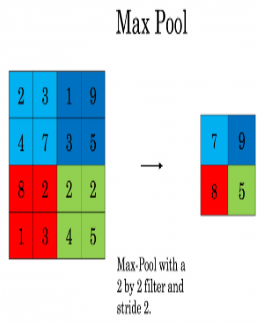

### 两种池化之二：均值池化

- 在输入矩阵中滑动一个大小为fxf的窗口，计算窗口里的值中的平均值，然后这个均值作为输出的一部分。

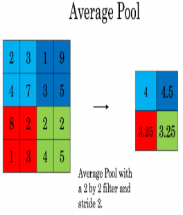

### 池化层的特点

- 没有用于反向传播训练的参数，但是参与反向传播。（如果不参与反向传播，反向传播到这就会断掉，前面的参数就训练不到了，但是我们要训练所有参数，所以池化层一定参与了反向传播）
- 有超参数：窗口大小$f$

### 实现池化层的前向传播

池化层输入输出尺寸公式如下：
$$ n_H = \lfloor \frac{n_{H_{prev}} - f}{stride} \rfloor +1 $$
$$ n_W = \lfloor \frac{n_{W_{prev}} - f}{stride} \rfloor +1 $$
$$ n_C = n_{C_{prev}}$$

python函数如下：

```python
def pool_forward(A_prev,hparameters,mode="max"):
    """
    实现池化层的前向传播
    
    参数：
        A_prev - 输入数据，维度为(m, n_H_prev, n_W_prev, n_C_prev)
        hparameters - 包含了 "f" 和 "stride"的超参数字典
        mode - 模式选择【"max" | "average"】
        
    返回：
        A - 池化层的输出，维度为 (m, n_H, n_W, n_C)
        cache - 存储了一些反向传播需要用到的值，包含了输入和超参数的字典。
    """
    
    #获取输入数据的基本信息
    (m , n_H_prev , n_W_prev , n_C_prev) = A_prev.shape
    
    #获取超参数的信息
    f = hparameters["f"]
    stride = hparameters["stride"]
    
    #计算输出维度
    n_H = int((n_H_prev - f) / stride ) + 1
    n_W = int((n_W_prev - f) / stride ) + 1
    n_C = n_C_prev
    
    #初始化输出矩阵
    A = np.zeros((m , n_H , n_W , n_C))
    
    for i in range(m):                              #遍历样本
        for h in range(n_H):                        #在输出的垂直轴上循环
            for w in range(n_W):                    #在输出的水平轴上循环
                for c in range(n_C):                #循环遍历输出的通道
                    #定位当前的切片位置
                    vert_start = h * stride         #竖向，开始的位置
                    vert_end = vert_start + f       #竖向，结束的位置
                    horiz_start = w * stride        #横向，开始的位置
                    horiz_end = horiz_start + f     #横向，结束的位置
                    #定位完毕，开始切割
                    a_slice_prev = A_prev[i,vert_start:vert_end,horiz_start:horiz_end,c]
                    
                    #对切片进行池化操作
                    if mode == "max":
                        A[ i , h , w , c ] = np.max(a_slice_prev)
                    elif mode == "average":
                        A[ i , h , w , c ] = np.mean(a_slice_prev)
                        
    #池化完毕，校验数据格式
    assert(A.shape == (m , n_H , n_W , n_C))
    
    #校验完毕，开始存储用于反向传播的值
    cache = (A_prev,hparameters)
    
    return A,cache

```

## 实现卷积层的反向传播

在现在的深度学习框架中，我们只需要负责前向传播，反向传播由框架解决。
卷积神经网络的反向传播是十分复杂的，这里只放出一些公式。

#### 计算dA

$$
dA += \sum _{h=0} ^{n_H} \sum_{w=0} ^{n_W} W_c \times dZ_{hw} \tag{1}
$$

- $W_c$是过滤器
- $Z_{hw}$是卷积层第h行第w列使用点乘计算后输出的Z的梯度，是个标量

> 注意：每次更新$dA$的时候，都会用相同的过滤器$W_c$乘以不同的$dZ$，因为在前向传播的时候，每个过滤器都与a_slice进行了点乘相加

#### 计算dW

$$ dW_c  += \sum _{h=0} ^{n_H} \sum_{w=0} ^ {n_W} a_{slice} \times dZ_{hw}  \tag{2}$$

其中，$a_{slice}$对应着$Z_{ij}$的激活值。由此，我们就可以推导$W$的梯度，因为我们使用了过滤器来对数据进行窗口滑动，在这里，我们实际上是切出了和过滤器一样大小的切片，切了多少次就产生了多少个梯度，所以我们需要把它们加起来得到这个数据集的整体$dW$

#### 计算dB

$$ db = \sum_h \sum_w dZ_{hw} \tag{3}$$

和以前的神经网络一样，$db$是由$dZ$的累加计算的，在这里，我们只需要将conv的输出(Z)的所有梯度累加就好了。

#### 函数实现

```python
def conv_backward(dZ,cache):
    """
    实现卷积层的反向传播
    
    参数：
        dZ - 卷积层的输出Z的 梯度，维度为(m, n_H, n_W, n_C)
        cache - 反向传播所需要的参数，conv_forward()的输出之一
        
    返回：
        dA_prev - 卷积层的输入（A_prev）的梯度值，维度为(m, n_H_prev, n_W_prev, n_C_prev)
        dW - 卷积层的权值的梯度，维度为(f,f,n_C_prev,n_C)
        db - 卷积层的偏置的梯度，维度为（1,1,1,n_C）
    
    """
    #获取cache的值
    (A_prev, W, b, hparameters) = cache
    
    #获取A_prev的基本信息
    (m, n_H_prev, n_W_prev, n_C_prev) = A_prev.shape
    
    #获取dZ的基本信息
    (m,n_H,n_W,n_C) = dZ.shape
    
    #获取权值的基本信息
    (f, f, n_C_prev, n_C) = W.shape
    
    #获取hparaeters的值
    pad = hparameters["pad"]
    stride = hparameters["stride"]
    
    #初始化各个梯度的结构
    dA_prev = np.zeros((m,n_H_prev,n_W_prev,n_C_prev))
    dW = np.zeros((f,f,n_C_prev,n_C))
    db = np.zeros((1,1,1,n_C))
    
    #前向传播中我们使用了pad，反向传播也需要使用，这是为了保证数据结构一致
    A_prev_pad = zero_pad(A_prev,pad)
    dA_prev_pad = zero_pad(dA_prev,pad)
    
    #现在处理数据
    for i in range(m):
        #选择第i个扩充了的数据的样本,降了一维。
        a_prev_pad = A_prev_pad[i]
        da_prev_pad = dA_prev_pad[i]
        
        for h in range(n_H):
            for w in range(n_W):
                for c in range(n_C):
                    #定位切片位置
                    vert_start = h
                    vert_end = vert_start + f
                    horiz_start = w
                    horiz_end = horiz_start + f
                    
                    #定位完毕，开始切片
                    a_slice = a_prev_pad[vert_start:vert_end,horiz_start:horiz_end,:]
                    
                    #切片完毕，使用上面的公式计算梯度
                    da_prev_pad[vert_start:vert_end, horiz_start:horiz_end,:] += W[:,:,:,c] * dZ[i, h, w, c]
                    dW[:,:,:,c] += a_slice * dZ[i,h,w,c]
                    db[:,:,:,c] += dZ[i,h,w,c]
        #设置第i个样本最终的dA_prev,即把非填充的数据取出来。
        dA_prev[i,:,:,:] = da_prev_pad[pad:-pad, pad:-pad, :]
    
    #数据处理完毕，验证数据格式是否正确
    assert(dA_prev.shape == (m, n_H_prev, n_W_prev, n_C_prev))
    
    return (dA_prev,dW,db)
    

```

## 实现池化层的反向传播

接下来，我们从最大值池化层开始实现池化层的反向传播。 即使池化层没有反向传播过程中要更新的参数，我们仍然需要通过池化层反向传播梯度，以便为在池化层之前的层（比如卷积层）计算梯度。

#### 最大值池化层的反向传播

在开始池化层的反向传播之前，我们需要创建一个`create_mask_from_window()`的函数，我们来看一下它是干什么的：

$$ X = \begin{bmatrix}
1 && 3 \\
4 && 2
\end{bmatrix} \quad \rightarrow  \quad M =\begin{bmatrix}
0 && 0 \\
1 && 0
\end{bmatrix}\tag{4}$$

正如你所看到的，这个函数创建了一个掩码矩阵，以保存最大值的位置，当为1的时候表示最大值的位置，其他的为0，这个是最大值池化层，均值池化层的向后传播也和这个差不多，但是使用的是不同的掩码。

```python
def create_mask_from_window(x):
    """
    从输入矩阵中创建掩码，以保存最大值的矩阵的位置。
    
    参数：
        x - 一个维度为(f,f)的矩阵
        
    返回：
        mask - 包含x的最大值的位置的矩阵
    """
    mask = x == np.max(x)
    
    return mask

```

为什么我们要创建这一个掩码矩阵呢？想一下我们的正向传播首先是经过卷积层，然后滑动地取卷积层最大值构成了池化层，如果我们不记录最大值的位置，那么我们怎样才能反向传播到卷积层呢？

#### 均值池化层的反向传播

在最大值池化层中，对于每个输入窗口，输出的所有值都来自输入中的最大值，但是在均值池化层中，因为是计算均值，所以输入窗口的每个元素对输出有一样的影响，我们来看看如何反向传播吧~

$$ dZ = 1 \quad \rightarrow  \quad dZ =\begin{bmatrix}
1/4 && 1/4 \\
1/4 && 1/4
\end{bmatrix}\tag{5}$$

```python
def distribute_value(dz,shape):
    """
    给定一个值，为按矩阵大小平均分配到每一个矩阵位置中。
    
    参数：
        dz - 输入的实数
        shape - 元组，两个值，分别为n_H , n_W
        
    返回：
        a - 已经分配好了值的矩阵，里面的值全部一样。
    
    """
    #获取矩阵的大小
    (n_H , n_W) = shape
    
    #计算平均值
    average = dz / (n_H * n_W)
    
    #填充入矩阵
    a = np.ones(shape) * average
    
    return a

```

#### 实现池化层的反向传播

```python
def pool_backward(dA,cache,mode = "max"):
    """
    实现池化层的反向传播
    
    参数:
        dA - 池化层的输出的梯度，和池化层的输出的维度一样
        cache - 池化层前向传播时所存储的参数。
        mode - 模式选择，【"max" | "average"】
        
    返回：
        dA_prev - 池化层的输入的梯度，和A_prev的维度相同
    
    """
    #获取cache中的值
    (A_prev , hparameters) = cache
    
    #获取hparameters的值
    f = hparameters["f"]
    stride = hparameters["stride"]
    
    #获取A_prev和dA的基本信息
    (m , n_H_prev , n_W_prev , n_C_prev) = A_prev.shape
    (m , n_H , n_W , n_C) = dA.shape
    
    #初始化输出的结构
    dA_prev = np.zeros_like(A_prev)
    
    #开始处理数据
    for i in range(m):
        a_prev = A_prev[i]      
        for h in range(n_H):
            for w in range(n_W):
                for c in range(n_C):
                    #定位切片位置
                    vert_start = h
                    vert_end = vert_start + f
                    horiz_start = w
                    horiz_end = horiz_start + f
                    
                    #选择反向传播的计算方式
                    if mode == "max":
                        #开始切片
                        a_prev_slice = a_prev[vert_start:vert_end,horiz_start:horiz_end,c]
                        #创建掩码
                        mask = create_mask_from_window(a_prev_slice)
                        #计算dA_prev
                        dA_prev[i,vert_start:vert_end,horiz_start:horiz_end,c] += np.multiply(mask,dA[i,h,w,c])
    
                    elif mode == "average":
                        #获取dA的值
                        da = dA[i,h,w,c]
                        #定义过滤器大小
                        shape = (f,f)
                        #平均分配
                        dA_prev[i,vert_start:vert_end, horiz_start:horiz_end ,c] += distribute_value(da,shape)
    #数据处理完毕，开始验证格式
    assert(dA_prev.shape == A_prev.shape)
    
    return dA_prev

```

## 全连接层

全连接层（fully connected layers，FC）在整个卷积神经网络中起到“分类器”的作用。如果说卷积层、池化层和激活函数层等操作是将原始数据映射到隐层特征空间的话，全连接层则起到将学到的“分布式特征表示”映射到样本标记空间的作用。