[TOC]

# （一）目标检测简介

问题：在一张图片中检测是否存在行人、汽车、摩托车。

前提：图中只会有上述物品中的一个，或一个都没有。

规定：图片的左上角坐标为(0,0)，右下角坐标为(1,1)；如果识别出物体，则其中心坐标为(b~x~,b~y~)，其宽度为b~w~，其高度为b~h~，并且置P~c~为1；若未识别出物体，则置P~c~为0，其他属性置为“？”

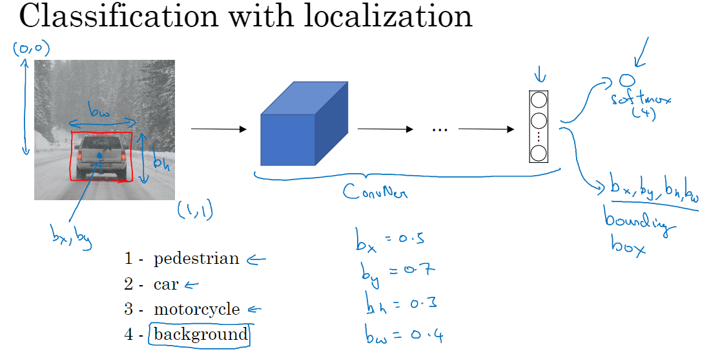

在训练中，规定神经网络的输出、损失函数如下图所示：

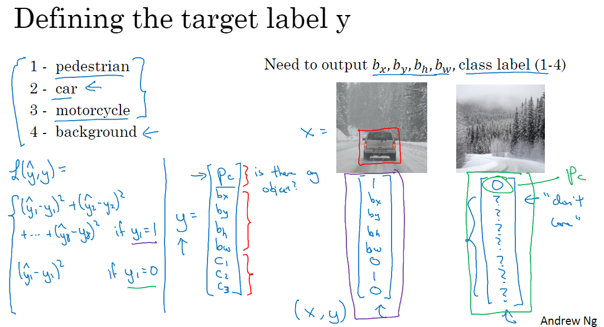

# （二）特征点检测

我们可以增加神经网络的输入，来获取更多信息，这常使用特征点来实现。

对于汽车，特征点是汽车中点坐标；对于人脸，可能是各个眼角的坐标，或一些脸上边缘线类的地方的坐标；对于人体，可以是一些关节的坐标。

输出向量的表示法如下图所示：

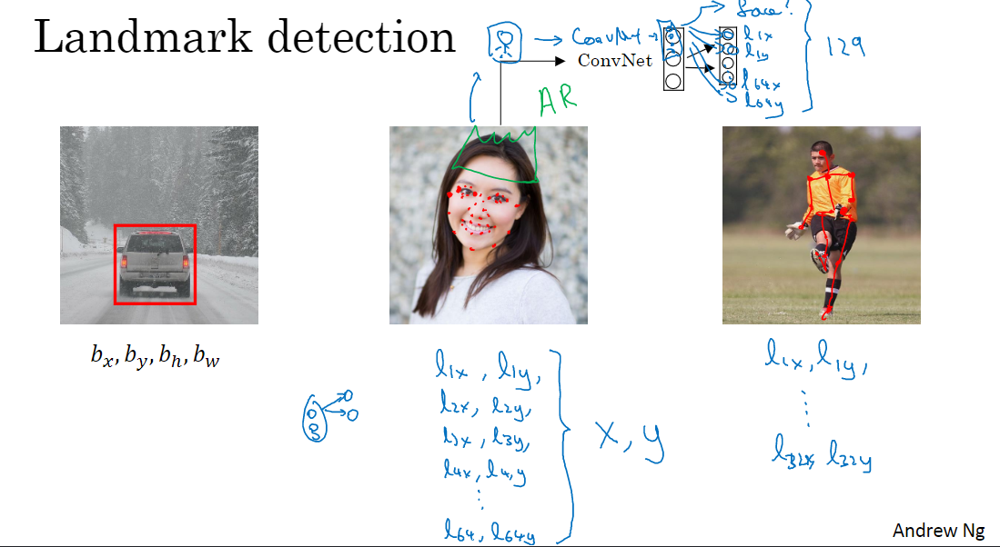

# （三）滑动窗口目标检测

做法：

1. 用仅包含车和无车的切片训练神经网络

   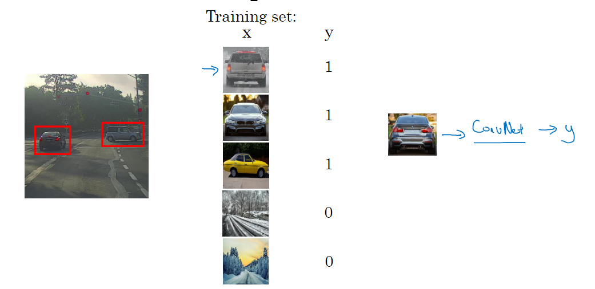

2. 用不同大小的方格在待检测图像上均匀切片

   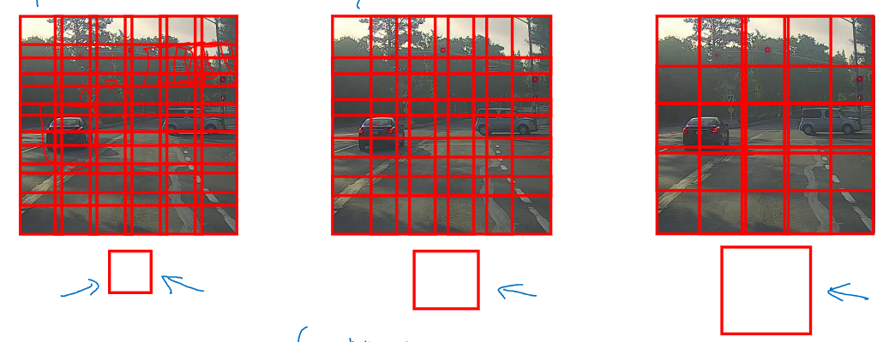

3. 检测所有这些切片上有无汽车

4. 得出结论

缺点：计算量大（已解决）

# （四）滑动窗口的卷积实现

## 滑动窗口中切片分别预测的缺陷

不同切片有很多重叠部分，这些部分在分别预测的时候会产生很多重复运算

## 理论基础

理论基础：FC层可以看作一个卷积层。如下图：

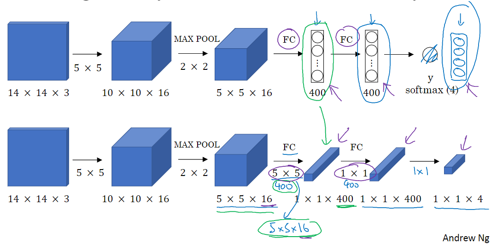

用同宽高过滤器可以得到“放倒的FC层”，最后输出的结果也不是一个向量，而是一个1×1×4的卷积层

## 具体做法

把图片整个输入预测函数中，通过卷积运算的方法同时计算所有切片。此时输出是一个m×n×4的卷积层。m×n是切片的总数，4代表目标检测中4种可能出现的结果。具体看图：

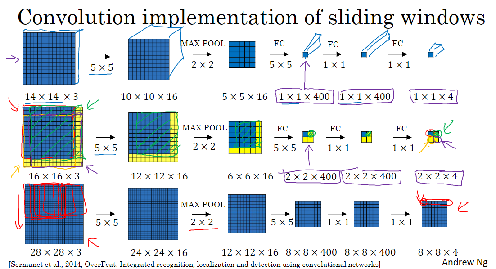

第一行是训练集运行情况，第二行是测试集运行情况，根据不同的步长，图片被切成不同的部分，利用卷积运算同时得出所有切片的结果（这里是4个）。第三行介绍了切片较多的时候的计算情况，最后得到64个结果。

下图展示了这种方法在实际中的运行情况：

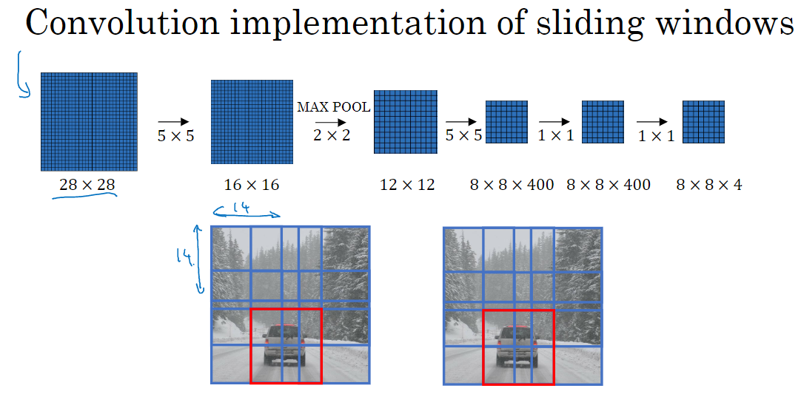

## 缺陷

不能得出准确的边框

# （五）Bounding Box预测

## YOLO算法（you only look once）（简介）

YOLO算法的目的是只看一遍图像（切片无重叠部分）就得出准确的边框结果。

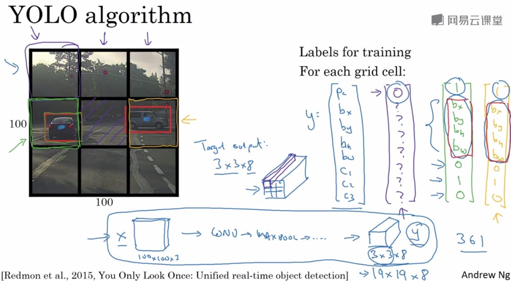

首先，将图片均匀的切成一些格子，切割的精细程度要保证同一个格子中不会出现两个被识别物体的中心。这里以九个格子为例。

然后为九个格子分别准备好一个图中所示的八维向量，并且用他们组成图中的3×3×8张量，格子与相应的张量位置对应。

在每个格子上都跑一遍图像检测与定位算法，识别出两辆车对应的y。如果一辆车的中心点在某个格子内，那么就把这辆车对应的y放到3×3×8张量的对应位置上。如果某个格子中没有任何一辆车的中心点，那么这个格子在张量的对应位置就定义为图中紫色向量。

以下是$b_x,b_y,b_h,b_w$的计算方法：

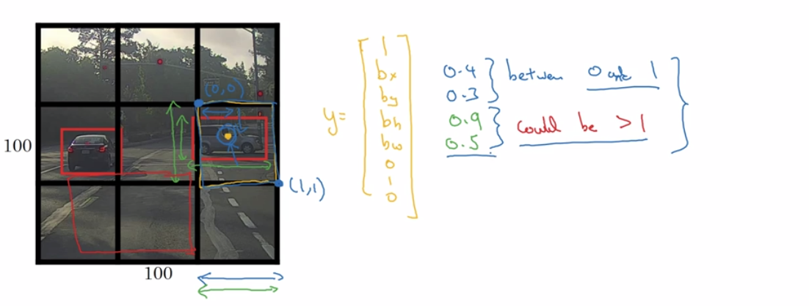

对输出张量中的每一个向量对应的格子，其左上角坐标定义为(0,0)，右下角坐标定义为(1,1)。若格子中有物体中心点，则这个格子对应的向量的$b_x,b_y$就由中心点在此格子内的相对比例来计算，$b_w,b_h$同理，如图所示。

由之前的推导可知，$b_x,b_y$一定在0，1之间，$b_w,b_h$则可以大于1，因为图像的大小不限于一个格子。而中心点由于在这个格子内，其相对该各自的坐标也一定在范围内。

# （六）交并比函数(intersection over union, loU)

## 目的

评价对象检测算法

## 工作方式

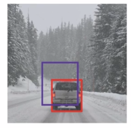

红框是目标结果，紫框是算法得出的结果。loU计算两个边界框交集与并集之比。通常loU≥0.5，就认为，结果是可以接受的。

# （七）非极大值抑制

## 目的

改善YOLO的输出结果。确保你的算法对每个对象只检测一次。

## 背景

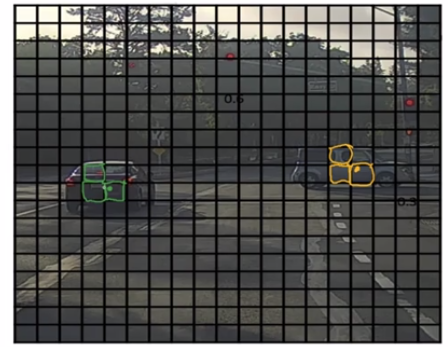

在实际运用YOLO时，可能会有多个格子认为车的中心点在自己内部（算出的$P_c$比较高），如上图所示。这就会导致对一个对象做出多次检测，如下图所示：

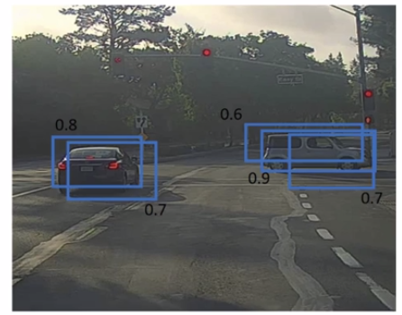

## 算法

上图中有五个格子认为车的中心点在自己内部（算出的$P_c$比较高），那么我们先锁定P_c最高的，0.9 。这之后，非极大值抑制会逐个审视其他的边界框。所有和这个最大的边界框有很大的交并比、高度重叠的其他边界框，它们的输出就会被抑制。如下图，0.9旁边的0.6和0.7被抑制：

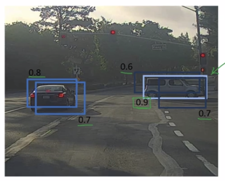

同理继续做，得到输出：

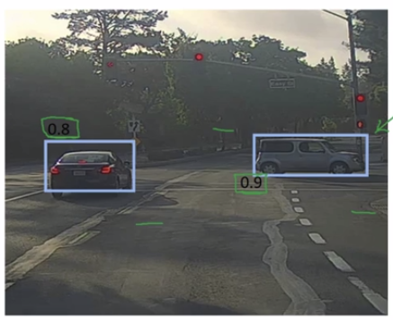

## 举例、算法细节

假设只做汽车检测，那么：

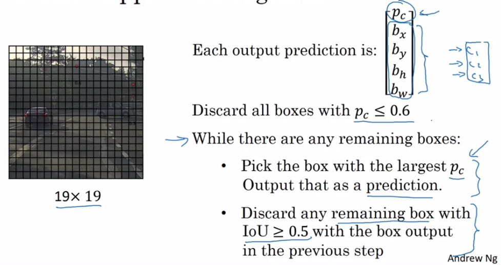

如果做汽车、行人、摩托车同时检测，那么最好分别用三次非极大值抑制。

# （八）Anchor Boxes

## 目的

让YOLO中的一个格子可以检测出多个对象

## 方法

扩充YOLO中每个格子对应的向量。使其能容纳多个边界框尺寸不同的对象。

## 举例

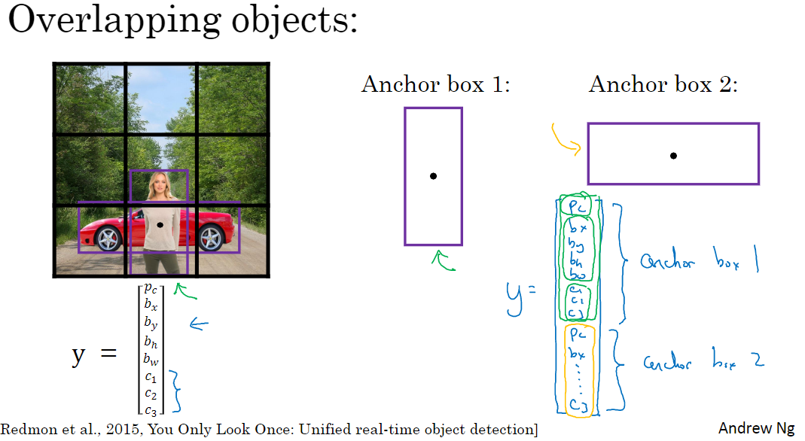

如图，定义两种anchor box，将它们有序地放入YOLO中每个格子对应的向量中，如图右下侧所示。

图中检测出的每个物体将对应一个元组(格子号，anchor box号)。

当从图中检测出物体时，它将被放入它中心点所在的格子对应的向量中，至于放入哪个anchor box，要由物体的边界框与两个anchor box分别做loU，取大的一个。

运算结果如下图所示：

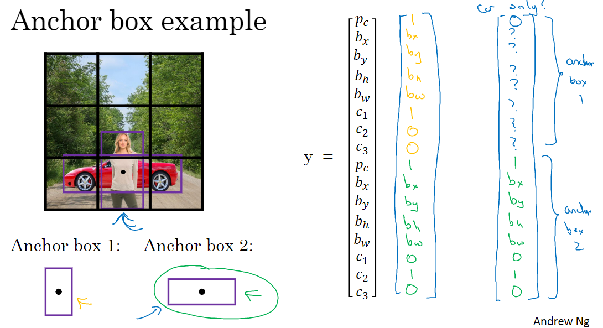

第一个手写向量是车、人都在的结果，第二个手写向量是假设人不在途中了得到的结果。

## 使用了anchor box的训练集

以下图中是训练集中的一个样本，左边的图是输入，右边的向量是对应的期望输出的一部分。真正的期望输出是由九个y组成的，见左侧图片下方的计算式。

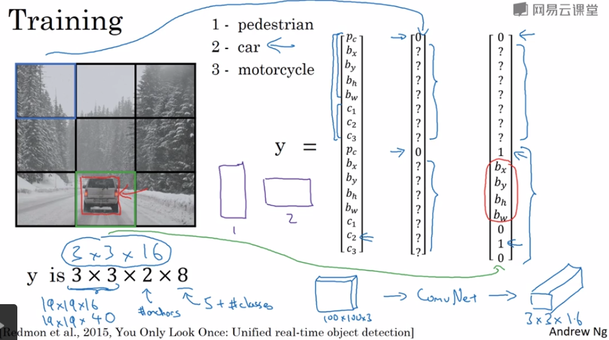

这个例子中，训练好的模型对输入做预测得到的结果如下：

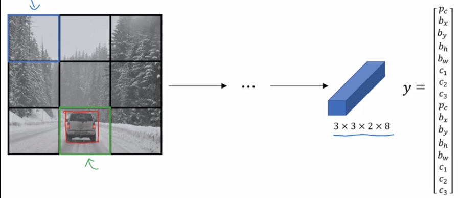

## 一例完整的边框预测的例子

输入：

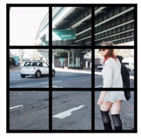

对图中的每个格子，计算出两个预测的边界框：

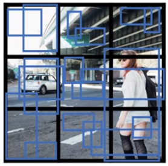

去掉预测值低的边界框：

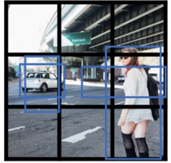

对每个类别（行人、汽车）做非极大值抑制来获得最终结果：

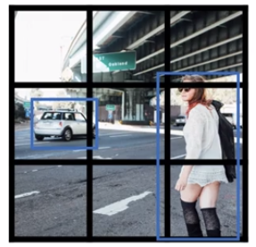

# （九）R-CNN(Region Proposal)

## 做法

- 把图像分成色块

  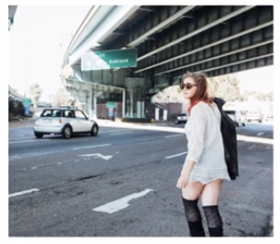

  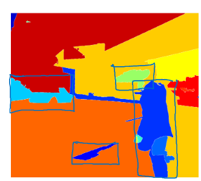

- 对每个色块所在区域做目标检测

## 优点

所需检测的切片数减少了

## 缺点

把图像变成色块消耗了大量时间，得不偿失

# （十）“YOLO找物体的中心点”这句话到底是什么意思？

问：YOLO中每个单元格负责去检测那些中心点落在该格子内的目标是怎样实现的？

答：YOLO算法训练和测试过程一定要分开看。训练时，每个obj对应一个GT box, box的中心就是obj的中心，训练的时候，只有这个中心点所在grid cell才负责检查这个obj的class。这样训练后，网络就学会找到obj中心点对应的grid并选择置信度大的box回归并输出。也就是测试时，一气呵成。

也就是说训练时每个obj的中心是已知的，每个grid cell是否被击中是有代码标识出来的，网络在训练时需要学会找到obj的中心。

理解：

算法的训练过程中，样本输入中的物体中心点、边界框都已知，因此每个最后会学到：我是不是某个物体的中心点，如何从我自己这个小格子，判断出整个物体的边界框。

算法的测试过程中，首先每个格子会通过训练中学会的技能，先判断，自己是某个物件的中心的概率(pc)是多少（肯定不为0，因为是测试过程，而不是样本输出）；然后再判断，自己是某个特定东西的中心的概率(c1,c2,c3,...)是多少，同时用训练过程中学会的技能，预估自己所属的那个东西有多大。

> 也就是说，YOLO预测的边界框实际上是通过“管中窥豹”的方法得出的，只看一个小切片，然后预测整个物体的大小。

在这之后，每个格子会把自己的pc和c_i以此相乘，来得到自己格子里有某种特定物体的评分。

在这之后，通过阈值过滤、非极大值抑制，得出输出。