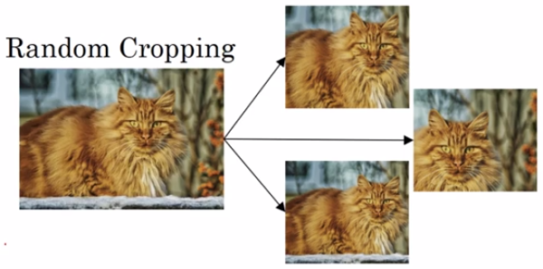

[TOC]

# （一）经典网络

## LeNet - 5

LeNet - 5，针对灰度图像训练，可识别灰度图像中的手写数字。

LeNet - 5，不用padding，使用均值池化，使用全连接层，使用softmax，池化后会做非线性映射处理

随着一层一层的处理，数据的尺寸会不断变小

## AlexNet

AlexNet，使用RGB图像，使用最大池化，使用更多层数

## VGG-16

VGG-16，超参数少，结构简单，只用same padding，16指卷积层和全连接层共16个，#channel和图像尺寸变化有规律（每次池化通道加一倍，尺寸减一倍）

缺点：参数太多（1.38million）

# （二）残差网络(Residual Net)

一般的神经网络是这样的：

线性激活和非线性激活交替进行

残差网络是这样的：

黄箭头指向的a叫残差块，a[l]的数据被copy到了后面，参与后面的运算，这叫捷径。

下图展示了五个残差块构成的残差网络：

由于出现了$a^{[l+2]}=g(z^{[l+1]}+a^{[l]})$这样的操作，这要求$$a^{[l]}$$和$$z^{[l+1]}$$尺寸相同。

因此残差网络使用了较多的same padding。

因此得到了下图中，普通网络和残差网络的对比：

**残差块的优点：**

- 学习恒等函数非常容易，保证了网络性能不受影响
- 使用很多恒等卷积，使得跳远连接得以实现

# （三）1×1卷积（网络中的网络）

在channel为1的输入长用1×1卷积是没啥用的：

在channel较多的输入上用1×1卷积比较有用，把这个过滤器上的#channel个常数设为参数。用的时候，输入先经过多个过滤器，得到原尺寸×原尺寸×#filter这么大的输出，然后再用relu处理。

一点对比：

- 池化可以可以压缩输入的宽度和高度
- 1×1卷积可以压缩输入的信道数

以下是1×1卷积压缩信道数的距离

1×1卷积还可以用于保持通道数、增加通道数，以构建其它类型的网络

# （四）Inception网络

1×1卷积在inception网络中发挥了很大作用。具体就是：代替人工确定卷积层中的过滤器类型，或者确定是否需要创建卷积层或池化层。

## inception模块及其主要思想

对输入同时用不同的过滤器、池化器，保证输出的宽和高相等，然后把输出通通叠在一起。使得不用手动选择各种器，而是由网络自己去选择。问题是这样会提高计算成本

在上图中，5×5过滤器部分所需计算的次数如下：

> 这里只统计乘法的次数

1.2亿次，对现代计算机负担也很重。

下面使用1×1卷积减少计算次数：

这里使用了“瓶颈层”作为中间层。把输入的规模先减小再扩大。把运算量减少了一个数量级。

然而这样的瓶颈层是否会是神经网络的性能下降呢？

答：只要合理构建就不会影响性能。

## inception网络架构

### inception网络中的一层

利用瓶颈层完成1×1、3×3、5×5部分。

注意到最大池化部分无法改变信道数，因此在后面接上一个1×1卷积减少数据量。

### inception网络架构图

最后使用全连接层和softmax输出

更准确的网络应该还有下图中的一些分支：

他们都是用全连接和softmax输出。它们的作用是通过隐藏层，试图做出预测

# （五）从在开源世界下载预训练过的模型开始，做迁移学习

假设你要做分辨三种猫的猫分类器。

首先，从网上下载模型，和人家花了好久预训练的参数。

然后判断你自己的数据集规模。

如果你的数据集比较小，你可以固定人家网络的所有参数，在最后加一个softmax层，只训练它：

如果可能，你可以把数据集经过人家网络得到的结果存到硬盘，然后单独用这些数据训练softmax层，提高训练速度。

如果你的数据集要大一些，你可以训练神经网络的后几层：

如果你的数据集非常大，你可以训练神经网络的所有层，把人家预训练的参数当作你的初始化参数。

# （六）数据增强

## 方法

1. 垂直镜像对称

   

2. 随机裁剪

   

3. 旋转

4. 倾斜

5. 局部弯曲

6. 色彩转换

   好处是增加算法 对颜色的鲁棒性

   方法是给RGB通道加不同的偏移值

   色彩转换算法：PCA（生成主分析）

数据增强也有超参数，比如旋转角度、色彩增强程度的，一个好的开始可以是从开源世界获取参数

# （七）计算机视觉现状

## 数据vs手工

数据量少的时候，我们会用更多的手工技巧、更精巧的架构，来制作好的模型。数据量多的时候，我们倾向于用更简单的架构、更少的人工操作，来做出好的模型

## 竞赛技巧

- 用多个神经网络预测，取yhat的平均值

  缺点：运行速度慢，占内存多

- 预测一张图片的时候，把它取多个切片分别预测，取平均结果

  缺点：运行速度慢

因此竞赛技巧不适合实际生产应用。

## 使用开源代码

- 使用论文中发表的网络架构
- 使用开源的网络实现
- 在自己的数据集上使用预处理模型和预处理参数