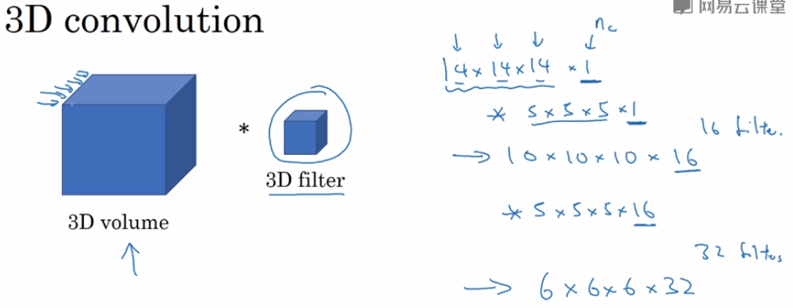

[TOC]

# （一）一些术语

## 人脸验证

输入一个人的图片，判断他是否是他所声称的人

## 人脸识别

- 有一个K人的数据库
- 输入一张图片
- 判断这个人是数据库中的哪一个（或者不是任何一个）

# （二）One-shot学习

人脸识别的一个难题是，对于一个人，你只有一个训练样本。（回想你录入自己面部信息的时候的场景。）

解决方法：

## Similarity函数

输入两张图片，输出这两张图片的差异值

如果差异值小于一个预定值（或超参数）$\tau$，那么就判定这两个图片上是同一个人。

# （三）Siamese网络

## 目的

输入图片，输出一个代表该图片的编码。

## 使用方法

输入两张图片，输出两个编码，根据某种规则定义两个编码间的距离。如果距离大于某个阈值，那么输出“是同一个人”，否则输出“不是同一个人”。

# （四）Triplet loss（三元组损失）

## 训练输入：三元组

anchor：锚，三张图中的基准

positive：与anchor为同一人的图片

negative：与anchor不为同一人的照片

## 超参数

$\alpha$：间隔参数。是一个正数。保证A与P的相似度和A与N的相似度直接的差别足够大。

## 使用的一些外来物

编码函数f：输入图片A，输出数字化编码f(A)

距离函数d：输入两张图片A、B，输出它们之间的“距离”。通常使用它们编码后做差的范数。
$$
d(A,B)=\|f(A)-f(B)\|^{2}
$$

## 损失函数

$$
L(A,P,N)=max(d(A,P)-d(A,N)+\alpha,0)
$$

如果算法正确判断出了A和P是同一个人，A和N不是同一个人，那么$d(A,P)-d(A,N)$应该是一个负数，这个负数绝对值越大，说明算法越准确，我们用间隔参数来保证这个负数的绝对值大到一定的程度。

如果算出$d(A,P)-d(A,N)+\alpha$小于0，那么说明算法做得很好，就记为无损失；否则，记下距离差未达标的程度。

## 成本函数

$$
J=-\sum{L(A,P,N)}
$$

## 注意的点

- 生成三元组的时候，我们要尽量选一些迷惑性较大的图片（Negative和Positive和Anchor很像，但的确不是同一个人），以增加学习的强度，使得学习结果好。

# （五）二分类解决面部识别问题

## 网络架构

把两个Siamese网络集合到一起，它们的输出结果输入到一个逻辑回归单元中，这个单元输出这两张图片是同一个人的概率

## 输出层计算公式

## 应用

实际应用中，无需输入两个图片，计算出它们的编码，再逻辑回归。

实际应用中，可以事先编码好图片，需要计算的时候，直接从数据库里拿出编码做逻辑回归就可以了。

这样可以节省计算。

# （六）神经风格迁移

## 应用举例

## 成本函数（代价函数）

设应用举例中的三幅图为C(Content), S(Style), G(Generated image)。在训练神经网络实现这种功能时，我们需要定义一个成本函数$J(G)$来评判生成的G是否令我们满意。我们将使用梯度下降来优化$J(G)$。

定义成本函数为：
$$
J(G)=\alpha J_{content}(C,G)+\beta J_{style}(S,G)
$$
其中Jcontent用于评价C与G内容相似程度，Jstyle用于评价S与G风格相似程度。alpha和beta是超参数，用于设置内容相似度与风格相似度在我们预计目标上的权重。

## 用梯度下降生成G

给定内容图像和风格图像如下：

进行处理以生成合成图像如下：

1. 随机初始化G，例如随机生成一个100×100×3的RGB图像：

   

2. 用梯度下降最小化J(G)
   $$
   G=G-\frac{\partial J(G)}{\partial G}
   $$
   这里实际上是在更新G的像素值

   

## 内容代价函数

如果把内容代价函数放在神经网络的浅层，由于浅层隐藏单元检测的是一些简单的特征（比如图像中的垂直分界线），它就会使生成图的内容从很细微的级别上和内容图相似（比如，输出图和内容图几乎完全一样）。如果把内容代价函数放在神经网络的深层，由于深层隐藏单元检测的是比较整体的内容（比如图像中是否有狗），那么最后的输出在内容方面上只能保证主要内容是相同的（比如，内容图里有一只纯色狗，输出图输出了一个外形姿态差不多的狗，但是是一只花斑狗）。

所以内容代价函数一般放在神经网络的中等层次上进行评估。

假设我们在第l层评价Jcontent，设C和G在网络中运算到这一层得到的激活值分别为$a^{[l](C)}$和$a^{[l](G)}$。

Jcontent定义为两个a的距离，例如：
$$
J_{content}=\|a^{[l](C)}-a^{[l](G)}\|^{2}
$$

## 风格代价函数

### 什么是风格？

风格是某一层的输出中，各个channel之间的关系。

例如，某一层的各个隐藏单元输出了如下一些图像：

那么，风格描述的就是：橙色与左斜线同时出现的概率、绿色与垂直分割线同时出现的概率等等。

### 风格矩阵（Style matrix / Gram matrix）

定义第$l$层的输出为$a^{[l]}$，它的尺寸为$(n_H,n_W,n_C)$。它的风格矩阵为$G^{[l]}$，其尺寸为$(n_c^{[l]},n_c^{[l]})$，该矩阵的第i行第j列表示的是$a^{[l]}$第i层与第j层之间的关系。

G中元素的计算公式如下
$$
G^{[l]}_{kk'}=\sum_{i=1}^{n_C}\sum_{i=1}^{n_C}a_{ijk}^{[l]}a_{ijk'}^{[l]}
$$
由于我们要对Style图片和Generated图片分别计算风格矩阵并进行比较，那么就有了：
$$
G^{[l](S)}_{kk'}=\sum_{i=1}^{n_C}\sum_{i=1}^{n_C}a_{ijk}^{[l](S)}a_{ijk'}^{[l](S)}\\
G^{[l](G)}_{kk'}=\sum_{i=1}^{n_C}\sum_{i=1}^{n_C}a_{ijk}^{[l(G)]}a_{ijk'}^{[l](G)}
$$

### 风格代价函数

单层的：
$$
\begin{align}
J_{style}^{[l]}(S,G)&=\frac{1}{(2n_H^{[l]}n_W^{[l]}n_C^{[l]})^2}\|G^{[l](S)}-G^{[l](G)}\|^{2}_{F}\\
&=\frac{1}{(2n_H^{[l]}n_W^{[l]}n_C^{[l]})^2}\sum_k\sum_{k'}(G^{[l](S)}_{kk'}-G^{[l](G)}_{kk'})^{2}
\end{align}
$$

> 下标F表示两个矩阵间的Frobenius范数

最后真正的、整体的：
$$
J_{style}(S,G)=\sum_{l}\lambda^{[l]}J_{style}^{[l]}(S,G)
$$
其中lambda是对各层代价函数的权重超参数。

# （七）深度卷积网络在学什么

我们来研究下面这个卷积网络各层都学到了什么：

在第一层中拿出一个隐藏单元，输入一张图片，进行运算，寻找能将这个隐藏单元的激活函数最大化的图片的切片，你可能会得到：

拿出另外两个隐藏单元，做相同操作，你可能会得到：

再多来几个：

你可以理解为，第一层的隐藏单元通常会找一些简单的特征

我们跳出第一层，来看各个层：

层次越深，能使得隐藏单元激活函数最大化的图像切片就可以越复杂。

# （八）1D卷积、2D卷积、3D卷积

## 1D

心电图、时间序列信息

## 2D

灰度图像

## 3D

RGB图像、X光照片

