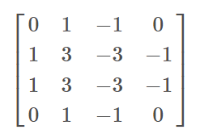
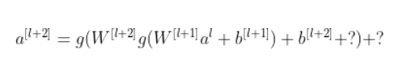
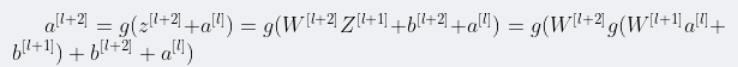
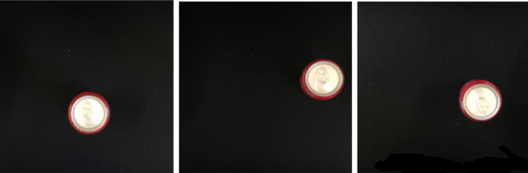
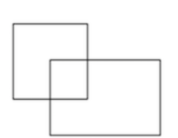
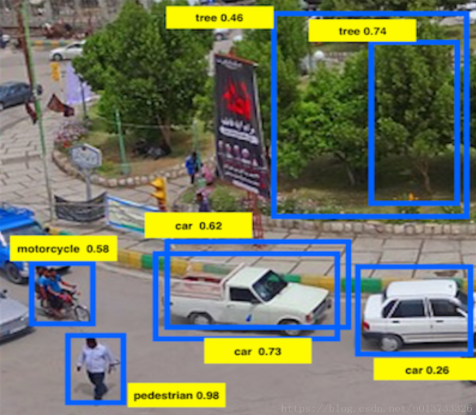

# Week 1 quiz - The basics of ConvNets

## 1. Question 1

What do you think applying this filter to a grayscale image will do?

- [ ] Detect 45 degree edges
- [x] Detect vertical edges
- [ ] Detect horizontal edges
- [ ] Detect image contrast

> Because the left part is positive, and the right part is negative.
>
> 而且因为左右正负看起来挺对称的

## 2. Question 2

Suppose your input is a 300 by 300 color (RGB) image, and you are **not** using a convolutional network. If the first hidden layer has 100 neurons, each one fully connected to the input, how many parameters does this hidden layer have (including the bias parameters)?

- [ ] 9,000,001
- [ ] 9,000,100
- [ ] 27,000,001
- [x] 27,000,100

> 300\*300\*3\*100+100=27,000,100

## 3. Question 3

Suppose your input is a 300 by 300 color (RGB) image, and you use a convolutional layer with 100 filters that are each 5x5. How many parameters does this hidden layer have (including the bias parameters)?

- [ ] 2501
- [ ] 2600
- [ ] 7500
- [x] 7600

> (5\*5\*3+1)\*100=7600

## 4. Question 4

You have an input volume that is 63x63x16, and convolve it with 32 filters that are each 7x7, using a stride of 2 and no padding. What is the output volume?

- [x] 29x29x32

- [ ] 16x16x32

- [ ] 29x29x16

- [ ] 16x16x16

  > n = 63, f = 7, s = 2, p = 0, 32 filters.
  > $$
  > \lfloor\frac{63-7+1}{2}+1\rfloor=29
  > $$
  >

## 5. Question 5

You have an input volume that is 15x15x8, and pad it using “pad=2.” What is the dimension of the resulting volume (after padding)?

- [ ] 17x17x10
- [x] 19x19x8
- [ ] 19x19x12
- [ ] 17x17x8

> $$
> 15+2*2=19
> $$
>
>

## 6. Question 6

You have an input volume that is 63x63x16, and convolve it with 32 filters that are each 7x7, and stride of 1. You want to use a “same” convolution. What is the padding?

- [ ] 1
- [ ] 2
- [x] 3
- [ ] 7

> $$
> p=\frac{7-1}{2}=3
> $$
>
>

## 7. Question 7

You have an input volume that is 32x32x16, and apply max pooling with a stride of 2 and a filter size of 2. What is the output volume?

- [ ] 15x15x16
- [ ] 16x16x8
- [x] 16x16x16
- [ ] 32x32x8

> $$
> \lfloor\frac{32-2+1}{2}+1\rfloor=16
> $$
>
> 池化层输出channel数=输入channel数

## 8. Question 8

Because pooling layers do not have parameters, they do not affect the backpropagation (derivatives) calculation.

- [ ] True
- [x] False

> 如果池化层不影响反向传播的话，说明他这一层没有梯度，如果他这一层没有梯度，说明反向传播会在这里中断，所以池化层会影响反向传播

## 9. Question 9

In lecture we talked about “parameter sharing” as a benefit of using convolutional networks. Which of the following statements about parameter sharing in ConvNets are true? (**Check all that apply.**)

- [x] It reduces the total number of parameters, thus reducing overfitting.

- [x] It allows a feature detector to be used in multiple locations throughout the whole input image/input volume.

- [ ] It allows parameters learned for one task to be shared even for a different task (transfer learning).

  > 这里扯不上迁移学习。多位置使用同一特征检测器是指在同一个网络的同一层使用该“同一特征检测器”

- [x] It allows gradient descent to set many of the parameters to zero, thus making the connections sparse.

## 10. Question 10

In lecture we talked about “sparsity of connections” as a benefit of using convolutional layers. What does this mean?

- [ ] Regularization causes gradient descent to set many of the parameters to zero.

  > 是参数共享导致的

- [ ] Each filter is connected to every channel in the previous layer.

  > 不会的，参数共享导致连接数减少

- [x] Each activation in the next layer depends on only a small number of activations from the previous layer.

- [ ] Each layer in a convolutional network is connected only to two other layers

  > 两个太多了，只连上一层。

# Week 2

## 1. Question 1

Which of the following do you typically see as you move to deeper layers in a ConvNet?

- [ ] nH and nW  increases, while nC decreases
- [ ] nH and nW decreases, while nC also decreases
- [ ] nH and nW increases, while nC also increases
- [x] nH and nW  decrease, while nC increases

> 宽和高减少，信道数增加

## 2. Question 2

Which of the following do you typically see in a ConvNet? (**Check all that apply.**)

- [x] Multiple CONV layers followed by a POOL layer
- [ ] Multiple POOL layers followed by a CONV layer
- [x] FC layers in the last few layers
- [ ] FC layers in the first few layers

## 3. Question 3

In order to be able to build very deep networks, we usually only use pooling layers to downsize the height/width of the activation volumes while convolutions are used with “valid” padding. Otherwise, we would downsize the input of the model too quickly.

- [ ] True
- [x] False

## 4. Question 4

Training a deeper network (for example, adding additional layers to the network) allows the network to fit more complex functions and thus almost always results in lower training error. For this question, assume we’re referring to “plain” networks.

- [ ] True
- [x] False

> 只要你会调，再深的网络都没毛病

## 5. Question 5

The following equation captures the computation in a ResNet block. What goes into the two blanks(*?*) above?

- [ ] 0 andz[l+1], respectively
- [x] a[l] and 0, respectively
- [ ] z[l]and a[l], respectively
- [ ] 0 and a[l], respectively

> 

## 6. Question 6

Which ones of the following statements on Residual Networks are true? (**Check all that apply.**)

- [ ] Using a skip-connection helps the gradient to backpropagate and thus helps you to train deeper networks

- [x] The skip-connections compute a complex non-linear function of the input to **pass to a deeper layer** in the network.

- [ ] A ResNet with L layers would have on the order of  L^2^ skip connections in total.

  > 约$\frac{L}{2}$

- [x] The skip-connection makes it easy for the network to learn an identity mapping between the input and the output within the ResNet block.

## 7. Question 7

Suppose you have an input volume of dimension 64x64x16. How many parameters would a single 1x1 convolutional filter have (including the bias)?

- [ ] 2
- [ ] 17
- [x] 4097
- [ ] 1

> 64x64x1 + 1 = 4097

## 8. Question 8

Suppose you have an input volume of dimension $n_H \times n_W \times n_C$. Which of the following statements you agree with? (Assume that “1x1 convolutional layer” below always uses a stride of 1 and no padding.)

- [x] You can use a 1x1 convolutional layer to reduce nCnC but not nHnH, nWnW.
- [x] You can use a pooling layer to reduce nHnH, nWnW, but not nCnC.
- [ ] You can use a 1x1 convolutional layer to reduce nHnH, nWnW, and nCnC.
- [ ] You can use a pooling layer to reduce nHnH, nWnW, and nCnC.

## 9. Question 9

Which ones of the following statements on Inception Networks are true? (**Check all that apply.**)

- [ ] Inception networks incorporates a variety of network architectures (similar to dropout, which randomly chooses a network architecture on each step) and thus has a similar regularizing effect as dropout.

- [x] Inception blocks usually use 1x1 convolutions to reduce the input data volume’s size before applying 3x3 and 5x5 convolutions.

- [x] A single inception block allows the network to use a combination of 1x1, 3x3, 5x5 convolutions and pooling.

- [ ] Making an inception network deeper (by stacking more inception blocks together) should not hurt training set performance.

- [ ] > 可能会导致过拟合

## 10. Question 10

Which of the following are common reasons for using open-source implementations of ConvNets (both the model and/or weights)? **Check all that apply.**

- [ ] A model trained for one computer vision task can usually be used to perform data augmentation even for a different computer vision task.
- [x] Parameters trained for one computer vision task are often useful as pretraining for other computer vision tasks.
- [x] The same techniques for winning computer vision competitions, such as using multiple crops at test time, are widely used in practical deployments (or production system deployments) of ConvNets.
- [x] It is a convenient way to get working an implementation of a complex ConvNet architecture.

# Week3 Quiz: Detection algorithms

1. You are building a 3-class object classification and localization algorithm. The classes are: pedestrian (c=1), car (c=2), motorcycle (c=3). What would be the label for the following image? Recall y=[pc,bx,by,bh,bw,c1,c2,c3]y=[pc,bx,by,bh,bw,c1,c2,c3]
   

   - [x] y=[1, 0.3, 0.7, 0.3, 0.3, 0, 1, 0]
   - [ ] y=[1, 0.7, 0.5, 0.3, 0.3, 0, 1, 0]
   - [ ] y=[1, 0.3, 0.7, 0.5, 0.5, 0, 1, 0]
   - [ ] y=[1, 0.3, 0.7, 0.5, 0.5, 1, 0, 0]
   - [ ] y=[0, 0.2, 0.4, 0.5, 0.5, 0, 1, 0]

2. Continuing from the previous problem, what should y be for the image below? Remember that “?” means “don’t care”, which means that the neural network loss function won’t care what the neural network gives for that component of the output. As before, y=[pc,bx,by,bh,bw,c1,c2,c3]y=[pc,bx,by,bh,bw,c1,c2,c3].
   

   - [ ] y=[1, ?, ?, ?, ?, 0, 0, 0]
   - [x] y=[0, ?, ?, ?, ?, ?, ?, ?]
   - [ ] y=[?, ?, ?, ?, ?, ?, ?, ?]
   - [ ] y=[0, ?, ?, ?, ?, 0, 0, 0]
   - [ ] y=[1, ?, ?, ?, ?, ?, ?, ?]

3. You are working on a factory automation task. Your system will see a can of soft-drink coming down a conveyor belt, and you want it to take a picture and decide whether (i) there is a soft-drink can in the image, and if so (ii) its bounding box. Since the soft-drink can is round, the bounding box is always square, and the soft drink can always appears as the same size in the image. There is at most one soft drink can in each image. Here’re some typical images in your training set:
   

   - [ ] Logistic unit (for classifying if there is a soft-drink can in the image)

   - [x] Logistic unit,bx andby

- [ ] Logistic unit,bx,by,bh (since bw =bh)

   - [ ] Logistic unit,bx,by,bh,bw

   - [ ] > 不需要bw、bh，因为饮料瓶都是相同大小的

4. If you build a neural network that inputs a picture of a person’s face and outputs N landmarks on the face (assume the input image always contains exactly one face), how many output units will the network have?

   - [ ] N
   - [x] 2N
   - [ ] 3N
   - [ ] N**2

   > 每个节点用一对数来表示（横纵坐标），因此输出数是标记数的二倍

5. When training one of the object detection systems described in lecture, you need a training set that contains many pictures of the object(s) you wish to detect. However, bounding boxes do not need to be provided in the training set, since the algorithm can learn to detect the objects by itself.

   - [ ] True
   - [x] False

   > 不正确。我们需要通过训练集中提供的边界框来优化算法寻找边界框的结果。

6. Suppose you are applying a sliding windows classifier (non-convolutional implementation). Increasing the stride would tend to increase accuracy, but decrease computational cost.

   - [ ] True
   - [x] False

   > 不会提高准确性，因为切片数变少了

7. In the YOLO algorithm, at training time, only one cell —the one containing the center/midpoint of an object— is responsible for detecting this object.

   - [x] True
   - [ ] False

8. What is the IoU between these two boxes? The upper-left box is 2x2, and the lower-right box is 2x3. The overlapping region is 1x1.

   

   - [ ] 1/6
   - [x] 1/9
   - [ ] 1/10
   - [ ] None of the above

   > $1/(3+1+5)=1/9$

9. Suppose you run non-max suppression on the predicted boxes above. The parameters you use for non-max suppression are that boxes with probability ≤ 0.4 are discarded, and the IoU threshold for deciding if two boxes overlap is 0.5. How many boxes will remain after non-max suppression?

   

   - [ ] 3
   - [ ] 4
   - [x] 5
   - [ ] 6
   - [ ] 7

   > 最右边的车肯定是没了，左下能出3个物体，两个树交并比显然小于0.5，故一共检出5个物体

10. Suppose you are using YOLO on a 19x19 grid, on a detection problem with 20 classes, and with 5 anchor boxes. During training, for each image you will need to construct an output volume y as the target value for the neural network; this corresponds to the last layer of the neural network. (y may include some “?”, or “don’t cares”). What is the dimension of this output volume?

    - [ ] 19x19x(25x20)
    - [ ] 19x19x(20x25)
    - [x] 19x19x(5x25)
    - [ ] 19x19x(5x20)

    > 25里面有1个是否存在物体标记，4个用于标记边界框，20个用于区分物体种类

# Special applications: Face recognition & Neural style transfer

Quiz, 10 questions

## 1. Question 1

Face verification requires comparing a new picture against one person’s face, whereas face recognition requires comparing a new picture against K person’s faces.

- [x] True
- [ ] False

## 2. Question 2

Why do we learn a function d(img1,img2)d(img1,img2) for face verification? **(Select all that apply.)**

- [x] This allows us to learn to recognize a new person given just a single image of that person.
- [x] We need to solve a one-shot learning problem.
- [ ] This allows us to learn to predict a person’s identity using a softmax output unit, where the number of classes equals the number of persons in the database plus 1 (for the final “not in database” class).

> Softmax output unit has been removed.

- [ ] Given how few images we have per person, we need to apply transfer learning.

> We don’t need to use transfer learning.

## 3. Question 3

In order to train the parameters of a face recognition system, it would be reasonable to use a training set comprising 100,000 pictures of 100,000 different persons.

- [ ] True
- [x] False

> More than one pictures per person are needed.

## 4. Question 4

Which of the following is a correct definition of the triplet loss? Consider that αα. (We encourage you to figure out the answer from first principles, rather than just refer to the lecture.)

- [x] max(||f(A)−f(P)||2−||f(A)−f(N)||2+α,0)

- [ ] max(||f(A)−f(N)||2−||f(A)−f(P)||2+α,0)

  > 不要误选第二个，这里虽然有平方操作但是要看清楚，最后一步操作是减法，因此搞清楚被减数和减数是很重要的

- [ ] max(||f(A)−f(N)||2−||f(A)−f(P)||2−α,0)
- [ ] max(||f(A)−f(P)||2−||f(A)−f(N)||2−α,0)

## 5. Question 5

Consider the following Siamese network architecture:

The upper and lower neural networks have different input images, but have exactly the same parameters.

- [x] True
- [ ] False

> Wee need the same parameters to get f(x(i))

## 6. Question 6

You train a ConvNet on a dataset with 100 different classes. You wonder if you can find a hidden unit which responds strongly to pictures of cats. (I.e., a neuron so that, of all the input/training images that strongly activate that neuron, the majority are cat pictures.) You are more likely to find this unit in layer 4 of the network than in layer 1.

- [x] True
- [ ] False

## 7. Question 7

Neural style transfer is trained as a supervised learning task in which the goal is to input two images (xx), and train a network to output a new, synthesized image (yy).

- [ ] True
- [x] False

> Images have no labels.也就是说，这不是监督学习。只是一个不断优化成本函数的过程。没有预测一说，更没有预测对错、准确率一说

## 8. Question 8

In the deeper layers of a ConvNet, each channel corresponds to a different feature detector. The style matrix G[l]G[l]measures the degree to which the activations of different feature detectors in layer ll vary (or correlate) together with each other.

- [x] True
- [ ] False

## 9. Question 9

In neural style transfer, what is updated in each iteration of the optimization algorithm?

- [ ] The neural network parameters
- [x] The pixel values of the generated image GG
- [ ] The regularization parameters
- [ ] The pixel values of the content image CC

## 10. Question 10

You are working with 3D data. You are building a network layer whose input volume has size 32x32x32x16 (this volume has 16 channels), and applies convolutions with 32 filters of dimension 3x3x3 (no padding, stride 1). What is the resulting output volume?

- [x] 30x30x30x32
- [ ] Undefined: This convolution step is impossible and cannot be performed because the dimensions specified don’t match up.
- [ ] 30x30x30x16
