# （一）序列模型解决的问题

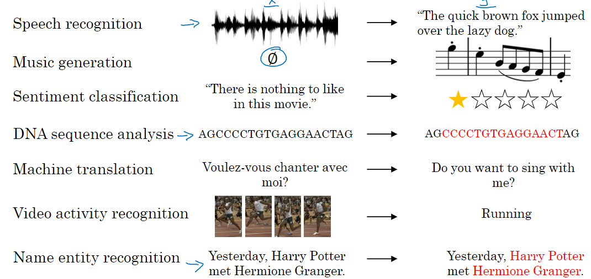

输入数据或输出数据在时间上或逻辑上有先后顺序。

# （二）相关数学符号

**训练集输入样本**：x。x是一个与“顺序”t有关的数据。x是一个数据的序列。

$x=x^{<1>},x^{<2>},x^{<3>},...,x^{<t>},...,x^{<T_{x}>}$

**训练集输出样本**：y。x是一个与“顺序”t有关的数据。x是一个数据的序列。

$y=y^{<1>},y^{<2>},y^{<3>},...,y^{<t>},...,y^{<T_{y}>}$

对于特定的问题，x、y也可能是一个实数。

**文本处理中的字典**：文本处理中，通常每一个单词对应一个实数。例如，用1到10000这10000个数字制成词汇量为10000的字典。$x$表示一个句子，$x^{<t>}$将表示一个单词。因此可用one-shot法，用一个10000维的向量表示$x^{<t>}$。

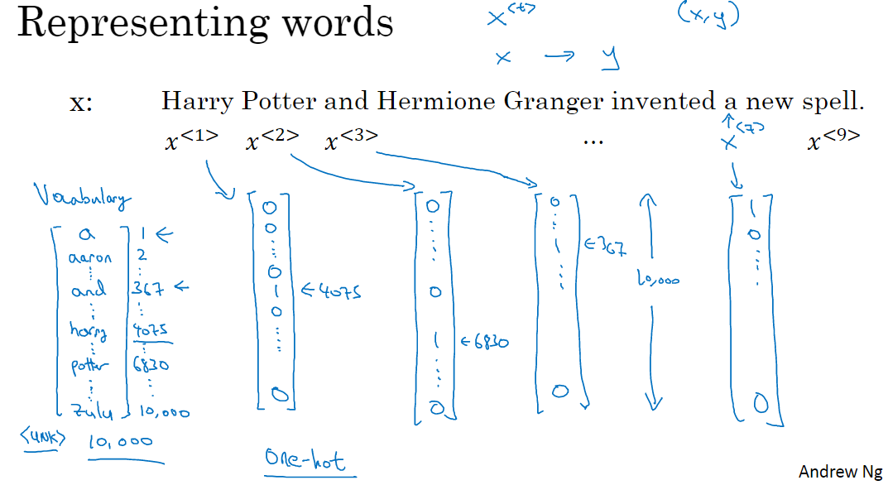

# （三）循环神经网络模型（$T_x=T_y$情况）

> 这段可能文字比较少，因为图片实在是太好懂了，比大量的文字好懂多了，也不需要配什么文字来解释。

## 定义符号

有些东西需要声明：

- 上标$[l]$表示第层$l$
  - 举例：$a{[4]}$表示第4层的激活值，$W^{[5]}$和$b^{[5]}$是第5层的参数。
- 上标$(i)$表示第个$i$样本
  - 举例：$x^{(i)}$表示第个$i$输入的样本。
- 上标$<t>$表示第个$t$时间步
  - 举例：$x^{<t>}$表示输入x的第t个时间步，$x^{(i)<t>}$表示输入x的第i个样本的第t个时间步。
- 下标i表示向量的第i项
  - 举例：$a^{[l]}_{i}$表示l层中的第i个项的激活值。

## 模型结构

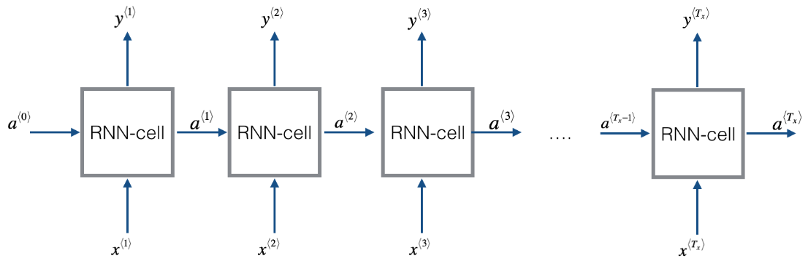

## RNN单元

循环神经网络可以看作是单元的重复。

要注意的是：$W_{aa},W_{ax}.W_{ya}$是所有RNN单元共用的，这也是“循环”神经网络的循环的意义。这使得模型对“序列”的前后关系具有一定的适应性。如果每个单元都是自己的W，那就是各自为政，体现不出“序列”的特点了。

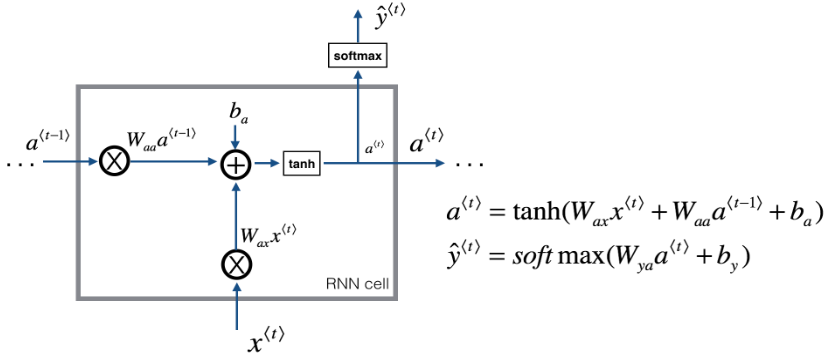

## RNN前向传播

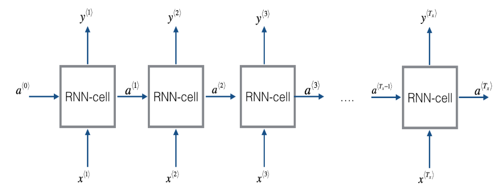

## RNN的反向传播

训练过程中每一个RNN单元都会产生损失函数值，加在一起就是训练总损失，按照图中的红线反向传播。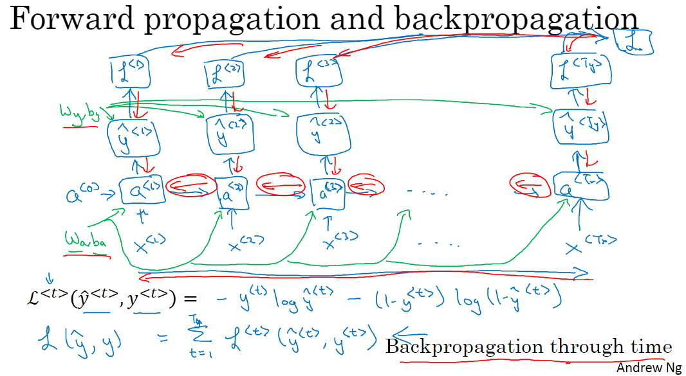

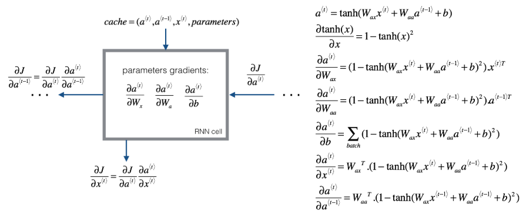

# （四）其他循环神经网络模型

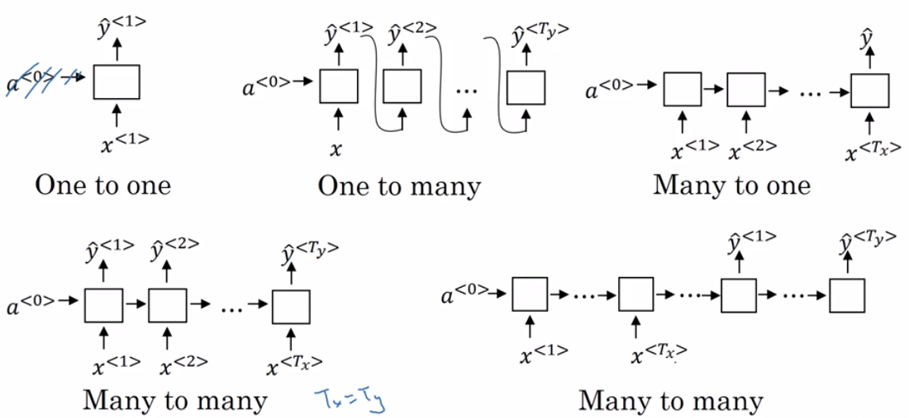

# （五）长短时记忆（Long Short-Term Memory (LSTM)）网络

## LSTM模块

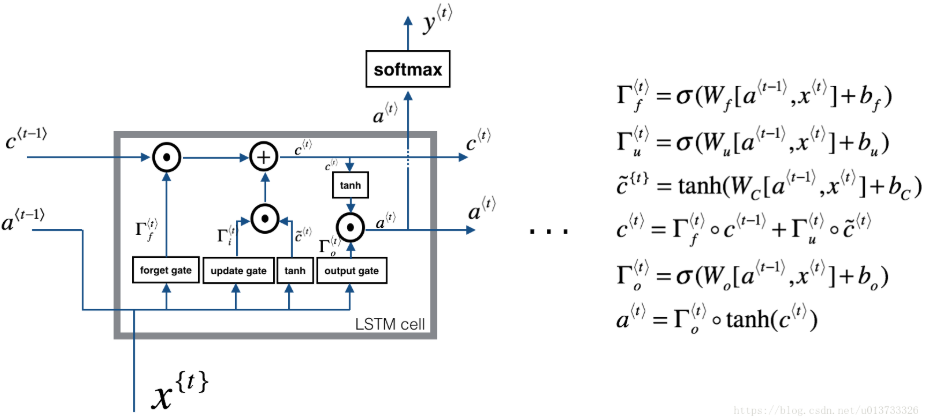

## 门

### 遗忘门

假设我们正在阅读文本中的单词，并希望使用LSTM来跟踪语法结构，比如主语是单数还是复数。如果主语从单数变为复数，我们需要找到一种方法来摆脱我们先前存储的单复数状态的记忆值。在LSTM中，遗忘门是这样做的:

$$
\Gamma_f^{\langle t \rangle} = \sigma(W_f[a^{\langle t-1 \rangle}, x^{\langle t \rangle}] + b_f)\tag{1}
$$
其中，$W_f$是控制遗忘门的权值，我们把$a^{<t-1>}$，$x^{<t>}$连接起来变为$[a^{\langle t-1 \rangle}, x^{\langle t \rangle}]$，然后$[a^{<t-1>},x^{<t>}]$乘以$W_f$，再加偏置再激活，结果就是得到了一个矢量$\Gamma_f^{<t>}$,其值在0与1之间。这个遗忘门向量将与前一个单元状态$c^{<t-1>}$相乘，因此，如果$\Gamma_f^{<t>}$的一个值是0（或者≈0），则意味着LSTM应该删除对应的信息，如果其中有为1的值，那么LSTM将保留该信息。

### 更新门

一旦我们“忘记”所讨论的过去的主题是单数，我们需要找到一种方法来更新它，以反映新的主题现在是复数。这里是更新门的公式：

$$
\Gamma_u^{\langle t \rangle} = \sigma(W_u[a^{\langle t-1 \rangle}, x^{\{t\}}] + b_u)\tag{2}
$$
与遗忘门相似, 这里 $\Gamma_u^{\langle t \rangle}$ 向量的值介于0与1之间. 为了计算 $c^{\langle t \rangle}$，它会和 $\tilde{c}^{\langle t \rangle}$（本次模块中计算出的新c）逐元素相乘,。

### 更新单元

为了要更新主题，我们需要创建一个新的向量，我们可以将其添加到之前的单元状态中。我们使用的公式是:

$$
 \tilde{c}^{\langle t \rangle} = \tanh(W_c[a^{\langle t-1 \rangle}, x^{\langle t \rangle}] + b_c)\tag{3}
$$
最后，单元的新状态是:

$$
c^{\langle t \rangle} = \Gamma_f^{\langle t \rangle}* c^{\langle t-1 \rangle} + \Gamma_u^{\langle t \rangle} *\tilde{c}^{\langle t \rangle} \tag{4}
$$

### 输出门

 为了决定我们将使用哪种输出，我们将使用以下两个公式:

$$
 \Gamma_o^{\langle t \rangle}=  \sigma(W_o[a^{\langle t-1 \rangle}, x^{\langle t \rangle}] + b_o)\tag{5}
$$

$$
 a^{\langle t \rangle} = \Gamma_o^{\langle t \rangle}* \tanh(c^{\langle t \rangle})\tag{6}
$$

(5)式使用sigmoid，(6)式使用tanh。

## LSTM前向传播

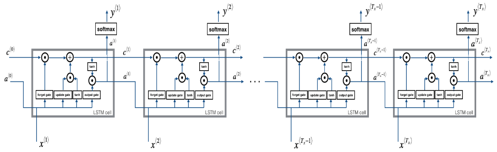

## LSTM反向传播

以下公式仅供望而生畏，切勿走火入魔：

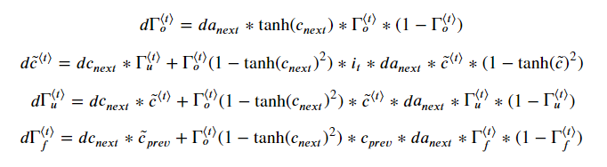

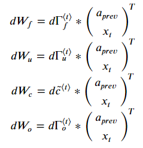

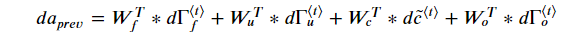

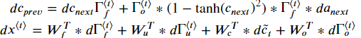

## LSTM训练

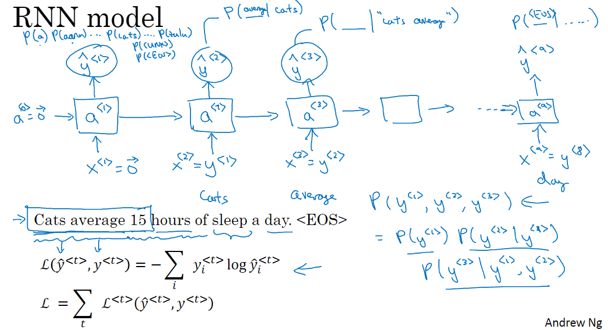

训练样本是y，训练目标也是y，训练时的输出是yhat，损失函数是由y与yhat之间的差异定义的。

LSTM工作时每一层的输出是：在前面层输出的条件下，这一层输出词典中每个词的概率。

LSTM训练时每一层的输出是：在前面层目标输出（训练样本的y序列）的条件下，这一层输出词典中每个词的概率。优化时，这个概率向量应该向样本中这一层的输出词所生成的独热向量靠拢。

# （六）双向神经网络

## 结构

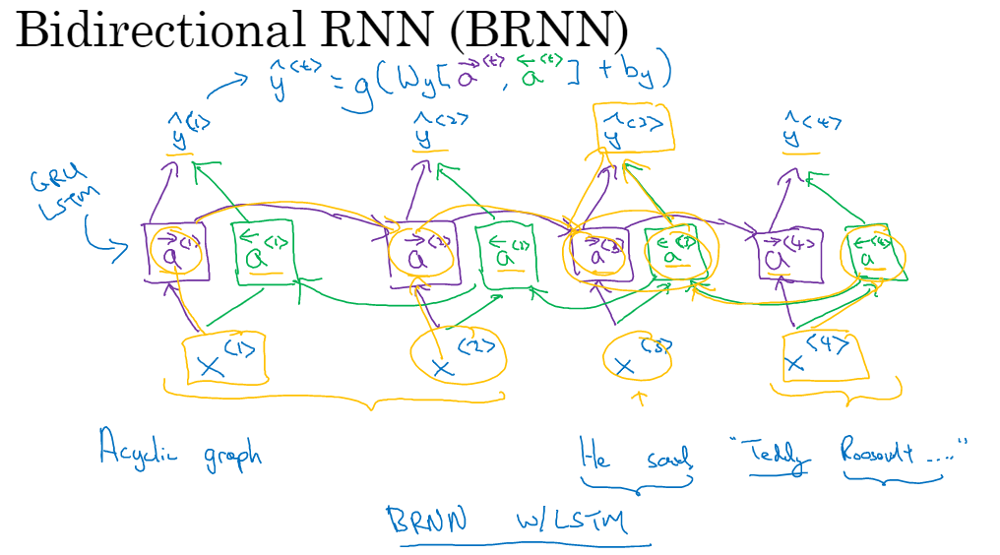

把输入数据顺序算一次，再逆序算一次，两次的输出综合考虑得到最终输出。

## 缺点

不能实时处理，必须要等输入全部输入完成之后才能开始得到结果。（因为双向要求序列模型进行到最后一块的时候才能再开始从第一个输入片开始再反向计算）

# （七）深层循环神经网络

## 结构1

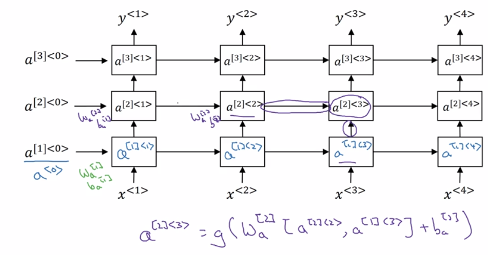

## 结构2

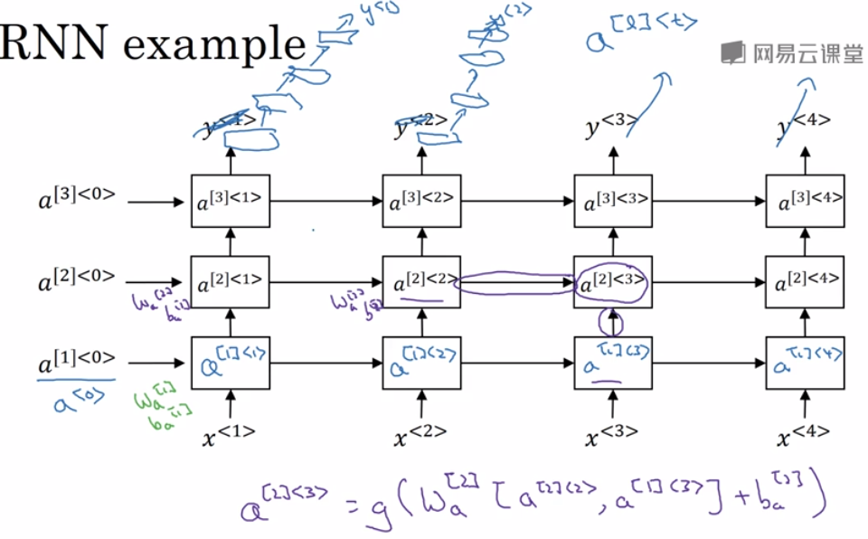

## 特点

在印刷体部分，每一块的a都是由两个a_prev共同作用计算出来的。

手写体部分有些特殊，它是单为某一项输出做的深层网络，a与a的计算只是单连接。
