# （一）序列模型应用

图片概括、机器翻译、语音识别等。

它们都是输入一个序列、输出一个序列

# （二）基本模型

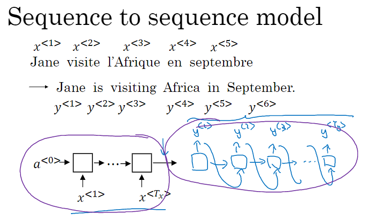

以机器翻译为例：输入法语序列，经过第一个圆圈中的编码器（many to one RNN），转换为特征向量，在经过第二个圆圈的解码器（one to many RNN），输出英语句子。

# （三）机器翻译中想输出好句子该优化什么

## 语言模型与机器翻译模型的区别

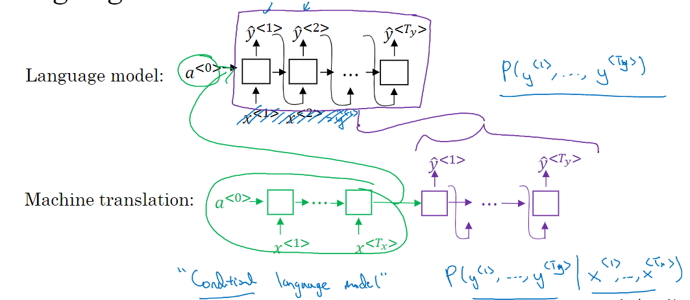

机器翻译比语言模型多了前面的编码器，也就是说，语言模型开始输出前，输入的是一个零向量，而机器翻译模型开始输出前，输入的是一个特征向量。因此机器翻译又叫条件语言模型。判断的是，在特征向量条件下，输出句子最可能是什么。也即：输出使以下概率最大化的句子：

## 该优化这个

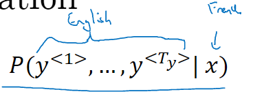

# （四）怎么优化

## 贪心搜索

我们的目的是$P(y^{<1>,...,y^{<T_{y}>}}|x)$最大。而贪心算法只是当输出到第t个单词时，使得第t+1个单词是最有可能的。也就是说贪心算法没有全局意识，很容易走进错误的岔路，如下图：

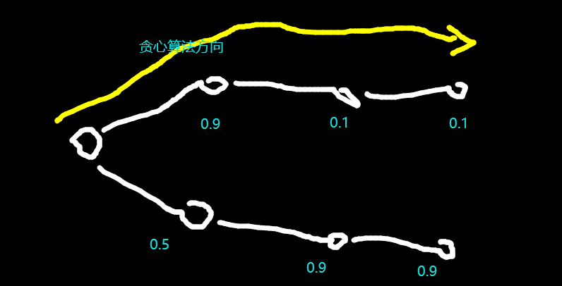

## 束搜索（定向搜索）

我们可以想：生成句子就是在一颗带权树上从根节点开始搜索一条路，使得这条路上权值乘积最大。

贪心算法是每次选择邻接顶点中未去过的顶点中权值最大的，由上面的图可以看出这是有缺陷的。

那么如何减少这种缺陷呢？如何让我们的树搜索算法富有“远见”呢？

束搜索算法是这样做的：每当到达第t个输出结点时，选择第t+1层、权值排行前N的顶点。对这N个顶点，计算出选择【其中一个顶点和该顶点下一级顶点中权值最大的顶点】时，能使$P(y^{<1>,...,y^{<t+2>}}|x)$最大化的顶点。依此得到第t+1层最终的选择。

如图所示：

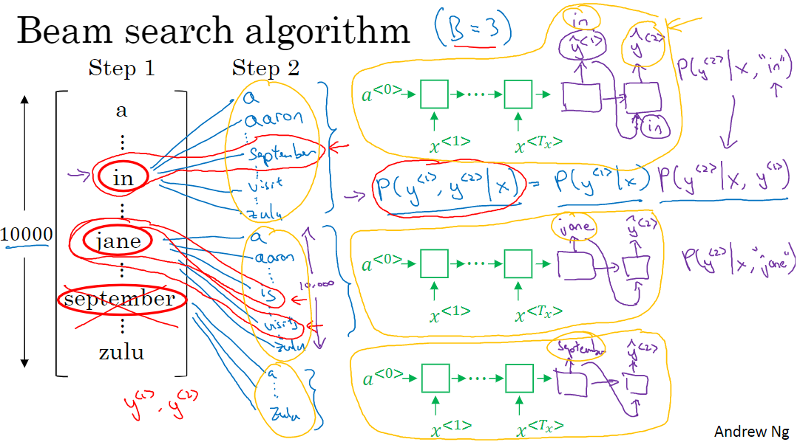

step1就是t+1层，从中选出排行前三的，分别找它们下一层中排第一的，算一下到这位置的P，在step1中这前三名中选出能让P最好的。

再来个图帮助理解：

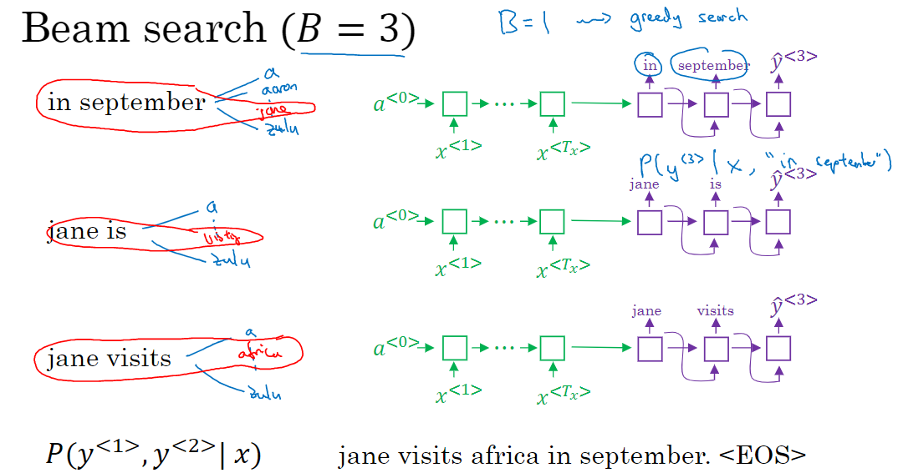

这是只有一层的远见。

如果要有两层的远见，可以在step2中也选前三的，再去看step3中排第一的，选出使step2、step3共同作用最好的step2中的单词，并记录他对应的step3单词。对于step1中规定的“前三名”，现在能得出3个“step2中的单词”，每个step1中的单词对应一个。然后再看能使目前为止调出来这三个三元组step1、step2、step3的单词，计算每一组同时选中时的P，选出最高的一组，把这一组的step1的单词加入输出序列。（算了半天其实是在挑step1中的单词，别搞乱了。）

## 束搜索的改进

束搜索优化的$P(y^{<1>,...,y^{<T_{y}>}}|x)$，在概率论中，实际是很多小于1的数相乘。这很可能造成最后的数小到计算机无法表示。因此我们修改这个目标函数：

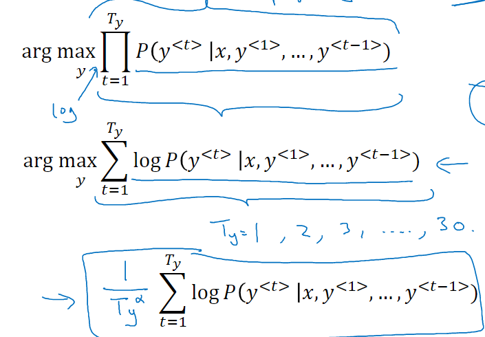

第一行是原来的方法，第二行是改进的方法，第三行是再次改进的方法。

第二行用于防止数值消失，第三行叫短句惩罚，用于防止输出短句子（因为P都小于1，因此logP都小于0，我们又要优化这个式子，因此计算机就会趋于使句子变短）。alpha=1时，惩罚比较猛，ahpha=0时，就是不惩罚。

## 优化用的超参数

1. 束搜索中的带宽（我前面用的N）
2. 短句惩罚中的alpha

# （五）定向搜索的误差分析

在机器翻译中，现在翻译出了一个很糟糕的句子，如何判断是RNN网络的锅，还是束搜索没调好的锅：

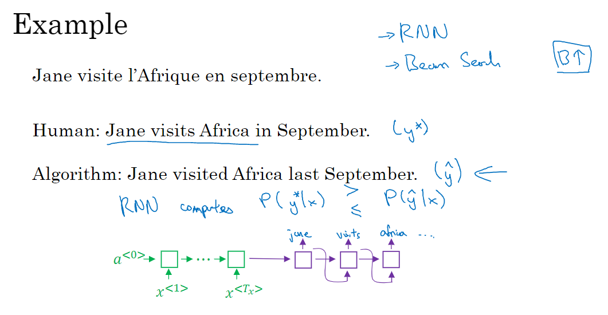

我们把原句放入网络中，计算出x；然后把人翻译的好句子ystar放入网络中，计算网络产生这个句子的概率；然后把机器翻译的坏句子yhat放入网络中，计算网络产生这个句子的概率。比较这两个概率。

如果人句子概率大，说明RNN能正确识别人句子是好句子，当初机器翻译出错只是因为束搜索选歪来。

如果机器翻译概率大，说明RNN网络好坏不分，也许束搜索很会选，但是RNN给了错误的引导方向。

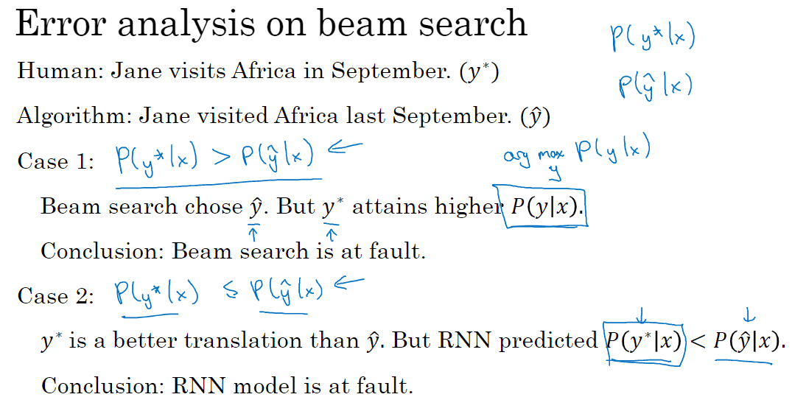

选出一两百个机器翻译的大错误，像上面那样分析一下每个错误是RNN的锅还是束搜索的锅，画个大表：

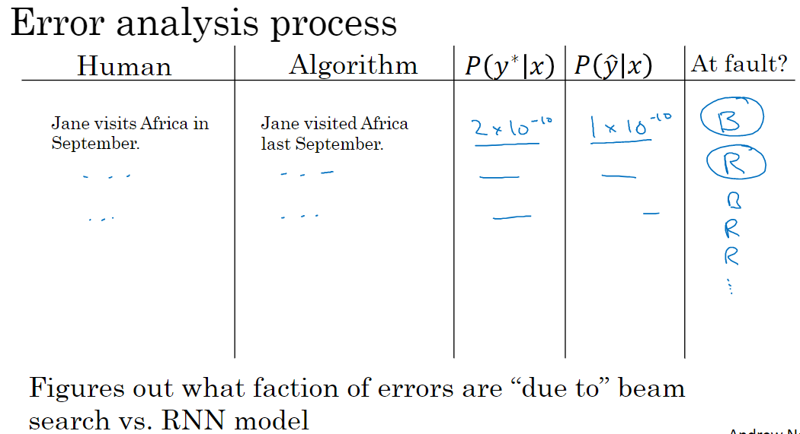

分析一下谁的锅占比例多，考虑先修复这个坏蛋。

# （六）Bleu得分：一种代替人给机翻打分的方法

## 从单词的角度

给定一个法语句子，给定两个翻译的挺好的句子，依此给一个机翻句子打分：

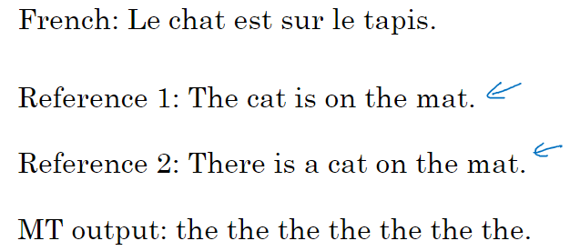

对于每个在机翻句子里出现的单词（不重复），它都会获得一定的得分。

MT输出中每个单词得分上限是：它在参考句子中的单句中出现次数最多的次数（图中，对MT输出的the，在参考句子1中出现了2次，在参考句子2中出现了1次，那么MT输出中the这个词得分上限为2）。

MT输出中每个单词的得分是：这个单词在MT输出中的次数。（如果超过上限，以上限为准。）

评判的总分：对参考句子中出现的所有单词，像MT输出单词的得分上限一样计算分数，然后求和。

MT输出的最终得分：MT输出中每个单词（不重复）得分求和 / 评判总分。

图中：

评判总分：the(2), is(1), cat(1), on(1), mat(1), there(1), a(1). 共8分。

MT得分：the(2). 共2分。

最终得分：2/8=0.25

## 从二连词的角度

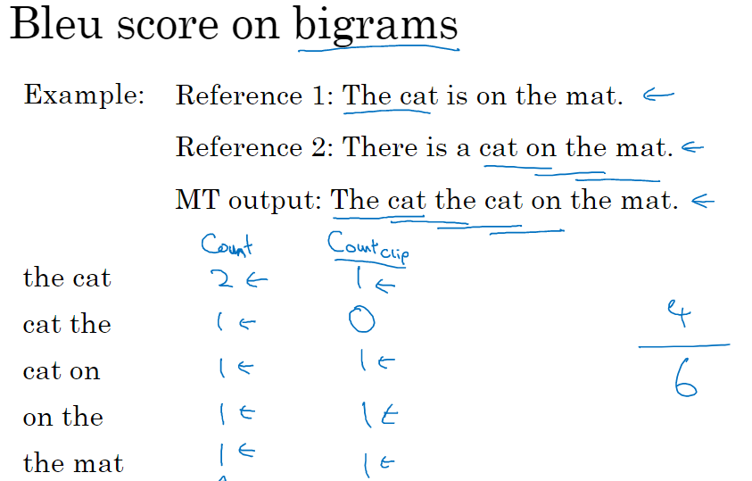

与单词角度同理，只是取样不是逐单词取样，而是逐连词取样。

## 改进（防止MT输出短句投机取巧）

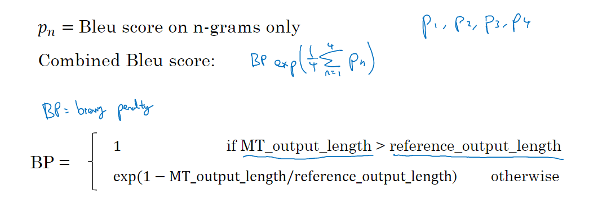

假设有4个参考句子；那么分别针对它们算出四个最终得分p1到p4，我们去他们的平均，在用个自然指数作为最终得分，但是这样容易被机器输出的短句投机取巧。因此我们如图对短句做惩罚。

# （七）注意力模型

以机翻为例。

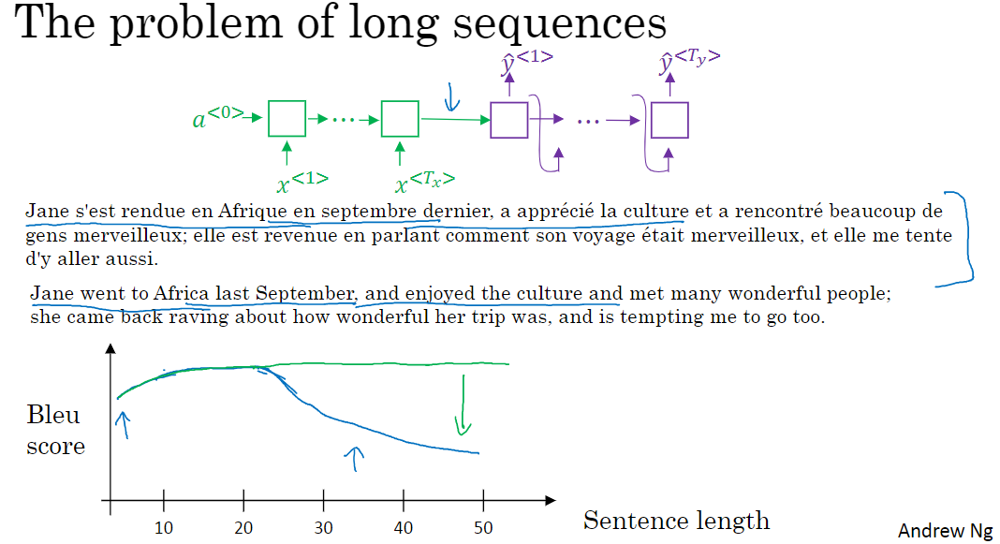

机翻基本模型是：全部输入转化为特征向量，然后输出。

可以看出，句子增长的时候，bleu得分会很快下降。

实际上，人翻译长句子也不是全看完，完了一口气全翻译好的。

因此要用注意力模型来应对长句子的机翻。

以下是一个简单的注意力模型：

印刷体部分是Tx=Ty的序列模型，把它进行如手写体的增强得到注意力模型

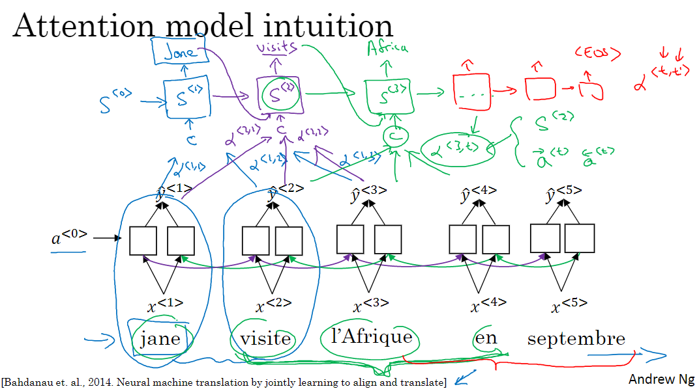

注意力模型没有编解码，而且yhat层实际是一个中间层。先用LSTM或是skipgram算出中间层yhat，再把相邻的几个yhat用注意力权重alpha加权后输入到s层（一个RNN层）作为s层输入的一部分，然后s层上再跑一个序列生成又产生一部分输入，这些输入综合起来得到s层的输出（也是最终输出）。

以下是alpha的公式，和注意力模型整理后的表示法（在这个版本中，yhat是输出）

看一下完整的注意力模型：

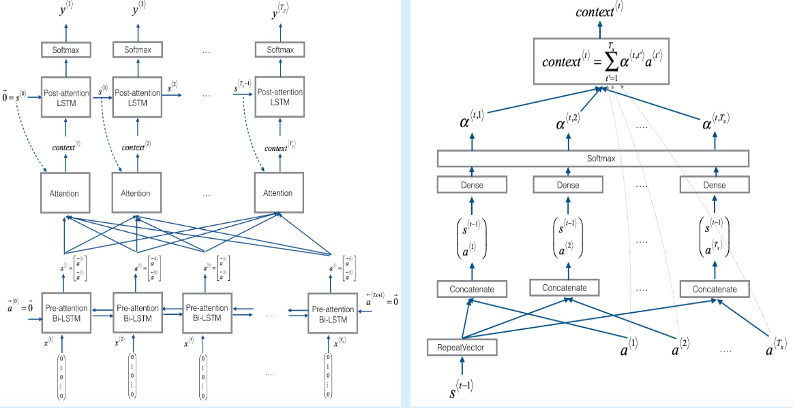

# （八）语音识别

## 问题

输入语音片段，得到里面说的话。

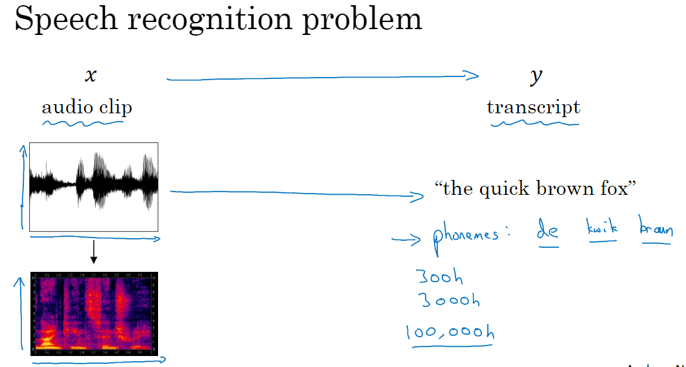

## 方法

### 注意力模型

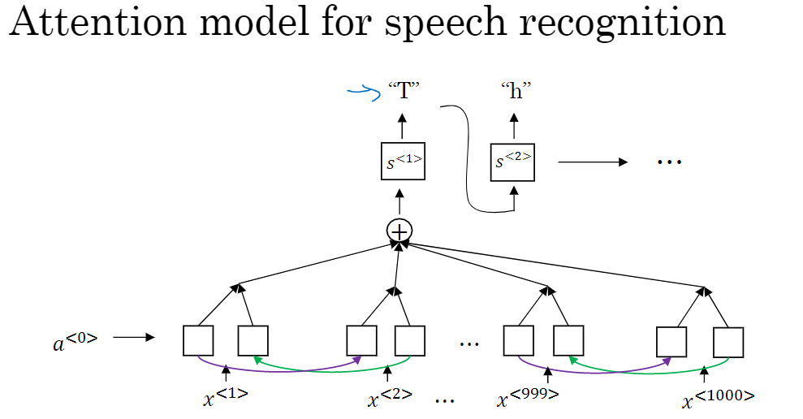

### CTC cost

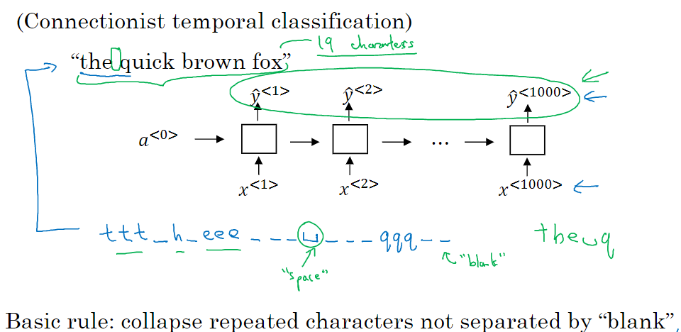

把语音按时长分开处理需要分的很细，如果用一般的序列模型会出现输入输出都是序列但是不等长的问题。

这里我们把图中手写体那样的输出也认为是好输出，因为有了空位占位符，就可以使得输入与输出等长。
