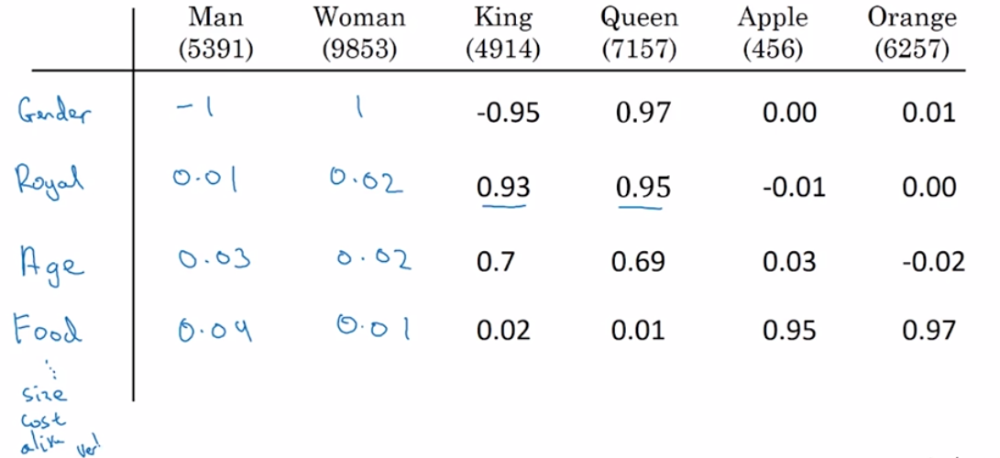

[TOC]

# （一）词汇表征

## 字典与One-Shot

缺点：无法学到词语之间的关系，例如苹果和橘子关系很紧密、国王和女王关系很紧密、男人和女人关系很紧密。

## 特征向量表示法

每个词用一个特征向量表示，这个向量的不同维度上可能表示了这个词的不同性质。

在这种表示法下，词语得以分类。假设这个向量是300维的。那么在300维空间中，性质相近的词距离就会比较近，性质相差较大的词距离就会比较远。

如何将这种距离关系可视化呢？

## t-SNE算法：词嵌入

### 举例

该算法将高维的词向量(用一种复杂的非线性的方法做映射)嵌入到二维的空间中，以将词语关系可视化。

可以看见，人、动物、数字、水果分别形成了小群体。在人这个小群体中，高贵的和不高贵的又分成了两个小群体。

### 优点

降低了表示词所用的向量的维度，多学到了很多词与词之间的关系。

# （二）使用词嵌入

## 举例

比如你正在判断一个句子里哪些单词是人名。

你的算法使用了词嵌入，且能准确判断出Sally Johnson是农民。因为算法认识：orange farmer一定是人

但是下一句是：Robert Lin is a durian cultivator. 你的算法不认识durian cultivator。它该如何得到正确答案？

根据词嵌入，它会知道durian和orange离得近，cultivator和farmer离得近。因此它推断出Robert Lin很可能是人名，而不是公司名。

## 迁移学习与词嵌入

1. 从很大的文本库中学习词嵌入（1-100B词汇量）（或者上网下载预训练的模型）
2. 把词嵌入迁移到有较小训练集的新任务上（例如100k词汇量）
3. 可选项：继续用新数据微调词嵌入

## 与人脸识别的联系

人脸识别会给每个人脸图片一个特征编码。

词嵌入会把每个词转化为一个特征向量。

## 词嵌入的特性

### 类比

你会发现：

这说明：man之于woman，相当于king之于queen

词嵌入还能帮助网络学会类似以下内容：

### 相似度函数

#### 余弦相似度（向量夹角公式）

$$
sim(u,v)=\frac{u^{T}v}{\|u\|_{2}\|v\|_{2}}
$$

分子式两个向量的内积，如果两个向量很相似，这个内积就会非常大。

向量夹角是0时，相似度为1；夹角为90°时，相似度为0；夹角为180°时，相似度为-1

#### 欧式距离

$$
d=\|u-v\|^{2}
$$

# （三）嵌入矩阵

就是个矩阵，每个词的嵌入向量有多少维，就有多少行，词典里有多少个词，就有多少列。用的时候，右乘一个one-shot的列向量，就能得到相应的词的嵌入向量。

图中o表示oneshot向量（独热向量），e表示embedding向量（嵌入向量）

实际使用的时候我们不用右乘向量的方法。因为算起来太慢了。

# （四）学习词嵌入

## 早期算法

目标：学习预测下一个单词：

第一步：取出各词的嵌入向量（300维）

第二步：把这些嵌入向量输入神经网络，通过softmax输出。

神经网络的输入：把6个嵌入向量叠在一起得到一个1800维的向量。

或者，使用历史窗口，也就是说，用一个超参数决定，我将使用空白处之前多少个词来对空白处进行预测。例如，令超参数为4，那么这里就是用“a glass of orange"来预测空白处，而不考虑“I want" 。

这称之为上下文。其他可能的上下文如下：

建立语言模型建议使用第一种。如果是为了学习词嵌入，那么用后面几个也挺好。

第三步：把输出和期望输出（juice）做损失函数、成本函数，反向传播优化神经网络和softmax的参数。这些参数包括：softmax层的W、b，神经网络中的W、b，嵌入矩阵E。

## Word2Vec的Skip-Gram算法

### 目的

利用预测单词的任务，来习得一个好的嵌入矩阵。

### 步骤

1. 在语料库中自己给自己出题。先选一个词，再在这个词前后一定范围内再选一个词。给自己出的题就是用前一个词预测后一个词。

   > 注意：语料库中a、the等无意义的常见词要控制好数量，不然大量的训练资源会被反复地放在这些词上，造成浪费。

2. 设前一个词的独热向量为o，嵌入矩阵为E，前一个词的嵌入向量为e，后一个词的独热向量为y，那么网络将是这样的：

   输入o，经过E转化为e，将e输入一个softmax分类器，得到yhat，将yhat向y的方向优化。

   这个神经网络的参数有：E，softmax单元的W和b。在这个过程中我们不断获得更好的E

### 缺陷

softmax输出向量中每一个数的计算公式为：

当词典词数较大的时候，分母的计算是非常消耗资源的。

可以采用softmax分类器树的方法解决这个问题。

最上层的分类器输出神经网络输出结果在字典的前一半还是后一半，以此做类似二分法的分类，节省了运算资源。注意，通常把常见的词放在离树根近的地方，因此这棵树不一定是完美的对称树。

## 使用负采样的算法

###  目的

利用预测单词的任务，来习得一个好的嵌入矩阵。

### 步骤

1. 在语料库中自己给自己出题。先选一个词，再在这个词前后一定范围内再选一个词作为正采样。再在全部语料库中随机选k个词作为负采样。给自己出的题就是做k+1个二分分类：对正采样的预测结果应该是1，对负采样的预测结果应该是0.

   > 与skip-gram的区别：skip-gram中，使用softmax，每次预测需要对字典中所有词进行预测（相当于对1个词做正采样，对其他所有词做负采样），消耗计算资源大，正采样占比太少。负采样的方法每次只对k+1各词做预测，其他词不理会，消耗计算资源小，是k对1的问题，正负采样比例更和谐。

   

2. 二分类器计算公式：

   

3. 从语料库中选词的概率分布：

   

   其中$f(w_{i})$指的是（w指word）某个单词在语料库中出现的频率。

## GloVe词向量

这是一种非常简单的模型，只需要优化下面这个式子：

其中$X_{ij}$是指，i在语料库中所有的j的上下文中出现的次数：

这里的$f(X_{ij})$防止了连续对几个相连词组进行训练（为训练提速、提高效率），同时这里规定0log0等于0

# （五）情绪分类

为你的词嵌入学习词语的情感。

## 训练

我们利用评价语句以及它们对应的情感优劣来训练

## 应用

把输入的词语的嵌入向量求平均值（最主要的就是要它们情感数值的平均值），然后再放到一个带参数的softmax分类器中，输入情感等级（比如1级到5级）。

## 缺点

没考虑词序。比如“lack in good taste, good service, good ambience”，这是个批评的句子，却因为平均（一个lack，三个good）被识别为赞美的句子。

## 解决方法

用这样的多对一序列模型训练：

而且用这种方法训练后应用时，如果输入句子是"completely absent in good ... ambience"，而absent不在训练集中，模型也能很好的判断出这句话不是褒义而是贬义（因为词典中对lack和absent做过训练，知道他们是相似的）

# （六）消除词嵌入的偏见（指社会偏见）

## 问题的提出

man to woman as doctor to babysitter???

这是不对的

## 问题的解决

这里以性别偏见为例，每个词向量是300维

1. 分析偏见的趋势

   算出$e_{man}-e_{women}$、$e_{male}-e_{female}$这之类的平均值。

   

   你得出：嵌入向量中与性别偏见有关的维数有10维，无关的有290维

2. 中和步

   分析出想消除偏见的词(doctor vs baby sitter)和不想消除“偏见”的词(grandmother vs grandfather)

3. 平均步

   我们要防止一种情况发生，就是修正过后，babysitter更接近grandfather，或doctor更接近grandmother。

   如下图，我们将使用算法将grandmother和grandmother移到与non-bias轴等距的地方。

第三周-序列模型和注意力机制