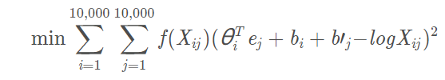
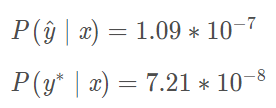
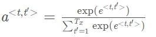

## Recurrent Neural Networks

1. Suppose your training examples are sentences (sequences of words). Which of the following refers to the jth word in the ith training example?

   - [x] x(i)<j>x(i)<j>
   - [ ] x<i>(j)x<i>(j)
   - [ ] x(j)<i>x(j)<i>
   - [ ] x<j>(i)x<j>(i)

   > We index into the ithith row first to get the ithith training example (represented by parentheses), then the jthjth column to get the jthjth word (represented by the brackets).

2. Consider this RNN:
   
   This specific type of architecture is appropriate when:

   - [x] Tx=TyTx=Ty
   - [ ] Tx<TyTx<Ty
   - [ ] Tx>TyTx>Ty
   - [ ] Tx=1Tx=1

   > It is appropriate when every input should be matched to an output.

3. To which of these tasks would you apply a many-to-one RNN architecture? (Check all that apply).
   

   - [ ] peech recognition (input an audio clip and output a transcript)
   - [x] Sentiment classification (input a piece of text and output a 0/1 to denote positive or negative sentiment)
   - [ ] Image classification (input an image and output a label)
   - [x] Gender recognition from speech (input an audio clip and output a label indicating the speaker’s gender)

4. You are training this RNN language model.
   
   At the tthtth time step, what is the RNN doing? Choose the best answer.

   - [ ] Estimating P(y<1>,y<2>,…,y<t−1>)P(y<1>,y<2>,…,y<t−1>)
   - [ ] Estimating P(y<t>)P(y<t>)
   - [x] Estimating P(y<t>∣y<1>,y<2>,…,y<t−1>)P(y<t>∣y<1>,y<2>,…,y<t−1>)
   - [ ] Estimating P(y<t>∣y<1>,y<2>,…,y<t>)P(y<t>∣y<1>,y<2>,…,y<t>)

   > Yes,in a language model we try to predict the next step based on the knowledge of all prior steps.

5. You have finished training a language model RNN and are using it to sample random sentences, as follows:
   
   
   What are you doing at each time step t?

   - [ ] (i) Use the probabilities output by the RNN to pick the highest probability word for that time-step as y^<t>y^<t>. (ii) Then pass the ground-truth word from the training set to the next time-step.
   - [ ] (i) Use the probabilities output by the RNN to randomly sample a chosen word for that time-step as y^<t>y^<t>. (ii) Then pass the ground-truth word from the training set to the next time-step.
   - [ ] (i) Use the probabilities output by the RNN to pick the highest probability word for that time-step as y^<t>y^<t>. (ii) Then pass this selected word to the next time-step.
   - [x] (i) Use the probabilities output by the RNN to randomly sample a chosen word for that time-step as y^<t>y^<t>. (ii) Then pass this selected word to the next time-step.

   > 题目说的是随机取样，因此不选AC。又因为这是取样过程不是训练过程，所以不选B。B实际上是训练过程在做的事

6. You are training an RNN, and find that your weights and activations are all taking on the value of NaN (“Not a Number”). Which of these is the most likely cause of this problem?

   - [ ] Vanishing gradient problem.
   - [x] Exploding gradient problem.
   - [ ] ReLU activation function g(.) used to compute g(z), where z is too large.
   - [ ] Sigmoid activation function g(.) used to compute g(z), where z is too large.

7. Suppose you are training a LSTM. You have a 10000 word vocabulary, and are using an LSTM with 100-dimensional activations a. What is the dimension of Γu at each time step?

   - [ ] 1
   - [x] 100
   - [ ] 300
   - [ ] 10000

   > Γu的向量维度等于LSTM中隐藏单元的数量。

8. Here’re the update equations for the GRU.
   
   Alice proposes to simplify the GRU by always removing the ΓuΓu. I.e., setting ΓuΓu = 1. Betty proposes to simplify the GRU by removing the ΓrΓr. I. e., setting ΓrΓr = 1 always. Which of these models is more likely to work without vanishing gradient problems even when trained on very long input sequences?

   - [ ] Alice’s model (removing Γu), because if ΓrΓr≈0 for a timestep, the gradient can propagate back through that timestep without much decay.
   - [ ] Alice’s model (removing Γu), because if ΓrΓr≈1 for a timestep, the gradient can propagate back through that timestep without much decay.
   - [x] Betty’s model (removing Γr), because if ΓuΓu≈0 for a timestep, the gradient can propagate back through that timestep without much decay.
   - [ ] Betty’s model (removing Γr), because if ΓuΓu≈1 for a timestep, the gradient can propagate back through that timestep without much decay.

   > Yes, For the signal to backpropagate without vanishing, we need c\<t\> to be highly dependant on c\<t−1\>
   >
   > 如果让Γu=1，那ct就与c\<t-1\>无关了，c这个变量就没有多大意义了

9. Here are the equations for the GRU and the LSTM:
   
   From these, we can see that the Update Gate and Forget Gate in the LSTM play a role similar to ***_\*** and **__** in the GRU. What should go in the the blanks?

   - [x] ΓuΓu and 1−ΓuΓu
   - [ ] ΓuΓu and ΓrΓr
   - [ ] 1−ΓuΓu and ΓuΓu
   - [ ] ΓrΓr and ΓuΓu

10. You have a pet dog whose mood is heavily dependent on the current and past few days’ weather. You’ve collected data for the past 365 days on the weather, which you represent as a sequence as x<1>,…,x<365>x<1>,…,x<365>. You’ve also collected data on your dog’s mood, which you represent as y<1>,…,y<365>y<1>,…,y<365>. You’d like to build a model to map from x→y. Should you use a Unidirectional RNN or Bidirectional RNN for this problem?

    - [ ] Bidirectional RNN, because this allows the prediction of mood on day t to take into account more information.
    - [ ] Bidirectional RNN, because this allows backpropagation to compute more accurate gradients.
    - [x] Unidirectional RNN, because the value of y<t>y<t> depends only on x<1>,…,x<t>x<1>,…,x<t>, but not on x<t+1>,…,x<365>x<t+1>,…,x<365>
    - [ ] Unidirectional RNN, because the value of y<t>y<t> depends only on x<t>x<t>, and not other days’ weather.

## Natural Language Processing & Word Embeddings

1. Suppose you learn a word embedding for a vocabulary of 10000 words. Then the embedding vectors should be 10000 dimensional, so as to capture the full range of variation and meaning in those words.
   -  True
   -  **False**

------

1. What is t-SNE?
   -  **A non-linear dimensionality reduction technique.**
   -  A linear transformation that allows us to solve analogies on word vectors.
   -  A supervised learning algorithm for learning word embeddings.
   -  An open-source sequence modeling library.

------

1. Suppose you download a pre-trained word embedding which has been trained on a huge corpus of text. You then use this word embedding to train an RNN for a language task of recognizing if someone is happy from a short snippet of text, using a small training set.

| x(input text)                                                | y (happy?) |
| ------------------------------------------------------------ | ---------- |
| I'm feeling wonderful today!                                 | 1          |
| I'm bummed my cat is ill.                                    | 0          |
| Really enjoying this!                                        | 1          |
| Then even if the word "ecstatic" does not appear in your small training set, your RNN might reasonably be expected to recognize "I’m ecstatic" as deserving a label $y = 1$. |            |

Then even if the word “ecstatic” does not appear in your small training set, your RNN might reasonably be expected to recognize “I’m ecstatic” as deserving a label y=1y = 1*y*=1.
\- [x] True
\- [ ] False

------

1. Which of these equations do you think should hold for a good word embedding? (Check all that apply)     **AC**
   -  eboy−egirl≈ebrother−esister
   -  eboy−egirl≈esister−ebrother
   -  $e_{boy} - e_{brother} ≈ e_{girl} - e_{sister} $
   -  $e_{boy} - e_{brother} ≈ e_{sister} - e_{girl} $

------

1. Let EE*E* be an embedding matrix, and let e1234e_{1234}*e*1234 be a one-hot vector corresponding to word 1234. Then to get the embedding of word 1234, why don’t we call E∗e1234E∗e_{1234}*E*∗*e*1234 in Python?
   -  **It is computationally wasteful.**
   -  The correct formula is ET∗e1234E^T∗e_{1234}*E**T*∗*e*1234.
   -  This doesn’t handle unknown words ().
   -  None of the above: Calling the Python snippet as described above is fine.

------

1. When learning word embeddings, we create an artificial task of estimating P(target∣context)P(target \mid context)*P*(*t**a**r**g**e**t*∣*c**o**n**t**e**x**t*). It is okay if we do poorly on this artificial prediction task; the more important by-product of this task is that we learn a useful set of word embeddings.

   -  True
   -  **False**

   > 做得不好的话得到的词嵌入也会是错的

------

1. In the word2vec algorithm, you estimate P(t∣c)P(t \mid c)*P*(*t*∣*c*), where tt*t* is the target word and cc*c* is a context word. How are tt*t* and cc*c* chosen from the training set? Pick the best answer.
   -  ***c* and t are chosen to be nearby words.**
   -  c is the one word that comes immediately before tt*t*.
   -  c is the sequence of all the words in the sentence before tt*t*.
   -  *c* is a sequence of several words immediately before tt*t*.

------

1. Suppose you have a 10000 word vocabulary, and are learning 500-dimensional word embeddings. The word2vec model uses the following softmax function:

   P(t∣c)=eθTtec∑10000t'=1eθTt′ecP(t \mid c)=\frac{e^{\theta_t^T e_c}}{\sum_{t′=1}^{10000} e^{\theta_{t&#x27;}^T e_c}}*P*(*t*∣*c*)=∑*t*′=110000*e**θ**t*′*T**e**c**e**θ**t**T**e**c*

   Which of these statements are correct? Check all that apply.

   -  **θt and ec are both 500 dimensional vectors.**
   -  θt and ec are both 10000 dimensional vectors.
   -  **θt and ec are both trained with an optimization algorithm such as Adam or gradient descent.**
   -  After training, we should expect θt to be very close to ec when tt*t* and cc*c* are the same word.

------

1. Suppose you have a 10000 word vocabulary, and are learning 500-dimensional word embeddings.The GloVe model minimizes this objective:
   
   Which of these statements are correct? Check all that apply.

   -  θi and ej hould be initialized to 0 at the beginning of training.

   -  **θi and ej hould be initialized randomly at the beginning of training.**

   -  **Xij is the number of times word i appears in the context of word j.**

   -  **The weighting function f(.) must satisfy f(0)=0.**

     > The weighting function helps prevent learning only from extremely common word pairs. It is not necessary that it satisfies this function.

------

1. You have trained word embeddings using a text dataset of m1m_1*m*1 words. You are considering using these word embeddings for a language task, for which you have a separate labeled dataset of m2m_2*m*2 words. Keeping in mind that using word embeddings is a form of transfer learning, under which of these circumstance would you expect the word embeddings to be helpful?

-  **m1>>m2**
-  m1&lt;&lt;m2

## Sequence models & Attention mechanism

1. Consider using this encoder-decoder model for machine translation.

 This model is a “conditional language model” in the sense that the encoder portion (shown in green) is modeling the probability of the input sentence xx*x*. - [x] True - [ ] False

1. In beam search, if you increase the beam width BB, which of the following would you expect to be true? Check all that apply.
   -  **Beam search will run more slowly.**
   -  **Beam search will use up more memory.**
   -  **Beam search will generally find better solutions (i.e. do a better job maximizing P(y | x)**
   -  Beam search will converge after fewer steps.

------

1. In machine translation, if we carry out beam search without using sentence normalization, the algorithm will tend to output overly short translations.
   -  True
   -  False

------

1. Suppose you are building a speech recognition system, which uses an RNN model to map from audio clip x to a text transcript yy*y*. Your algorithm uses beam search to try to find the value of y that maximizes P(y∣x)
   On a dev set example, given an input audio clip, your algorithm outputs the transcript yˆ=\hat{y} =*y*^= “I’m building an A Eye system in Silly con Valley.”, whereas a human gives a much superior transcript y∗ “I’m building an AI system in Silicon Valley.”.
   According to your model,
   
   Would you expect increasing the beam width B to help correct this example?
   -  **No, because P(y∗∣x)≤P(yˆ∣x) indicates the error should be attributed to the RNN rather than to the search algorithm.**
   -  No, because P(y∗∣x)≤P(yˆ∣x) indicates the error should be attributed to the search algorithm rather than to the RNN.
   -  Yes, because P(y∗∣x)≤P(yˆ∣x) indicates the error should be attributed to the RNN rather than to the search algorithm.
   -  Yes, because P(y∗∣x)≤P(yˆ∣x) indicates the error should be attributed to the search algorithm rather than to the RNN.

------

1. Continuing the example from Q4, suppose you work on your algorithm for a few more weeks, and now find that for the vast majority of examples on which your algorithm makes a mistake,

   P(y∗∣x)>P(yˆ∣x)

   . This suggest you should focus your attention on improving the search algorithm.

   -  **True**
   -  False

------

1. Consider the attention model for machine translation.

Further, here is the formula for 

Which of the following statements about α&lt;t,t'> are true? Check all that apply.

-  **We expect α&lt;t,t′> to be generally larger for values of a&lt;t′> that are highly relevant to the value the network should output for y&lt;t>. (Note the indices in the superscripts.)**
-  We expect α&lt;t,t′> to be generally larger for values of a&lt;t> that are highly relevant to the value the network should output for y&lt;t′>. (Note the indices in the superscripts.)
-  ∑tα&lt;t,t′>=1 (Note the summation is over t)
-  **∑t′α&lt;t,t′>=1 (Note the summation is over t′.)**

1. The network learns where to “pay attention” by learning the values e<t,t′>, which are computed using a small neural network:
   We can’t replace s&lt;t−1> with s&lt;t> as an input to this neural network. This is because s&lt;t> depends on α&lt;t,t'> which in turn depends on e&lt;t,t'>; so at the time we need to evalute this network, we haven’t computed s&lt;t>yet.
   -  True
   -  False

------

1. Compared to the encoder-decoder model shown in Question 1 of this quiz (which does not use an attention mechanism), we expect the attention model to have the greatest advantage when:
   -  The input sequence length Tx is large.
   -  The input sequence length Tx is small.

------

1. Under the CTC model, identical repeated characters not separated by the “blank” character (_) are collapsed. Under the CTC model, what does the following string collapse to? __c_oo_o_kk_b_ooooo_\_oo_\_kkk
   -  cokbok
   -  **cookbook**
   -  cook book
   -  coookkboooooookkk

------

1. In trigger word detection,

   x&lt;t>

   is:

   -  **Features of the audio (such as spectrogram features) at time t.**
   -  The t-th input word, represented as either a one-hot vector or a word embedding.
   -  Whether the trigger word is being said at time t.
   -  Whether someone has just finished saying the trigger word at time t.
